# Projeto Hígia

**Código da Disciplina**: FGA0208 
**Número do Grupo**: 03 

## Wiki

https://unbarqdsw2020-2.github.io/2020.2_G3_ProjetoHigia

## Alunos

| Matrícula  | Aluno                         |
| ---------- | ----------------------------- |
| 18/0011961 | Aline Helena Lermen           |
| 18/0013637 | Arthur Paiva Tavares          |
| 17/0139981 | Danillo Gonçalves de Souza    |
| 18/0063723 | Fellipe dos Santos Araujo     |
| 17/0103200 | Gabriel Alves Hussein         |
| 17/0069800 | Ithalo Luiz de Azevedo Mendes |
| 17/0164411 | Victor Amaral Cerqueira       |

## Sobre

O objetivo do nosso projeto é desenhar, arquitetar e desenvolver uma aplicação mobile voltada para o armazenamento e fácil controle de documentos médicos, além de inovar o compartilhamento de informações e arquivos entre pacientes e médicos.

## Screenshots Primeira Entrega <<FOCO: DSW(Base)>>

### Readme Wiki

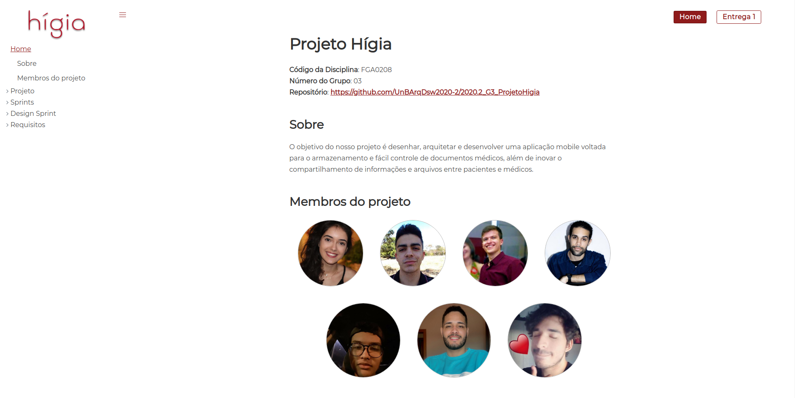

### Design Sprint

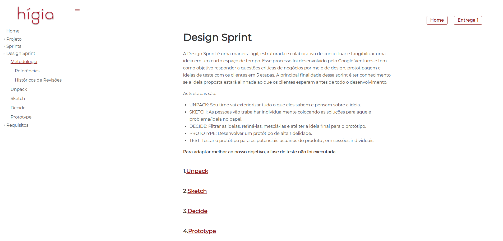

### BPMN

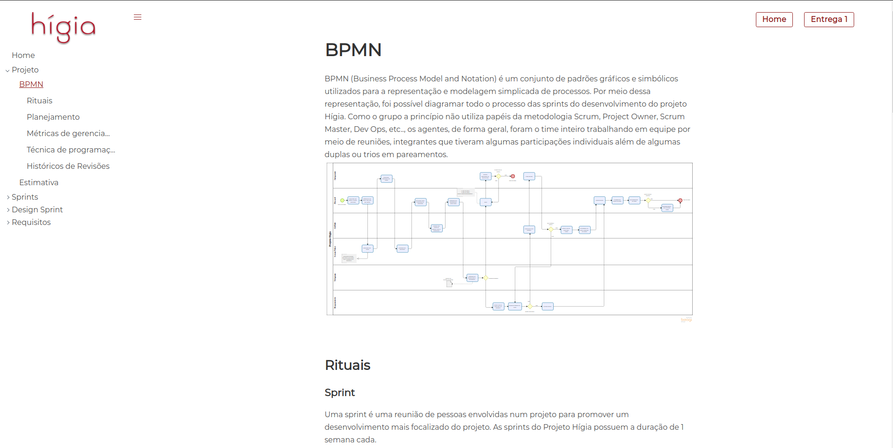

### Storyboard

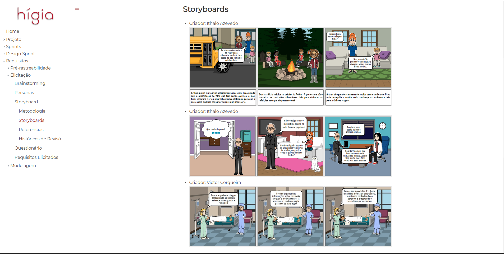

## Vídeo(s) Primeira Entrega <<FOCO: DSW(Base)>>

[Módulo Projeto Não Orientado a Abordagens Específicas](https://www.youtube.com/watch?v=1i1FSKLa3sw&feature=youtu.be)

[Módulo Processos/Metodologias/Abordagens](https://www.youtube.com/watch?v=WFZWljNopaQ&feature=youtu.be)

## Screenshots Segunda Entrega <<FOCO: DSW(Modelagem)>>

### Backlog

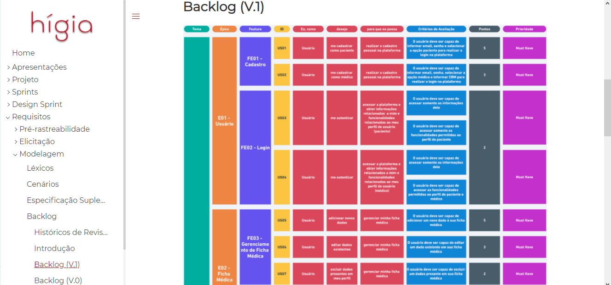

### Diagrama de classes

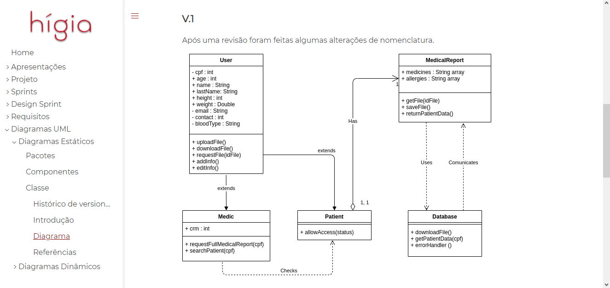

### Diagrama

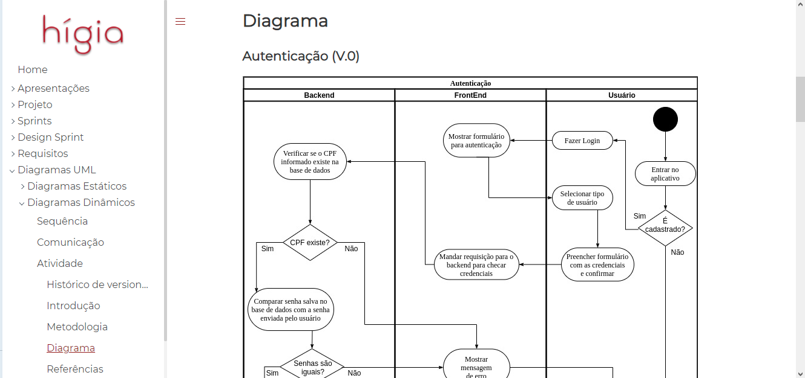

## Vídeo(s) Segunda Entrega <<FOCO: DSW(Modelagem)>>

[Módulo Projeto Orientado a Abordagens Tradicionais](https://unbarqdsw2020-2.github.io/2020.2_G3_ProjetoHigia/#/./videos/entrega2)

## Screenshots Terceira Entrega <<FOCO: DSW(Padrões de Projeto)>>

### Padrões GRASPs

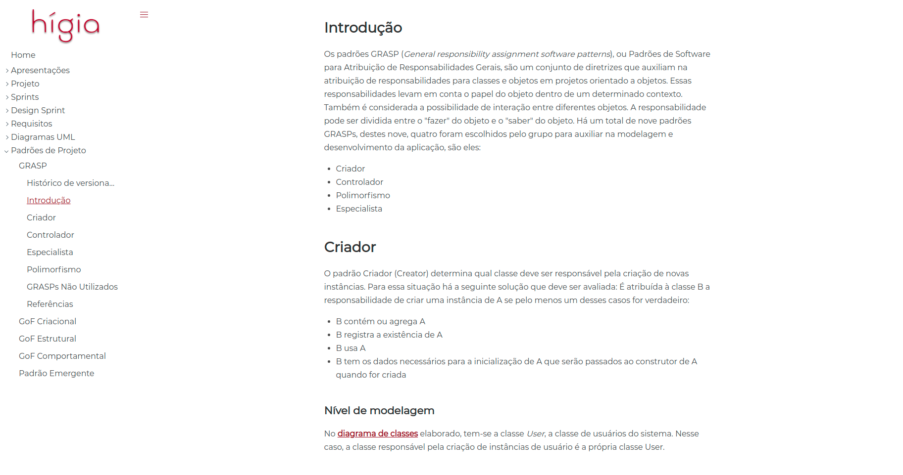

### Padrões GoFs

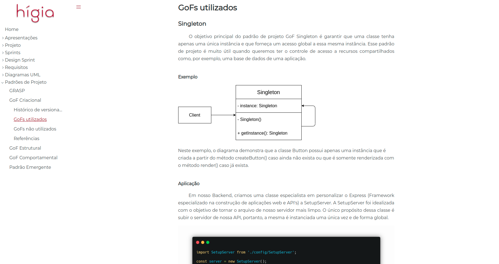

### Padrão Emergente

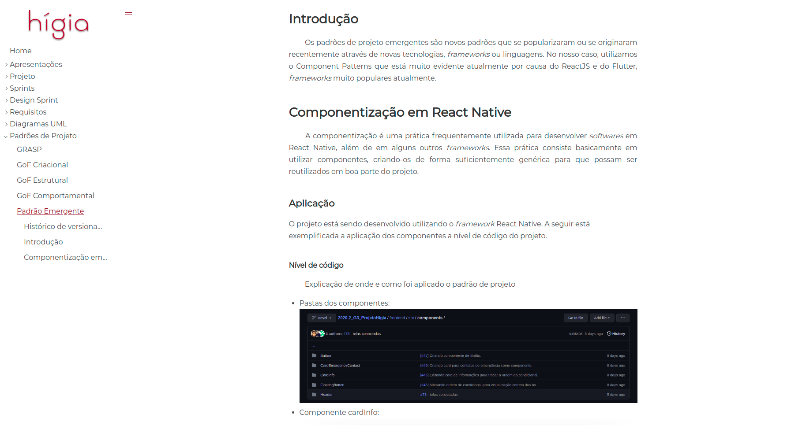

## Vídeo(s) Terceira Entrega <<FOCO: DSW(Padrões de Projeto)>>

[Módulo Padrões de Projeto GRASPs](https://youtu.be/n9shiFCyHC8)  
[Módulo Padrões de Projeto GoFs](https://youtu.be/y3WaFK6YfCQ)  
[Módulo Padrões de Projeto Extras](https://youtu.be/prgdaiVpM2A)  

## Screenshots Quarta Entrega (FINAL) <<FOCOS: Arquitetura & Reutilização de Software & PROJETO FINAL>>

### Documento de arquitetura
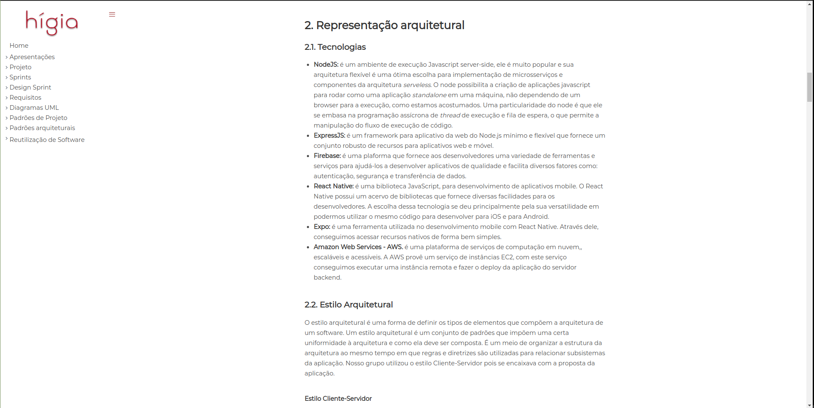

### Documento de reutilização do Backend
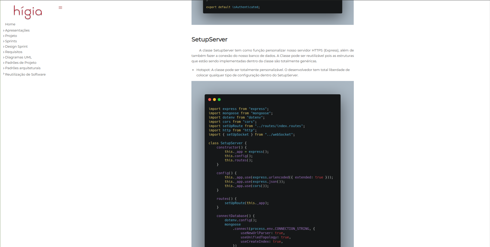

### Documento de reutilização do Frontend
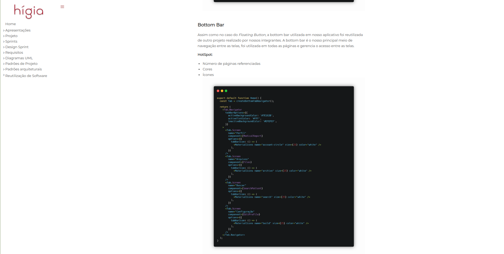

## Vídeo(s) Quarta Entrega (FINAL) <<FOCOS: Arquitetura & Reutilização de Software & PROJETO FINAL>>

[Documento de arquitetura](https://youtu.be/cVlhFjSBMBk)

[Documento de reutilização](https://youtu.be/ZmafJujQhtU)

## Descritivo dos Principais Aspectos Técnicos

**Principal(is) Metodologia(s) Adotada(s)**: SCRUM, Kanban, XP, Cumulative Flow. 
**Principais Linguagens Utilizadas e/ou Pretendidas**: Javascript. 
**Principais Tecnologias Utilizadas e/ou Pretendidas**: React Native(Frontend), NodeJS(Backend). 
**Principal(is) Estilo(s) Arquitetural(is) Adotado(s)**: Cliente-Servidor. 

## O Projeto está rodando?

( ) SIM
( ) NÃO
Se SIM, insira um manual (ou um script) para auxiliar ainda mais os interessados em consultar o projeto.

## Informações Complementares

Quaisquer outras informações sobre seu projeto podem ser descritas nessa seção.
