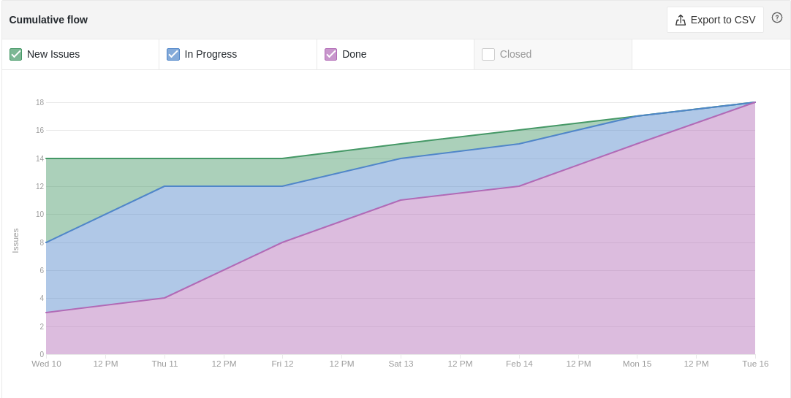
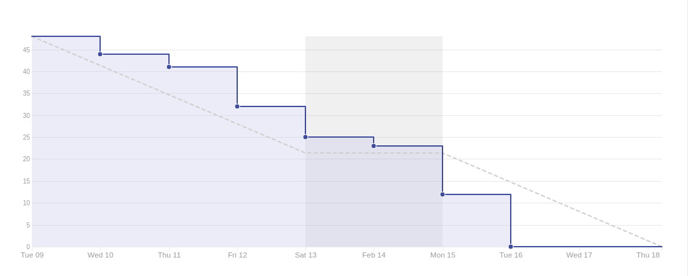

# Sprint 00

- **Data de início da sprint**: 10/02/2021
- **Data do fim da sprint**: 23/02/2021
- **Horário da Planning**:
  - **Início**: 19:00
  - **Fim**: 21:00

## Issues

|                                   Número                                   |                              Issue                               | Pontuação |                                                                       Responsáveis                                                                        |
| :------------------------------------------------------------------------: | :--------------------------------------------------------------: | :-------: | :-------------------------------------------------------------------------------------------------------------------------------------------------------: |
|  [#1](https://github.com/UnBArqDsw2020-2/2020.2_G3_ProjetoHigia/issues/1)  |        [5W2H](02-requisitos/pre-rastreabilidade/5w2h.md)         |     1     |                            [Danillo Souza](https://github.com/DanilloGS) e [Ithalo Azevedo](https://github.com/ithaloazevedo)                             |
|  [#2](https://github.com/UnBArqDsw2020-2/2020.2_G3_ProjetoHigia/issues/2)  | [Rich Picture](02-requisitos/pre-rastreabilidade/richPicture.md) |     2     |                                                                   Todos os integrantes                                                                    |
|  [#3](https://github.com/UnBArqDsw2020-2/2020.2_G3_ProjetoHigia/issues/3)  |       [Storyboard](02-requisitos/elicitacao/storyboard.md)       |     1     |                          [Ithalo Azevedo](https://github.com/ithaloazevedo) e [Victor Amaral](https://github.com/VictorAmaralC)                           |
|  [#4](https://github.com/UnBArqDsw2020-2/2020.2_G3_ProjetoHigia/issues/4)  |          [Brainstorm](01-designSprint/brainstorming.md)          |     2     |                                                                   Todos os integrantes                                                                    |
|  [#5](https://github.com/UnBArqDsw2020-2/2020.2_G3_ProjetoHigia/issues/5)  |      [Protótipo de papel](01-designSprint/protipoPapel.md)       |     1     |                                                                   Todos os integrantes                                                                    |
|  [#6](https://github.com/UnBArqDsw2020-2/2020.2_G3_ProjetoHigia/issues/6)  |  [Causa efeito](02-requisitos/pre-rastreabilidade/ishikawa.md)   |     3     |                         [Gabriel Hussein](https://github.com/GabrielHussein) e [Victor Amaral](https://github.com/VictorAmaralC)                          |
|  [#7](https://github.com/UnBArqDsw2020-2/2020.2_G3_ProjetoHigia/issues/7)  | [Mapa Mental](/02-requisitos/pre-rastreabilidade/mapaMental.md)  |     2     |                           [Aline Lermen](https://github.com/AlineLermen) e [Gabriel Hussein](https://github.com/GabrielHussein)                           |
|  [#8](https://github.com/UnBArqDsw2020-2/2020.2_G3_ProjetoHigia/issues/8)  |            [Estimativas](/03-projeto/estimativas.md)             |     8     |    [Arthur Paiva](https://github.com/ArthurPaivaT), [Danillo Souza](https://github.com/DanilloGS) e [Victor Amaral](https://github.com/VictorAmaralC)     |
|  [#9](https://github.com/UnBArqDsw2020-2/2020.2_G3_ProjetoHigia/issues/9)  |     [Glossário e Léxico](02-requisitos/modelagem/lexicos.md)     |     3     |                        [Fellipe Araujo](https://github.com/fellipe-araujo) e [Gabriel Hussein](https://github.com/GabrielHussein)                         |
| [#11](https://github.com/UnBArqDsw2020-2/2020.2_G3_ProjetoHigia/issues/11) |    [Questionários](02-requisitos/elicitacao/questionario.md)     |     3     |                                                      [Aline Lermen](https://github.com/AlineLermen)                                                       |
| [#12](https://github.com/UnBArqDsw2020-2/2020.2_G3_ProjetoHigia/issues/12) |           [MoSCoW](02-requisitos/modelagem/backlog.md)           |     2     |                                                                   Todos os integrantes                                                                    |
| [#13](https://github.com/UnBArqDsw2020-2/2020.2_G3_ProjetoHigia/issues/13) |         [Persona](02-requisitos/elicitacao/personas.md)          |     3     |   [Aline Lermen](https://github.com/AlineLermen), [Arthur Paiva](https://github.com/ArthurPaivaT) e [Ithalo Azevedo](https://github.com/ithaloazevedo)    |
| [#14](https://github.com/UnBArqDsw2020-2/2020.2_G3_ProjetoHigia/issues/14) | [Protótipo de alta fidelidade](01-designSprint/prototipoAlta.md) |     5     |   [Arthur Paiva](https://github.com/ArthurPaivaT), [Danillo Souza](https://github.com/DanilloGS) e [Fellipe Araujo](https://github.com/fellipe-araujo)    |
| [#15](https://github.com/UnBArqDsw2020-2/2020.2_G3_ProjetoHigia/issues/15) |                Criar e configurar wiki do projeto                |     2     |                                                    [Ithalo Azevedo](https://github.com/ithaloazevedo)                                                     |
| [#16](https://github.com/UnBArqDsw2020-2/2020.2_G3_ProjetoHigia/issues/16) |        [Cenários](./02-requisitos/modelagem/cenarios.md)         |     3     | [Arthur Paiva](https://github.com/ArthurPaivaT), [Ithalo Azevedo](https://github.com/ithaloazevedo), [Gabriel Hussein](https://github.com/GabrielHussein) |

- **Pontuação total**: 41
 
## Comentários
 
Ao decorrer da sprint, a equipe sentiu que haveria a necessidade de adicionar novas issues. As issues adicionadas ao decorrer da semana foram:

|                                   Número                                   |                                       Issue                                       | Pontuação |                                                                    Responsáveis                                                                    |
| :------------------------------------------------------------------------: | :-------------------------------------------------------------------------------: | :-------: | :------------------------------------------------------------------------------------------------------------------------------------------------: |
| [#17](https://github.com/UnBArqDsw2020-2/2020.2_G3_ProjetoHigia/issues/17) |    [Requisitos elicitados](/02-requisitos/elicitacao/requisitosElicitados.md)     |     2     | [Aline Lermen](https://github.com/AlineLermen), [Danillo Souza](https://github.com/DanilloGS) e [Ithalo Azevedo](https://github.com/ithaloazevedo) |
| [#18](https://github.com/UnBArqDsw2020-2/2020.2_G3_ProjetoHigia/issues/18) |              [Product Backlog](/02-requisitos/modelagem/backlog.md)               |     3     |                                                                Todos os integrantes                                                                |
| [#19](https://github.com/UnBArqDsw2020-2/2020.2_G3_ProjetoHigia/issues/19) | [Especificação Suplementar](/02-requisitos/modelagem/especificacaoSuplementar.md) |     2     |                        [Danillo Souza](https://github.com/DanilloGS) e [Fellipe Araujo](https://github.com/fellipe-araujo)                         |

**Nova pontuação total**: 48
 
Foi adicionado também o documento [BPMN](/03-projeto/bpmn.md), porém não foi criado uma issue para execução do mesmo.
### Resultado

Todas as issues propostas ao decorrer da sprint foram realizadas. Não houve dívida técnica.

### Cumulative Flow

### Burndown Report

### Velocity Tracking

