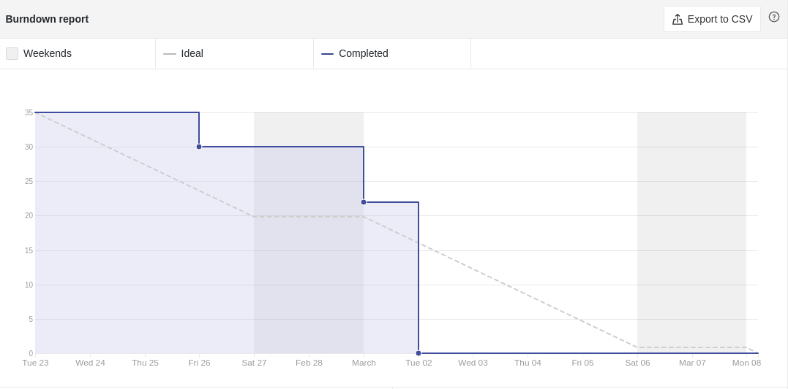
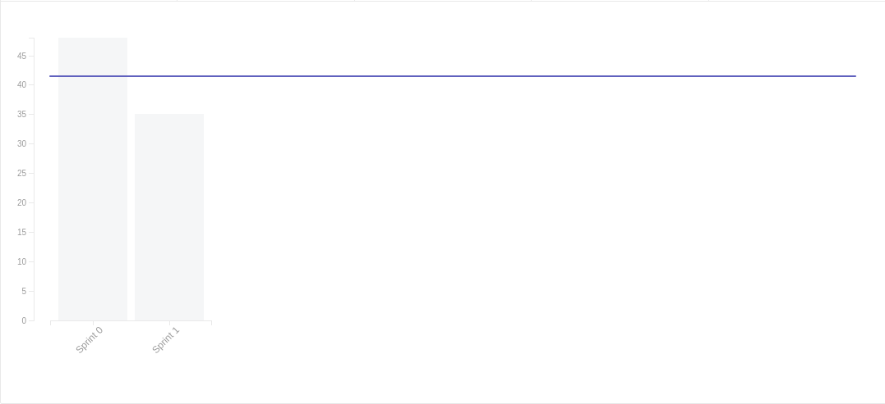

# Sprint 01

- **Data de início da sprint**: 24/02/2021
- **Data do fim da sprint**: 09/03/2021
- **Horário da Planning**:
  - **Início**: 19:20
  - **Fim**: 20:30

|                                   Número                                   |                                Issue                                 | Pontuação |                                                                       Responsáveis                                                                       |
| :------------------------------------------------------------------------: | :------------------------------------------------------------------: | :-------: | :------------------------------------------------------------------------------------------------------------------------------------------------------: |
| [#22](https://github.com/UnBArqDsw2020-2/2020.2_G3_ProjetoHigia/issues/22) |  [Diagrama de componentes](../04-diagramasUML/diagramaAtividade.md)  |     3     |                                                     [Arthur Paiva](https://github.com/ArthurPaivaT)                                                      |
| [#23](https://github.com/UnBArqDsw2020-2/2020.2_G3_ProjetoHigia/issues/23) |      [Diagrama de estado](../04-diagramasUML/diagramaEstado.md)      |     5     |                           [Arthur Paiva](https://github.com/ArthurPaivaT), [Ithalo Azevedo](https://github.com/ithaloazevedo)                            |
| [#24](https://github.com/UnBArqDsw2020-2/2020.2_G3_ProjetoHigia/issues/24) |     [Diagrama de pacotes](../04-diagramasUML/diagramaPacote.md)      |     3     |                                                   [Fellipe Araujo](https://github.com/fellipe-araujo)                                                    |
| [#25](https://github.com/UnBArqDsw2020-2/2020.2_G3_ProjetoHigia/issues/25) | [Diagrama de comunicação](../04-diagramasUML/diagramaComunicacao.md) |     5     |                           [Danillo Souza](https://github.com/DanilloGS), [Gabriel Hussein](https://github.com/GabrielHussein)                            |
| [#26](https://github.com/UnBArqDsw2020-2/2020.2_G3_ProjetoHigia/issues/26) |  [Diagrama de atividades](../04-diagramasUML/diagramaAtividade.md)   |     8     | [Aline Lermen](https://github.com/AlineLermen), [Ithalo Azevedo](https://github.com/ithaloazevedo), [Victor Cerqueira](https://github.com/VictorAmaralC) |
| [#27](https://github.com/UnBArqDsw2020-2/2020.2_G3_ProjetoHigia/issues/27) |   [Diagrama de sequência](../04-diagramasUML/diagramaSequencia.md)   |     5     |                           [Danillo Souza](https://github.com/DanilloGS), [Gabriel Hussein](https://github.com/GabrielHussein)                            |
| [#29](https://github.com/UnBArqDsw2020-2/2020.2_G3_ProjetoHigia/issues/29) |     [Diagrama de classes](../04-diagramasUML/diagramaClasse.md)      |     3     |                                                   [Victor Cerqueira](https://github.com/VictorAmaralC)                                                   |
| [#30](https://github.com/UnBArqDsw2020-2/2020.2_G3_ProjetoHigia/issues/30) |       [Evoluir backlog](../02-requisitos/modelagem/backlog.md)       |     3     |                                                   [Fellipe Araujo](https://github.com/fellipe-araujo)                                                    |

**Pontuação total:** 35

### Resultado

Todas as issues propostas ao decorrer da sprint foram realizadas e todos os documentos foram revisados . Não houve dívida técnica.
### Culmutative Flow

### Burndown Report

### Velocity Tracking

