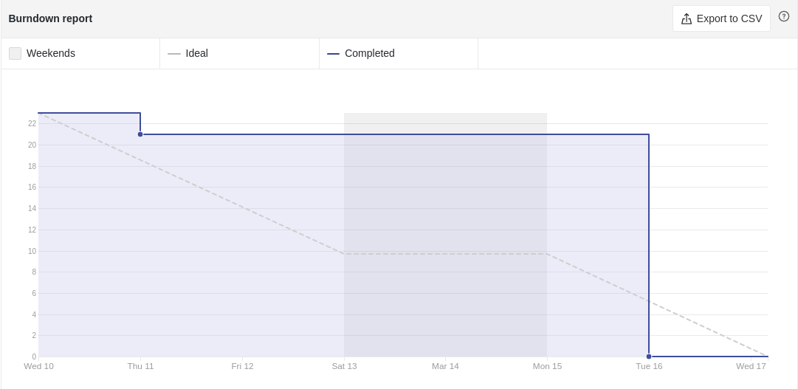
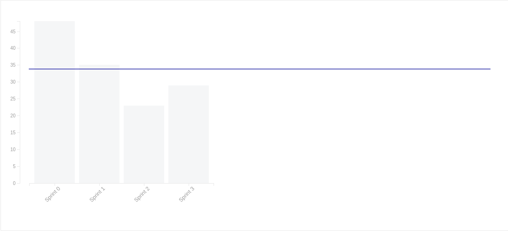

# Sprint 02

- **Data de início da sprint**: 10/03/2021
- **Data do fim da sprint**: 16/03/2021
- **Horário da Planning**:
  - **Início**: 19:30
  - **Fim**: 20:30

## Issues
| Número | Issue | Pontuação | Responsáveis |
| :----: | :---: | :-------: | :----------: |
|    [#34](https://github.com/UnBArqDsw2020-2/2020.2_G3_ProjetoHigia/issues/34)    |  Estudo de padrões de projeto GRASP      |  2         |         Todos os membros     |
|    [#35](https://github.com/UnBArqDsw2020-2/2020.2_G3_ProjetoHigia/issues/35)    |   Documentação modelagem GRASP    |        5   |     [Aline Lermen](https://github.com/AlineLermen), [Danillo Souza](https://github.com/DanilloGS), [Gabriel Hussein](https://github.com/GabrielHussein), [Ithalo Azevedo](https://github.com/ithaloazevedo)         |
|    [#36](https://github.com/UnBArqDsw2020-2/2020.2_G3_ProjetoHigia/issues/36)    |    Cadastro de novos usuários   |        8   | [Aline Lermen](https://github.com/AlineLermen), [Danillo Souza](https://github.com/DanilloGS), [Ithalo Azevedo](https://github.com/ithaloazevedo)             |
|    [#38](https://github.com/UnBArqDsw2020-2/2020.2_G3_ProjetoHigia/issues/38)    |   Criação da tela de cadastro/login     |    3       |   [Gabriel Hussein](https://github.com/GabrielHussein), Victor            |
|    [#40](https://github.com/UnBArqDsw2020-2/2020.2_G3_ProjetoHigia/issues/40)    |    Autenticação de usuário   |     5      |    [Fellipe Araujo](https://github.com/fellipe-araujo)          |

- **Pontuação total**: 23

## Comentários

Durante a nossa sprint planning tivemos dificuldades em reconhecer as issues da sprint 03, pois a maioria dos membros estava apertada com as outras matérias e não conseguiu estudar os GRASPs com antecedência. Por esse motivo, adiamos o noss planejamento para dia 12 e criamos apenas uma [issue](https://github.com/UnBArqDsw2020-2/2020.2_G3_ProjetoHigia/issues/34) para estudo. 

### Resultado

Todas as issues propostas ao decorrer da sprint foram realizadas. Não houve dívida técnica.

### Culmutative Flow

### Burndown Report

### Velocity Tracking

