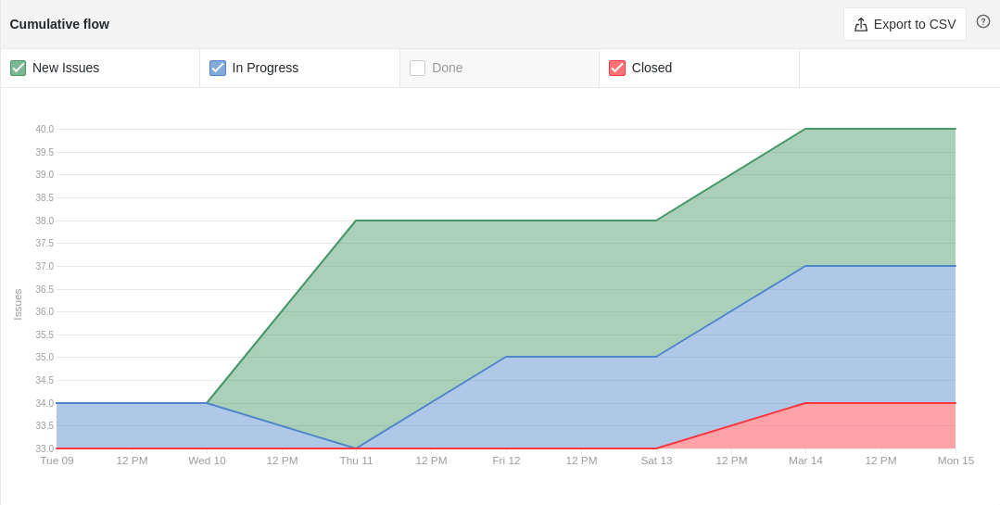
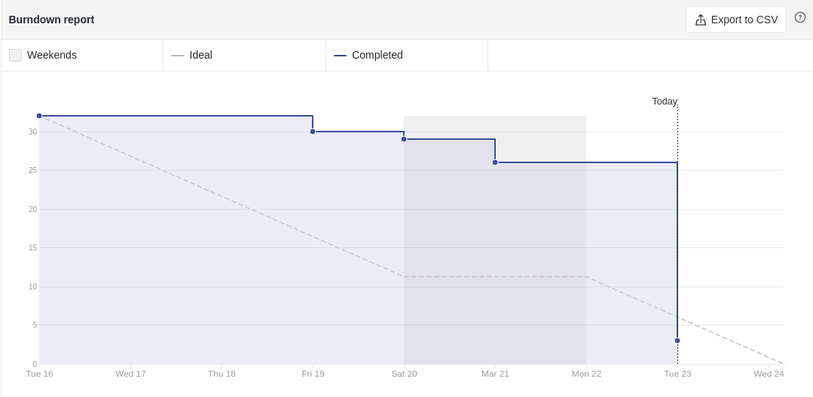

# Sprint 03

- **Data de início da sprint**: 17/03/2021
- **Data do fim da sprint**: 23/03/2021
- **Horário da Planning**:
  - **Início**: 19:40
  - **Fim**: 20:55

## Issues

|                                   Número                                   |                         Issue                         | Pontuação |                                                                                                 Responsáveis                                                                                                  |
| :------------------------------------------------------------------------: | :---------------------------------------------------: | :-------: | :-----------------------------------------------------------------------------------------------------------------------------------------------------------------------------------------------------------: |
| [#37](https://github.com/UnBArqDsw2020-2/2020.2_G3_ProjetoHigia/issues/37) |                    Realizar Login                     |     2     |                                                        [Aline Lermen](https://github.com/AlineLermen) e [Danillo Souza](https://github.com/DanilloGS)                                                         |
| [#42](https://github.com/UnBArqDsw2020-2/2020.2_G3_ProjetoHigia/issues/42) |              Ajustes documentação GRASP               |     1     |                                                                             [Gabriel Hussein](https://github.com/GabrielHussein)                                                                              |
| [#45](https://github.com/UnBArqDsw2020-2/2020.2_G3_ProjetoHigia/issues/45) |         Criação da tela de perfil de usuário          |     3     |                           [Danillo Souza](https://github.com/DanilloGS), [Ithalo Azevedo](https://github.com/ithaloazevedo) e [Victor Cerqueira](https://github.com/VictorAmaralC)                            |
| [#46](https://github.com/UnBArqDsw2020-2/2020.2_G3_ProjetoHigia/issues/46) |            Criação da tela de ficha médica            |     3     |                           [Aline Lermen](https://github.com/AlineLermen), [Fellipe Araujo](https://github.com/fellipe-araujo) e [Ithalo Azevedo](https://github.com/ithaloazevedo)                            |
| [#47](https://github.com/UnBArqDsw2020-2/2020.2_G3_ProjetoHigia/issues/47) |          Criação da tela de buscar paciente           |     1     |                                                     [Arthur Paiva](https://github.com/ArthurPaivaT) e [Fellipe Araujo](https://github.com/fellipe-araujo)                                                     |
| [#48](https://github.com/UnBArqDsw2020-2/2020.2_G3_ProjetoHigia/issues/48) | Criação da tela de detalhamento do perfil de paciente |     3     |                                                     [Arthur Paiva](https://github.com/ArthurPaivaT) e [Fellipe Araujo](https://github.com/fellipe-araujo)                                                     |
| [#49](https://github.com/UnBArqDsw2020-2/2020.2_G3_ProjetoHigia/issues/49) |              Criação de header e sidebar              |     1     |                                                                             [Victor Cerqueira](https://github.com/VictorAmaralC)                                                                              |
| [#52](https://github.com/UnBArqDsw2020-2/2020.2_G3_ProjetoHigia/issues/52) |    Documentação do padrão de projeto GoF Singleton    |     2     |                                                      [Danillo Souza](https://github.com/DanilloGS) e [Fellipe Araujo](https://github.com/fellipe-araujo)                                                      |
| [#53](https://github.com/UnBArqDsw2020-2/2020.2_G3_ProjetoHigia/issues/53) |     Documentação do padrão de projeto GoF Facade      |     2     |                                                   [Gabriel Hussein](https://github.com/GabrielHussein) e [Ithalo Azevedo](https://github.com/ithaloazevedo)                                                   |
| [#54](https://github.com/UnBArqDsw2020-2/2020.2_G3_ProjetoHigia/issues/54) |    Documentação do padrão de projeto GoF Decorator    |     2     |                                                    [Arthur Paiva](https://github.com/ArthurPaivaT) e [Victor Cerqueira](https://github.com/VictorAmaralC)                                                     |
| [#55](https://github.com/UnBArqDsw2020-2/2020.2_G3_ProjetoHigia/issues/55) |     Documentação dos padrão de projeto GoF State      |     2     |                                                  [Gabriel Hussein](https://github.com/GabrielHussein) e [Victor Cerqueira](https://github.com/VictorAmaralC)                                                  |
| [#56](https://github.com/UnBArqDsw2020-2/2020.2_G3_ProjetoHigia/issues/56) |    Documentação dos padrão de projeto GoF Observer    |     2     |                             [Aline Lermen](https://github.com/AlineLermen), [Arthur Paiva](https://github.com/ArthurPaivaT) e [Fellipe Araujo](https://github.com/fellipe-araujo)                             |
| [#64](https://github.com/UnBArqDsw2020-2/2020.2_G3_ProjetoHigia/issues/64) |          Ajustes das telas de cadastro/login          |     5     | [Danillo Souza](https://github.com/DanilloGS), [Fellipe Araujo](https://github.com/fellipe-araujo), [Ithalo Azevedo](https://github.com/ithaloazevedo) e [Victor Cerqueira](https://github.com/VictorAmaralC) |

- **Pontuação total**: 32

### Comentários

As métricas ficaram com qualidade ruim, pois a equipe não fez a utilização correta do zenhub nessa sprint. Os membros foram informados sobre a importância da utilização do Kanban.

### Resultado

Dos 32 pontos propostos no início da sprint 29 foram concluídos. A issue [#48](https://github.com/UnBArqDsw2020-2/2020.2_G3_ProjetoHigia/issues/48) foi adiada para a sprint seguinte.

### Culmutative Flow

### Burndown Report

### Velocity Tracking

