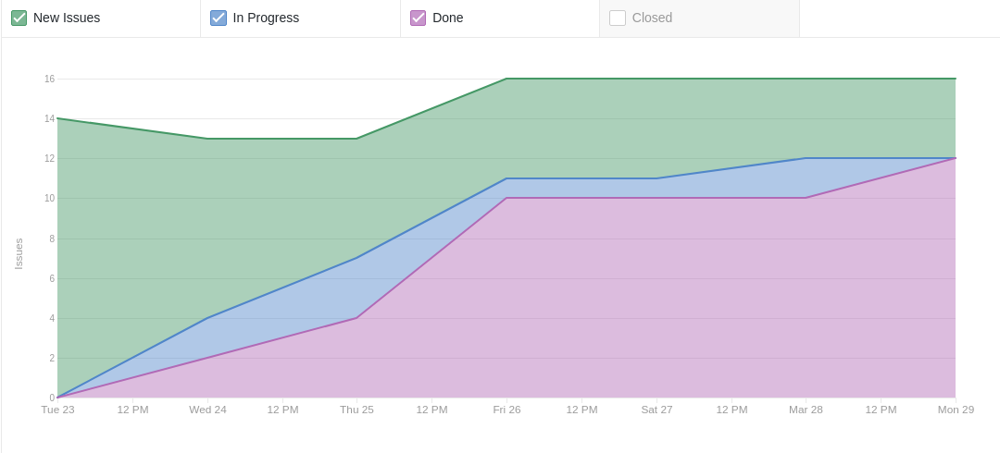
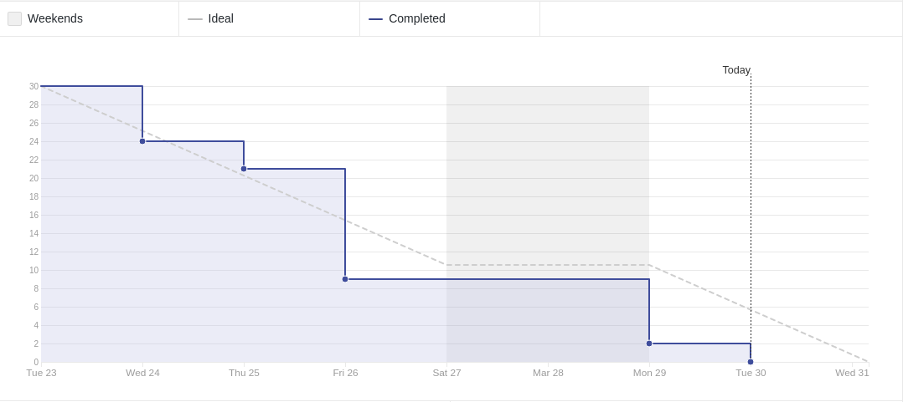
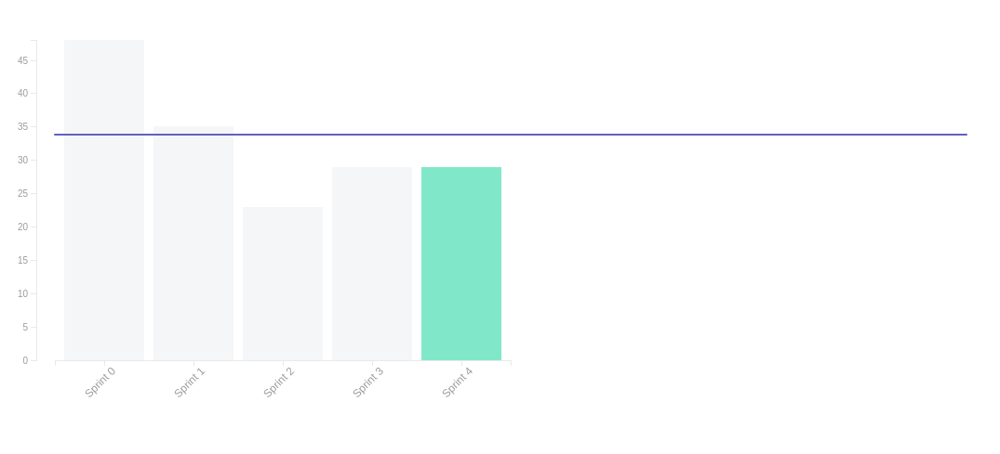

# Sprint 04

- **Data de início da sprint**: 24/03/2021
- **Data do fim da sprint**: 30/03/2021
- **Horário da Planning**:
  - **Início**: 19:40
  - **Fim**: 20:30

## Issues

|                                   Número                                   |                         Issue                         | Pontuação |                                             Responsáveis                                              |
| :------------------------------------------------------------------------: | :---------------------------------------------------: | :-------: | :---------------------------------------------------------------------------------------------------: |
| [#48](https://github.com/UnBArqDsw2020-2/2020.2_G3_ProjetoHigia/issues/48) | Criação da tela de detalhamento do perfil de paciente |     3     | [Arthur Paiva](https://github.com/ArthurPaivaT) e [Fellipe Araujo](https://github.com/fellipe-araujo) |
| [#68](https://github.com/UnBArqDsw2020-2/2020.2_G3_ProjetoHigia/issues/68) |      Criação de um template de documentação GoF       |     1     |                                                                                                       |
| [#69](https://github.com/UnBArqDsw2020-2/2020.2_G3_ProjetoHigia/issues/69) |              Demais GoFs não utilizados               |     5     |                                                                                                       |
| [#70](https://github.com/UnBArqDsw2020-2/2020.2_G3_ProjetoHigia/issues/70) |                  Documento de visão                   |     3     |                                                                                                       |
| [#71](https://github.com/UnBArqDsw2020-2/2020.2_G3_ProjetoHigia/issues/71) |             Criação do padrão middleware              |     1     |                                                                                                       |
| [#72](https://github.com/UnBArqDsw2020-2/2020.2_G3_ProjetoHigia/issues/72) |                 Documentar middleware                 |     1     |                                                                                                       |
| [#73](https://github.com/UnBArqDsw2020-2/2020.2_G3_ProjetoHigia/issues/73) |                    Conectar telas                     |     2     |                                                                                                       |
| [#74](https://github.com/UnBArqDsw2020-2/2020.2_G3_ProjetoHigia/issues/74) |                Criação do guia estilo                 |     5     |                                                                                                       |
| [#75](https://github.com/UnBArqDsw2020-2/2020.2_G3_ProjetoHigia/issues/75) |             Demais GRASPs não utilizados              |     3     |                                                                                                       |
| [#76](https://github.com/UnBArqDsw2020-2/2020.2_G3_ProjetoHigia/issues/76) |           Revisão dos GoFs comportamentais            |     2     |                                                                                                       |
| [#77](https://github.com/UnBArqDsw2020-2/2020.2_G3_ProjetoHigia/issues/77) |             Revisão dos GoFs criacionais              |     2     |                                                                                                       |
| [#78](https://github.com/UnBArqDsw2020-2/2020.2_G3_ProjetoHigia/issues/78) |             Revisão dos GoFs estruturais              |     2     |                                                                                                       |

- **Pontuação total**: 29

## Review

### Resultado

<!-- ### Cumulative Flow

### Burndown Report

 -->

### Velocity Tracking

