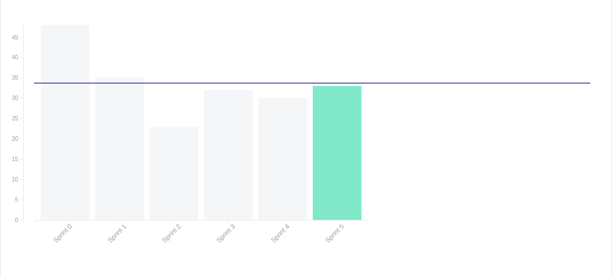

# Sprint 05

- **Data de início da sprint**: 31/03/2021
- **Data do fim da sprint**: 06/04/2021
- **Horário da Planning**:
  - **Início**: 19:30
  - **Fim**: 21:00

| Número | Issue | Pontuação | Responsáveis |
| :----: | :---: | :-------: | :----------: |
|  [#85](https://github.com/UnBArqDsw2020-2/2020.2_G3_ProjetoHigia/issues/85)      |   Documentação de padrão emergente na wiki   |     2      |      [Aline Lermen](https://github.com/AlineLermen) e [Ithalo Azevedo](https://github.com/ithaloazevedo)       |
|  [#86](https://github.com/UnBArqDsw2020-2/2020.2_G3_ProjetoHigia/issues/86)      |   Ficha médica    |      1     |         [Arthur Paiva](https://github.com/ArthurPaivaT), [Fellipe Araujo](https://github.com/fellipe-araujo) e [Victor Cerqueira](https://github.com/VictorAmaralC)     |
|  [#87](https://github.com/UnBArqDsw2020-2/2020.2_G3_ProjetoHigia/issues/87)      |   Contribuição sobre Padrões Emergentes na Wiki Colaborativa    |     2      |   [Arthur Paiva](https://github.com/ArthurPaivaT) e [Ithalo Azevedo](https://github.com/ithaloazevedo)           |
|  [#88](https://github.com/UnBArqDsw2020-2/2020.2_G3_ProjetoHigia/issues/88)      |  Revisão diagramas UML      |     5      |     [Aline Lermen](https://github.com/AlineLermen) e [Gabriel Hussein](https://github.com/GabrielHussein)         |
|  [#89](https://github.com/UnBArqDsw2020-2/2020.2_G3_ProjetoHigia/issues/89)      |  Tela de editar perfil de usuário     |   3        |     [Aline Lermen](https://github.com/AlineLermen), [Fellipe Araujo](https://github.com/fellipe-araujo) e [Gabriel Hussein](https://github.com/GabrielHussein)         |
|  [#90](https://github.com/UnBArqDsw2020-2/2020.2_G3_ProjetoHigia/issues/90)      |  Tirar foto do usuário     |    3       |    [Danillo Souza](https://github.com/DanilloGS), [Fellipe Araujo](https://github.com/fellipe-araujo) e [Victor Cerqueira](https://github.com/VictorAmaralC)          |
|  [#91](https://github.com/UnBArqDsw2020-2/2020.2_G3_ProjetoHigia/issues/91)      |    Validação de CRM   |      2     |    [Aline Lermen](https://github.com/AlineLermen), [Arthur Paiva](https://github.com/ArthurPaivaT) e [Gabriel Hussein](https://github.com/GabrielHussein)          |
|  [#92](https://github.com/UnBArqDsw2020-2/2020.2_G3_ProjetoHigia/issues/92)      |   Validação de CPF    |   2        |    [Danillo Souza](https://github.com/DanilloGS), [Gabriel Hussein](https://github.com/GabrielHussein) e [Ithalo Azevedo](https://github.com/ithaloazevedo)          |
|  [#93](https://github.com/UnBArqDsw2020-2/2020.2_G3_ProjetoHigia/issues/93)      |  Realizar upload de mídias     |      5     |      [Arthur Paiva](https://github.com/ArthurPaivaT), [Danillo Souza](https://github.com/DanilloGS), [Ithalo Azevedo](https://github.com/ithaloazevedo) e [Victor Cerqueira](https://github.com/VictorAmaralC)        |
|  [#94](https://github.com/UnBArqDsw2020-2/2020.2_G3_ProjetoHigia/issues/94)      |     Realizar download de mídias  |      3     |       [Arthur Paiva](https://github.com/ArthurPaivaT), [Danillo Souza](https://github.com/DanilloGS), [Ithalo Azevedo](https://github.com/ithaloazevedo) e [Victor Cerqueira](https://github.com/VictorAmaralC)       |
|  [#95](https://github.com/UnBArqDsw2020-2/2020.2_G3_ProjetoHigia/issues/95)      |   Remover arquivos    |     2      |       [Arthur Paiva](https://github.com/ArthurPaivaT), [Danillo Souza](https://github.com/DanilloGS), [Ithalo Azevedo](https://github.com/ithaloazevedo) e [Victor Cerqueira](https://github.com/VictorAmaralC)       |
|  [#96](https://github.com/UnBArqDsw2020-2/2020.2_G3_ProjetoHigia/issues/96)      |   Tela meus exames    |      3     |     [Aline Lermen](https://github.com/AlineLermen), [Fellipe Araujo](https://github.com/fellipe-araujo), [Gabriel Hussein](https://github.com/GabrielHussein) e [Victor Cerqueira](https://github.com/VictorAmaralC)         |

**Pontuação total:** 33

### Resultado

### Cumulative Flow

### Burndown Report

### Velocity Tracking

