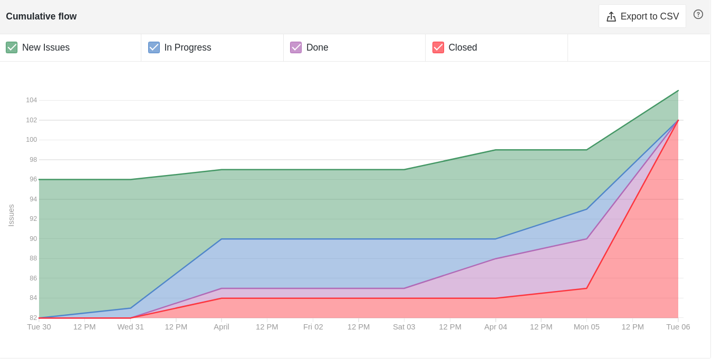
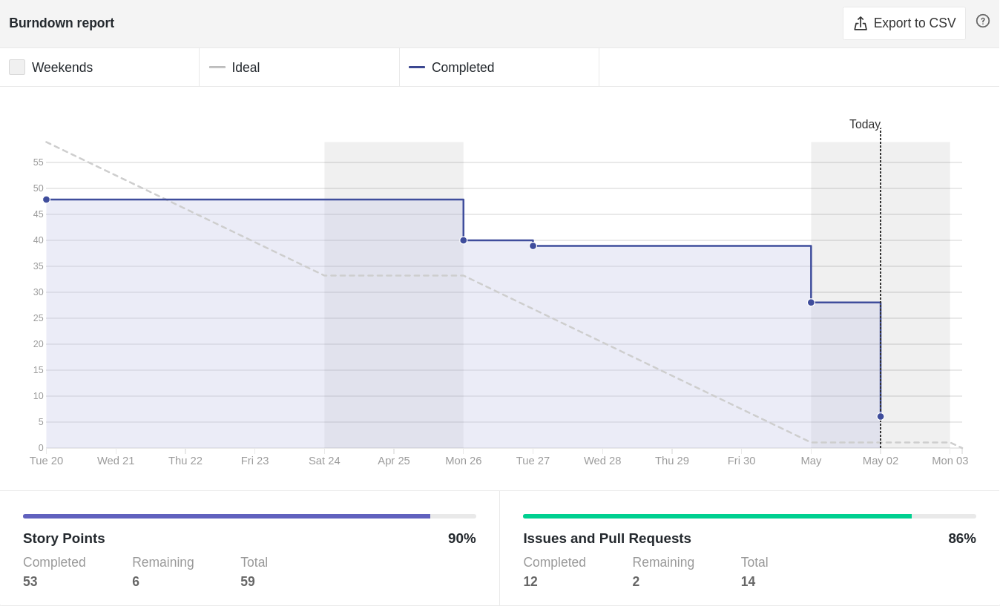
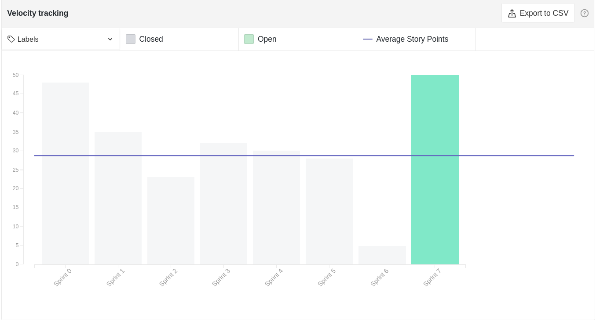

# Sprint 07

- **Data de início da sprint**: 15/04/2021
- **Data do fim da sprint**: 03/05/2021
- **Horário da Planning**:
  - **Início**: 19:00
  - **Fim**: 20:30

## Issues

|                                    Número                                    |                 Issue                 | Pontuação |                                                                                                  Responsáveis                                                                                                   |
| :--------------------------------------------------------------------------: | :-----------------------------------: | :-------: | :-------------------------------------------------------------------------------------------------------------------------------------------------------------------------------------------------------------: |
| [#108](https://github.com/UnBArqDsw2020-2/2020.2_G3_ProjetoHigia/issues/108) |       Documento de Arquitetura        |    13     |                                                                                              Todos os integrantes                                                                                               |
| [#109](https://github.com/UnBArqDsw2020-2/2020.2_G3_ProjetoHigia/issues/109) |     Conceder acesso aos arquivos      |     8     |                                                         [Arthur Paiva](https://github.com/ArthurPaivaT) e [Danillo Souza](https://github.com/DanilloGS)                                                         |
| [#111](https://github.com/UnBArqDsw2020-2/2020.2_G3_ProjetoHigia/issues/111) |         Reutilização frontend         |     3     |                         [Gabriel Hussein](https://github.com/GabrielHussein), [Ithalo Azevedo](https://github.com/ithaloazevedo) e [Victor Cerqueira](https://github.com/VictorAmaralC)                         |
| [#113](https://github.com/UnBArqDsw2020-2/2020.2_G3_ProjetoHigia/issues/113) |         Reutilização backend          |     5     |    [Aline Lermen](https://github.com/AlineLermen), [Danillo Souza](https://github.com/DanilloGS), [Gabriel Hussein](https://github.com/GabrielHussein) e [Ithalo Azevedo](https://github.com/ithaloazevedo)     |
| [#114](https://github.com/UnBArqDsw2020-2/2020.2_G3_ProjetoHigia/issues/114) |          Padrão arquitetural          |     3     |   [Aline Lermen](https://github.com/AlineLermen), [Arthur Paiva](https://github.com/ArthurPaivaT), [Ithalo Azevedo](https://github.com/ithaloazevedo) e [Victor Cerqueira](https://github.com/VictorAmaralC)    |
| [#115](https://github.com/UnBArqDsw2020-2/2020.2_G3_ProjetoHigia/issues/115) |          Estilo arquitetural          |     5     | [Aline Lermen](https://github.com/AlineLermen), [Gabriel Hussein](https://github.com/GabrielHussein), [Ithalo Azevedo](https://github.com/ithaloazevedo) e [Victor Cerqueira](https://github.com/VictorAmaralC) |
| [#116](https://github.com/UnBArqDsw2020-2/2020.2_G3_ProjetoHigia/issues/116) |          Visão arquitetural           |     5     |                          [Arthur Paiva](https://github.com/ArthurPaivaT), [Gabriel Hussein](https://github.com/GabrielHussein) e [Victor Cerqueira](https://github.com/VictorAmaralC)                           |
| [#117](https://github.com/UnBArqDsw2020-2/2020.2_G3_ProjetoHigia/issues/117) |         Validação dos inputs          |     3     |                                                      [Aline Lermen](https://github.com/AlineLermen) e [Gabriel Hussein](https://github.com/GabrielHussein)                                                      |
| [#118](https://github.com/UnBArqDsw2020-2/2020.2_G3_ProjetoHigia/issues/118) | Modal de permitir acesso a documentos |     3     |                                                      [Arthur Paiva](https://github.com/ArthurPaivaT) e [Fellipe Araujo](https://github.com/fellipe-araujo)                                                      |
| [#119](https://github.com/UnBArqDsw2020-2/2020.2_G3_ProjetoHigia/issues/119) |     Conectar Backend com Frontend     |     5     |                                                                                  [Danillo Souza](https://github.com/DanilloGS)                                                                                  |
| [#120](https://github.com/UnBArqDsw2020-2/2020.2_G3_ProjetoHigia/issues/120) |       Fazer deploy da aplicação       |     1     |                                                         [Arthur Paiva](https://github.com/ArthurPaivaT) e [Danillo Souza](https://github.com/DanilloGS)                                                         |
| [#121](https://github.com/UnBArqDsw2020-2/2020.2_G3_ProjetoHigia/issues/121) |  Criar loading ao fazer requisições   |     3     |                                                                                 [Arthur Paiva](https://github.com/ArthurPaivaT)                                                                                 |
| [#122](https://github.com/UnBArqDsw2020-2/2020.2_G3_ProjetoHigia/issues/122) | Criar objeto e transferir entre telas |     1     |                                                                                  [Danillo Souza](https://github.com/DanilloGS)                                                                                  |
| [#123](https://github.com/UnBArqDsw2020-2/2020.2_G3_ProjetoHigia/issues/123) |               Gerar APK               |     1     |                                                       [Danillo Souza](https://github.com/DanilloGS) e [Fellipe Araujo](https://github.com/fellipe-araujo)                                                       |

- **Pontuação total**: 59burnDown

## Comentários

- A sprint teve 3 semanas, a primeira semana da sprint foi utilizada somente para que a equipe pudesse estudar os conteúdos da disciplina. As 2 semanas seguintes foram para a realização das issues definidas.

### Resultado

- As issues [#119](https://github.com/UnBArqDsw2020-2/2020.2_G3_ProjetoHigia/issues/119) e [#123](https://github.com/UnBArqDsw2020-2/2020.2_G3_ProjetoHigia/issues/123) não puderam ser concluidas, pois o grupo não previu o quão complexo seria utilizar a biblioteca de documentos no React Native, então a funcionalidade de arquivos no frontend do app não foi implentada até a deadline.

### Cumulative Flow

### Burndown Report

### Velocity Tracking

