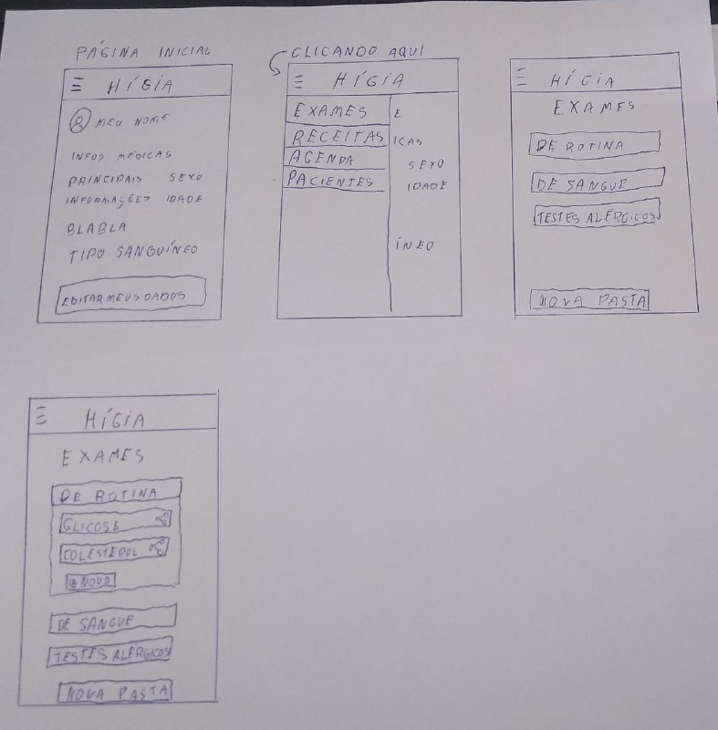
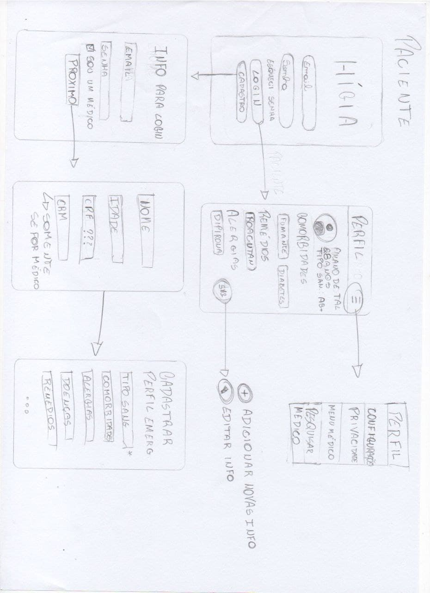
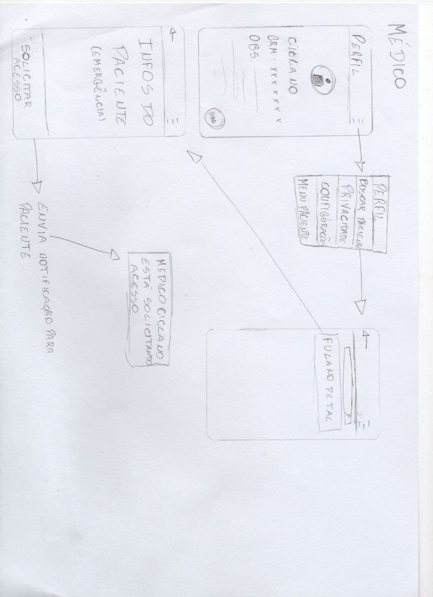
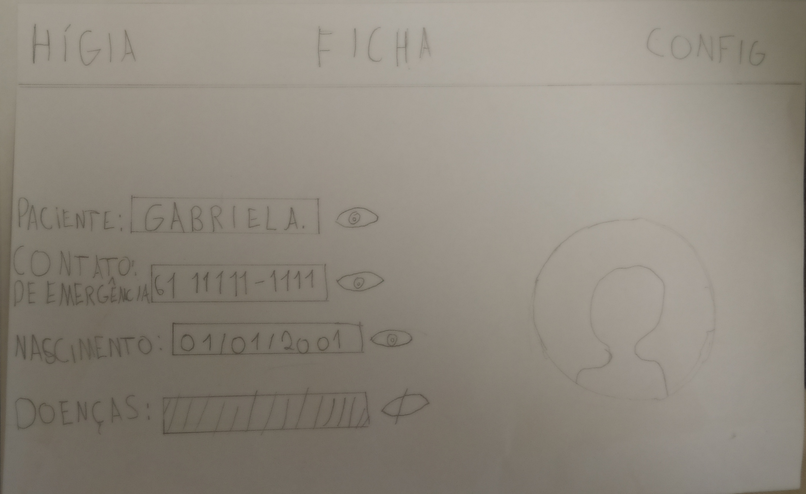
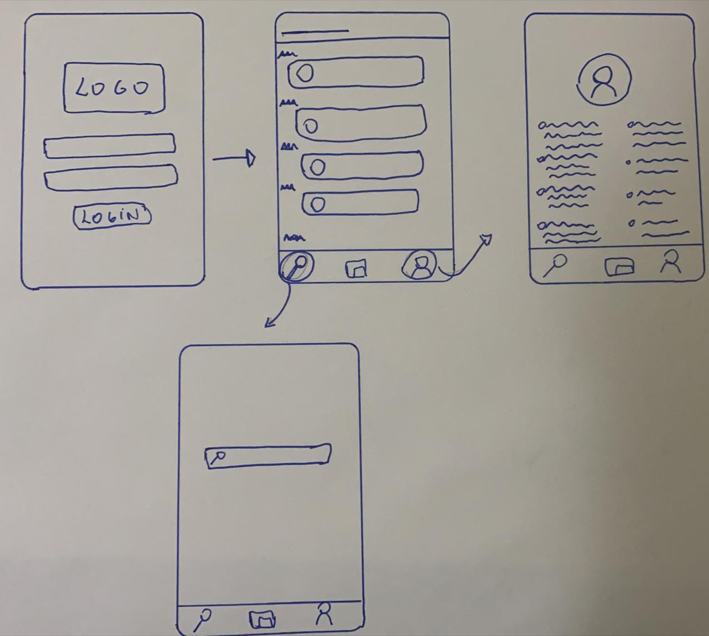

# Sketch
Para a fase de Sketch, nós escolhemos o protótipo de baixa fidelidade. Os protótipos de baixa fidelidade são esboços que ilustram a estrutura, o comportamento e as interações básicas de uma interface. Eles também são chamados de protótipos de papel ou sketches e visam definir a interação do usuário com a aplicação de forma simples, sem preocupações com elementos ligados ao design. Por ser simples, ele é utilizado para ajudar na definição do projeto e no levantamento dos requisitos do produto.

## Protótipos

### Aline Lermen

### Arthur Paiva

### Danillo Souza

### Fellipe Araujo

### Gabriel Hussein

### Ithalo Azevedo

## Referências
- https://startupsorocaba.com/startup-sorocaba-o-que-sao-prototipos-de-baixa-e-alta-fidelidade/
- https://www.vitaminaweb.com.br/fidelidade-de-prototipos-baixa-media-ou-alta/

## Históricos de Revisões

|    Data    | Versão |       Descrição        |                     Autor(es)                      |
| :--------: | :----: | :--------------------: | :------------------------------------------------: |
| 09/02/2021 |  0.1   | Desenho dos protótipos |  Arthur, Aline, Danillo, Fellipe, Gabriel, Ithalo  |
| 10/02/2021 |  1.0   |  Criação do documento  | [Ithalo Azevedo](https://github.com/ithaloazevedo) |