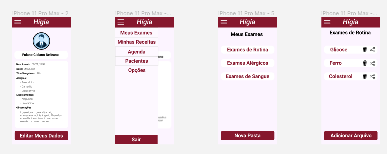
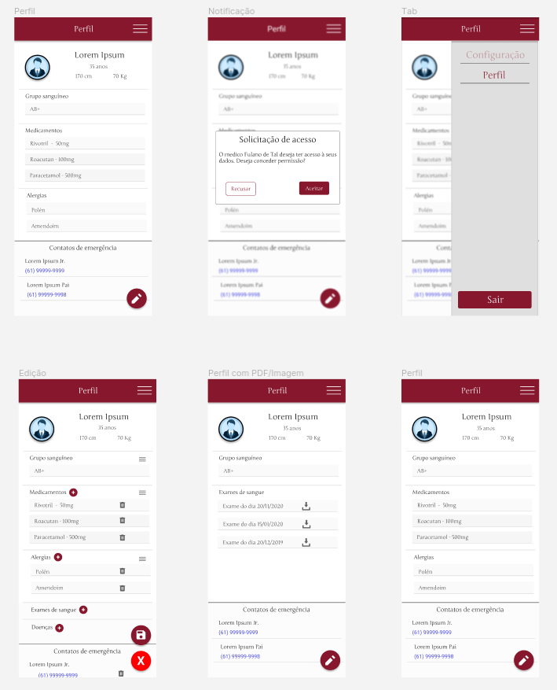
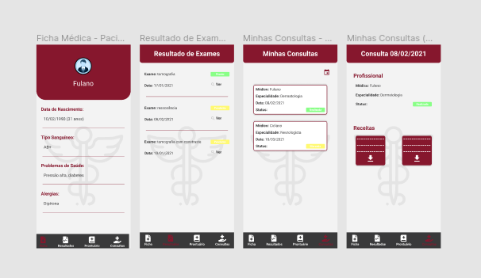
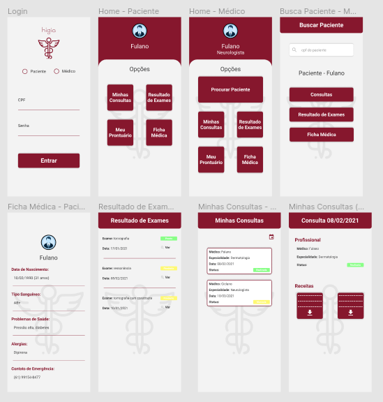

# Decide

## Históricos de versões

|    Data    | Versão |       Descrição        |                                                                      Autor(es)                                                                       |
| :--------: | :----: | :--------------------: | :--------------------------------------------------------------------------------------------------------------------------------------------------: |
| 10/02/2021 |  0.1   | Criação dos protótipos | [Arthur Paiva](https://github.com/ArthurPaivaT), [Danillo Souza](https://github.com/DanilloGS) e [Fellipe Araujo](https://github.com/fellipe-araujo) |
| 11/02/2021 |  1.0   |  Criação do documento  |                          [Danillo Souza](https://github.com/DanilloGS) e [Ithalo Azevedo](https://github.com/ithaloazevedo)                          |

## Introdução

Para a etapa Decide, nós utilizamos as ideias exteriorizadas através das etapas Sketch e Unpack para criar protótipos de média fidelidade. Nessa etapa, três membros da equipe foram designados para filtrar as ideias, refiná-las e criar o protótipo de média fidelidade. Os protótipos de média fidelidade (também chamados de Wireframes) são muito utilizados em um trabalho que envolve arquitetura de informação e não utilizam recursos de design avançados como cores e imagens e nem possuem simulações complexas de uso.

## Protótipos

### Arthur Paiva

### Danillo Souza

### Fellipe Araujo

 

## Referências

- Fidelidade de protótipos. https://www.vitaminaweb.com.br/fidelidade-de-prototipos-baixa-media-ou-alta/. Acesso em: 11/02/2021.
- Protótipos de baixa, média e alta fidelidade. https://jeffersonalex.medium.com/protótipos-de-baixa-média-e-alta-fidelidade-bf04870325a6. Acesso em: 11/02/2021.

