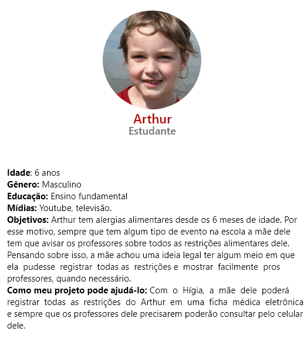

# Personas

## Históricos de Revisões

|    Data    | Versão |                   Descrição                    |                                                                     Autor(es)                                                                      |
| :--------: | :----: | :--------------------------------------------: | :------------------------------------------------------------------------------------------------------------------------------------------------: |
| 10/02/2020 |  0.1   |              Criação do documento              |                                                 [Ithalo Azevedo](https://github.com/ithaloazevedo)                                                 |
| 12/02/2020 |  0.2   |              Criação das personas              | [Ithalo Azevedo](https://github.com/ithaloazevedo),[Arthur Paiva](https://github.com/ArthurPaivaT), [Aline Lermen](https://github.com/AlineLermen) |
| 12/02/2020 |  1.0   | Revisão do documento e correção na metodologia |                                                 [Ithalo Azevedo](https://github.com/ithaloazevedo)                                                 |

## Introdução

As personas são personagens fictícios, baseadas em pessoas reais, levando em consideração comportamentos, personalidade, dificuldades, objetivos, satisfação e experiências. O uso das personas tem o objetivo de criar um perfil que sintetize as principais características do público-alvo do produto para que se consiga criar estratégias que satisfaça e atenda o público-alvo.

## Metodologia

Para o projeto, nossa equipe decidiu criar personas com comportamentos e dificuldades baseadas em pessoas conhecidas, possibilitando uma melhor noção dos objetivos e problemas que a persona pode encontrar. Para criar as personas, utilizamos o site [This Person does not exist](https://www.thispersondoesnotexist.com) para gerar fotos de pessoas não reais.

## Personas

- Criador: Ithalo Azevedo
    
- Criador: Ithalo Azevedo
    
- Criador: Aline Lermen
    
- Criador: Aline Lermen
    
- Criador: Arthur Paiva
    
- Criador: Arthur Paiva
    
- Criador: Arthur Paiva
    

## Referências

- This person does not exist: https://www.thispersondoesnotexist.com. Ultimo acesso em: 12/02/2021.
- Personas: https://requisitos-de-software.github.io/2020.1-Doarti/#/artefatos/elicitação/personas. Último acesso em: 10/02/2021.
