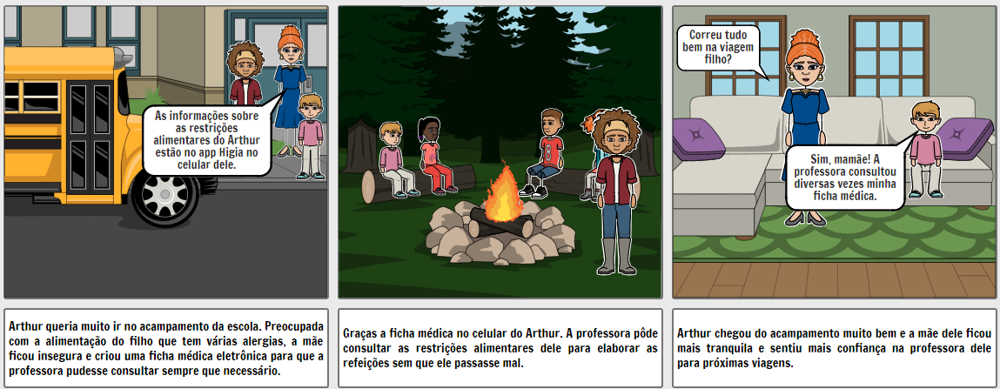
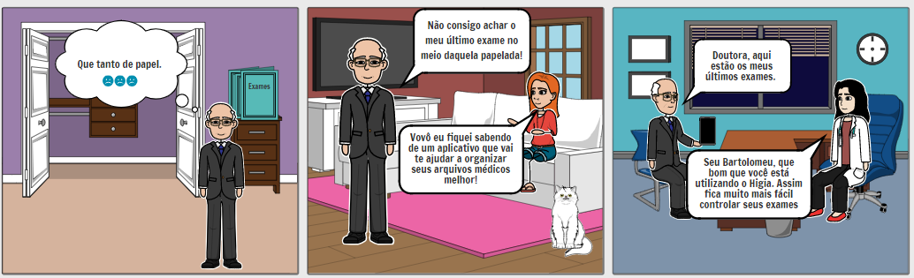

# Storyboard

## Históricos de Revisões

|    Data    | Versão |                   Descrição                    |                      Autor(es)                       |
| :--------: | :----: | :--------------------------------------------: | :--------------------------------------------------: |
| 10/02/2020 |  0.1   | Criação do documento e adição dos storyboards. |  [Ithalo Azevedo](https://github.com/ithaloazevedo)  |
| 11/02/2020 |  0.2   |            Adição dos storyboards.             | [Victor Cerqueira](https://github.com/VictorAmaralC) |
| 12/02/2020 |  1.0   | Revisão do documento e adição dos storyboards. |  [Ithalo Azevedo](https://github.com/ithaloazevedo)  |

## Introdução

Os storyboards são quadrinhos criados com o objetivo de elaborar e detalhar uma sequência narrativa. Essa ferramenta é muito utilizada em estúdios de animação para pré-visualizar filmes, em projetos de publicidade e, recentemente, é muito usado também na área de Engenharia de Software para fins de documentação. O principal objetivo é trazer a sequência narrativa de forma divertida, instigante e confortável para engajar o público.

## Metodologia

O storyboard foi criado através da ferramenta [Storyboard That](https://www.storyboardthat.com/pt) e utilizando as personas criadas pela equipe.

## Storyboards

- Criador: Ithalo Azevedo
  
- Criador: Ithalo Azevedo
  
- Criador: Victor Cerqueira
  
- Criador: Victor Cerqueira
  

## Referências

- StoryBoardThat. https://www.storyboardthat.com/pt. Ultimo acesso em: 11/02/2021.
- Storyboard: por que ele é essencial para a sua estratégia de Marketing Digital? https://rockcontent.com/br/blog/storyboard/. Último acesso em 10/02/2020.
