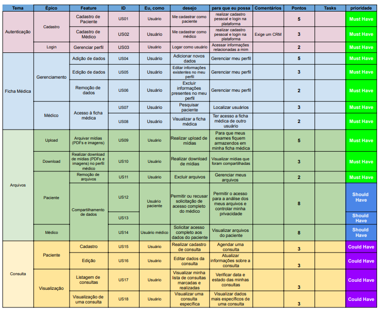

# Backlog do Produto

## Históricos de Revisões

|    Data    | Versão |                  Descrição                   |                     Autor(es)                       |
| :--------: | :----: | :------------------------------------------: | :------------------------------------------------:  |
| 13/02/2021 |  0.1   | Realização do backlog por meio de brainstorm |               Todos os integrantes                  |
| 15/02/2021 |  1.0   |             Criação do documento             | [Victor Amaral](https://github.com/VictorAmaralC)   |
| 02/03/2021 |  2.0   |  Criação e adição da versão 1.0 do backlog   | [Fellipe Araujo](https://github.com/fellipe-araujo) |

## Introdução

O Product Backlog é uma lista de funcionaidades desejadas de um produto, ou seja, os requisitos que um cliente espera receber ao final do projeto, descrito com sua própria linguagem. Ele cresce e muda à medida que se aprende mais sobre o produto e seus usuários.

## Backlog (V.1)

## Backlog (V.0)

## Referências
[1] YELLOW, Requisitos. Ágil, 2019, Disponível em: <https://yellow.netlify.app/modelagem/agil_v2/>. Acesso em: 15 de fevereiro, 2021.