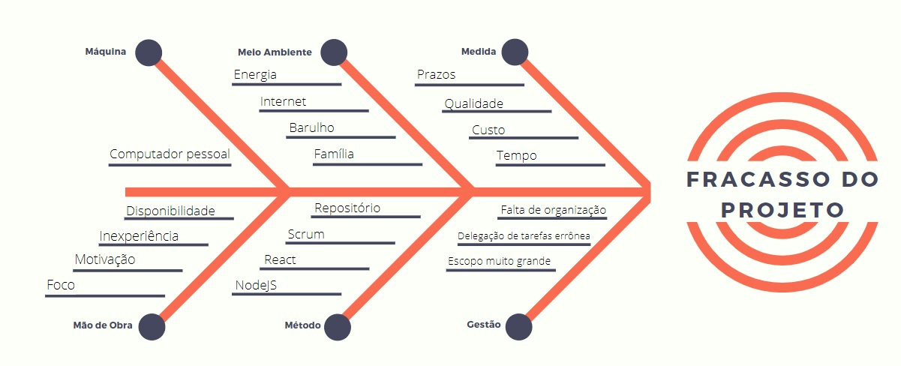
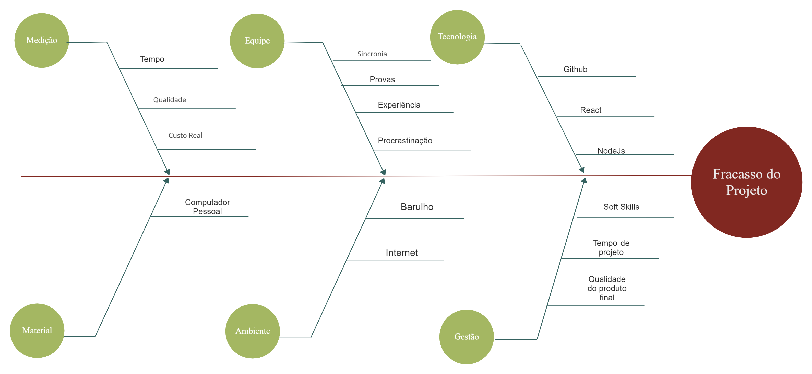

# Diagrama de Ishikawa

## Históricos de versões

|    Data    | Versão |       Descrição        |                                                Autor(es)                                                |
| :--------: | :----: | :--------------------: | :-----------------------------------------------------------------------------------------------------: |
| 11/02/2021 |  0.1   | Produção dos Diagramas | [Gabriel Hussein](https://github.com/GabrielHussein), [Victor Amaral](https://github.com/VictorAmaralc) |
| 15/02/2021 |  1.0   |  Criação do documento  |                            [Victor Amaral](https://github.com/VictorAmaralc)                            |

## Introdução

O diagrama de Ishikawa, também conhecido como diagrama de Causa-efeito, é uma forma de levantar os fatores e causas que levam a um determinado efeito, seja ele positivo ou negativo, a fim de se obter as informações necessárias para auxiliar na tomada de decisão de possíveis erros ou melhorias no projeto.

## Diagramas

Os diagramas produzidos tem como objetivo ilustrar possíveis causas que levariam ao fracasso do projeto.

Autor - Gabriel Hussein

Autor - Victor Amaral
## Referências

[1] ANDRADE, Luiza, Diagrama de ishikawa: O que é e como fazer, 2017. Disponível em: <www.siteware.com.br/metodologias/diagrama-de-ishkawa>. Acesso em: 10 de Feveiro de 2021.