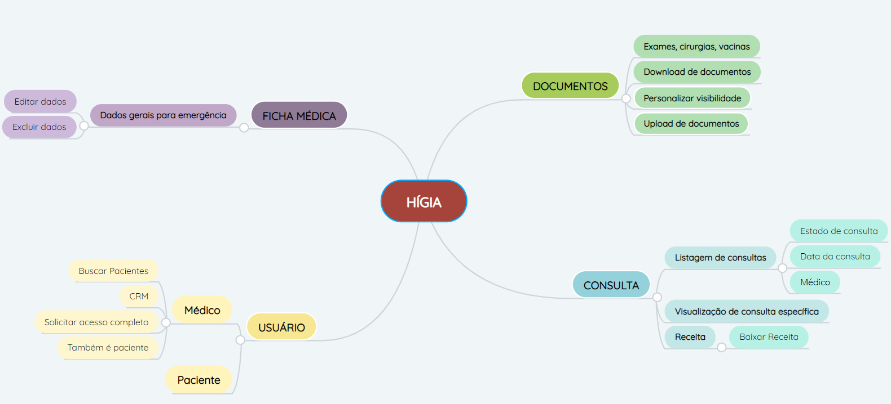

# Mapa Mental

## Históricos de Revisões

|    Data    | Versão |      Descrição       |                                             Autor(es)                                              |
| :--------: | :----: | :------------------: | :------------------------------------------------------------------------------------------------: |
| 10/02/2021 |  1.0   | Criação do documento | [Aline Lermen](https://github.com/AlineLermen) e [Gabriel Hussein](https://github.com/GabrielHussein) |

## Introdução

Mapa mental é uma técnica utilizada no início do projeto e tem como objetivo colocar as ideias no papel, em forma de desenhos e setas, facilitando associações entre as informações mais relevantes. Essa técnica ajuda a memorizar os pontos mais importantes do produto, e ajuda a trazer novas ideias ao projeto. Diferentemente do Rich Picture, mapa mental possui um tom mais livre de associação, dando autonomia para o membro em desenhar da forma que quiser.

## Mapa Mental Hígia

## Referências

- https://www.youtube.com/watch?v=m1qW0wPJV1M