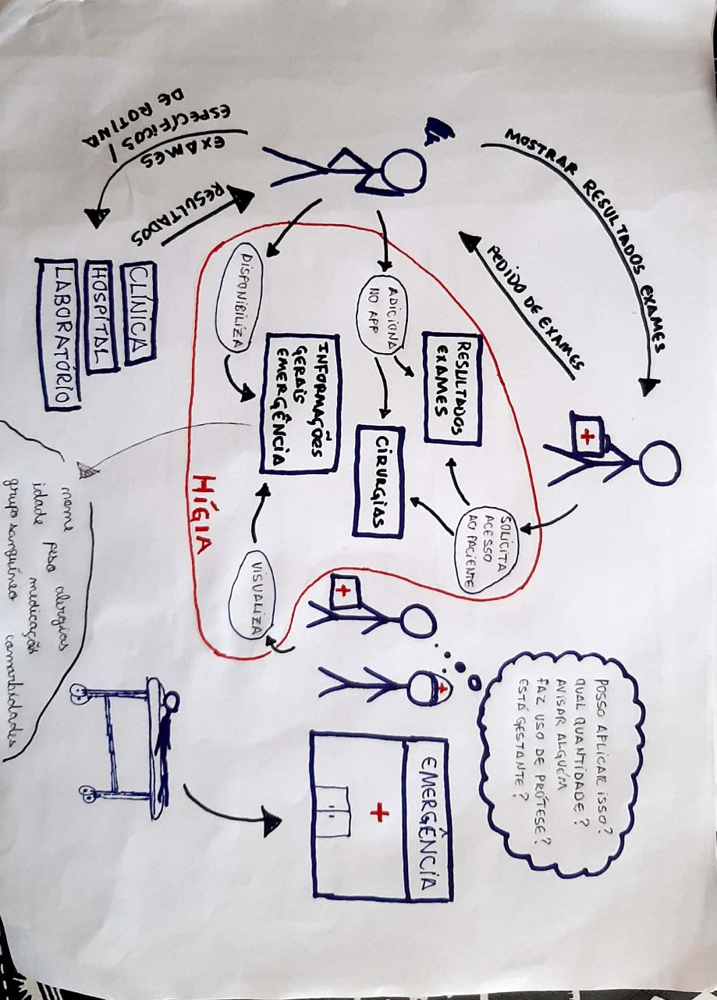
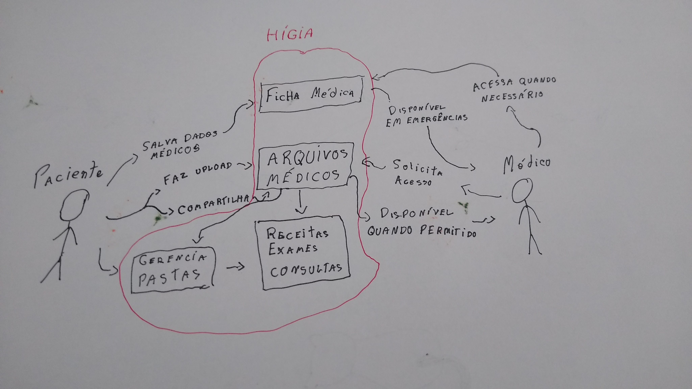
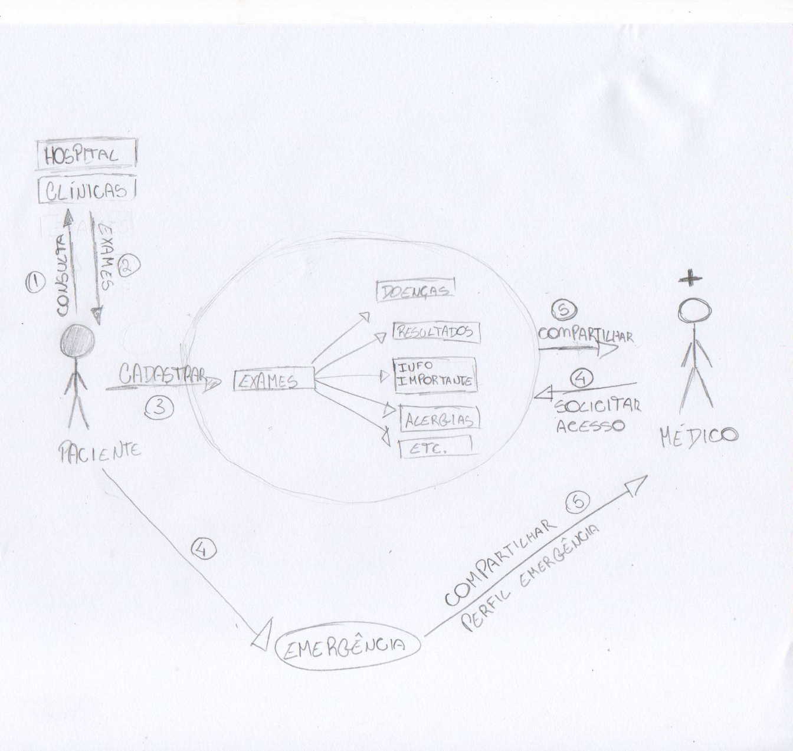
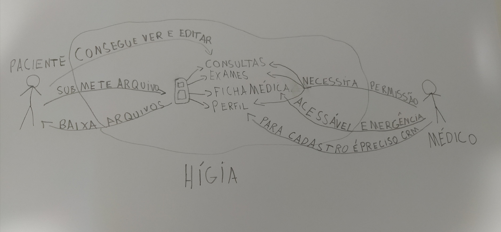
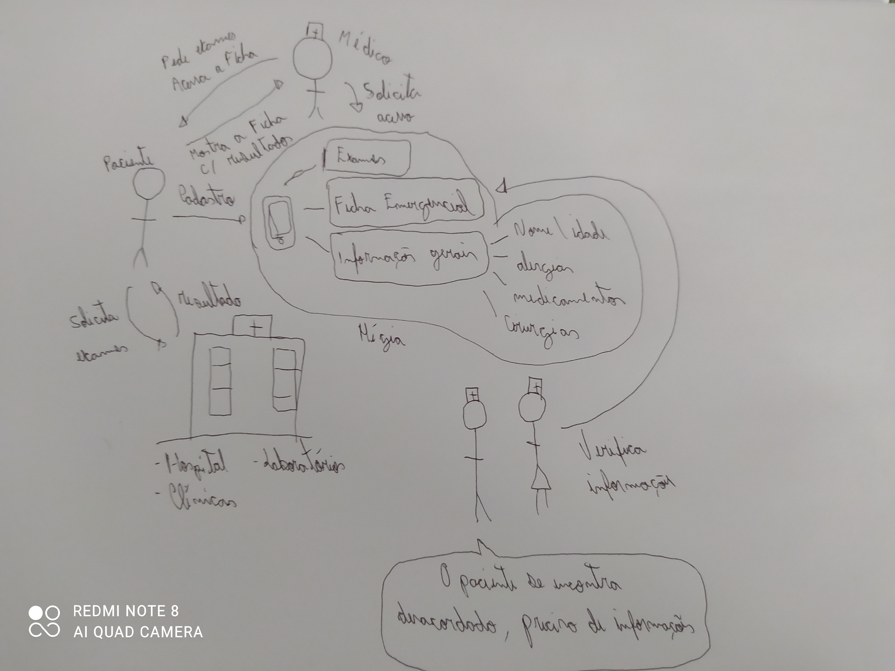

# Rich Picture

## Históricos de Revisões

|    Data    | Versão |          Descrição           |                   Autor(es)                    |
| :--------: | :----: | :--------------------------: | :--------------------------------------------: |
| 11/02/2021 |  0.1   | Elaboração dos rich pictures |              Todos os integrantes              |
| 15/02/2021 |  1.0   |     Criação do documento     | [Aline Lermen](https://github.com/AlineLermen) |
| 17/02/2021 |  1.0   |     Adição de mais Rich pictures     | [Arthur Paiva](https://github.com/ArthurPaivaT) |

## Introdução

Rich picture é uma técnica que tem como objetivo entender o processo da interação do usuário com o sistema. Através dele abstraimos em forma de diagramas e imagens as ações do usuário e os elementos do sistema envolvidos no processo. Cada integrante do grupo elaborou um rich picture.

### Aline Lermen

### Arthur Paiva

### Danillo Souza

### Fellipe Araujo

### Gabriel Hussein

### Ithalo Azevedo

### Victor Cerqueira

## Referências
- Rich Pictures: http://systems.open.ac.uk/materials/T552/pages/rich/richAppendix.html. Último acesso em: 13/02/2021.

