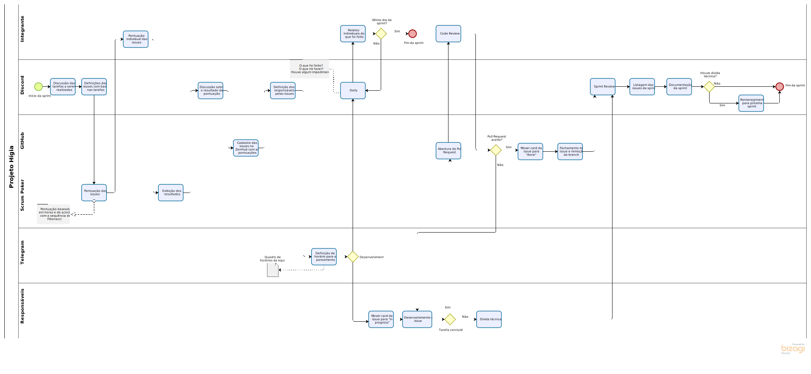

# BPMN

## Históricos de versões

|    Data    | Versão |                                      Descrição                                      |                                                                                                                             Autor(es)                                                                                                                              |
| :--------: | :----: | :---------------------------------------------------------------------------------: | :----------------------------------------------------------------------------------------------------------------------------------------------------------------------------------------------------------------------------------------------------------------: |
| 15/02/2021 |  0.1   |                                   Criação do BPMN                                   |                           [Danillo Souza](https://github.com/DanilloGS), [Fellipe Araujo](https://github.com/fellipe-araujo), [Gabriel Hussein](https://github.com/GabrielHussein) e [Ithalo Azevedo](https://github.com/ithaloazevedo)                            |
| 15/02/2021 |  1.0   |                                Criação do documento                                 | [Danillo Souza](https://github.com/DanilloGS),[Fellipe Araujo](https://github.com/fellipe-araujo), [Gabriel Hussein](https://github.com/GabrielHussein), [Ithalo Azevedo](https://github.com/ithaloazevedo) e [Victor Cerqueira](https://github.com/VictorAmaralC) |
| 02/03/2021 |  1.2   | Adição de informações sobre a metodologia e remoção de informações sobre os rituais |                                                                                                         [Ithalo Azevedo](https://github.com/ithaloazevedo)                                                                                                         |

## Introdução

BPMN (Business Process Model and Notation) é um conjunto de padrões gráficos e simbólicos utilizados para a representação e modelagem simplicada de processos. Por meio dessa representação, foi possível diagramar todo o processo das sprints do desenvolvimento do projeto Hígia.
Como o grupo a princípio não utiliza papéis da metodologia Scrum, Project Owner, Scrum Master, Dev Ops, etc.., os agentes, de forma geral, foram o time inteiro trabalhando em equipe por meio de reuniões, integrantes que tiveram algumas participações individuais além de algumas duplas ou trios em pareamentos.

## Metodologia 
O diagrama foi criado por 4 membros utilizando o software [Bizagi](bizagi.com). Durante o processo de criação buscamos identificar e representar todos os passos do nosso processo de trabalho.

## Referências
- **Notação BPMN**. Disponível em: https://www.heflo.com/pt-br/bpm/notacao-bpmn/. Último acesso em: 15 de fevereiro de 2021.
- **O que significa BPMN**. Disponível em: https://blog.smlbrasil.com.br/o-que-significa-bpmn/. Último acesso em: 15 de fevereiro de 2021.