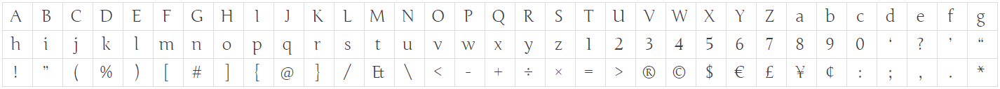
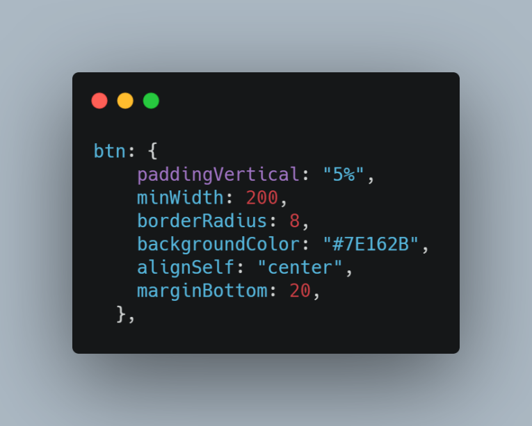

# Guia de estilo 

## Histórico de versionamento
|    Data    | Versão |      Descrição       |                                                                            Autor(es)                                                                            |
| :--------: | :----: | :------------------: | :-------------------------------------------------------------------------------------------------------------------------------------------------------------: |
| 26/03/2021 |  0.1   | Criação do documento | [Gabriel Hussein](https://github.com/GabrielHussein), [Ithalo Azevedo](https://github.com/ithaloazevedo) e [Victor Cerqueira](https://github.com/VictorAmaralC) |
| 26/03/2021 |  0.2   | Adição de imagens de grid e tipografia | [Gabriel Hussein](https://github.com/GabrielHussein) |
| 26/03/2021 |  0.3   | Adição de imagens de Paleta de cores, icones e componentes | [Victor Amaral](https://github.com/VictorAmaralC) |

## 1. Objetivo
O objetivo desse documento é apresentar a identidade visual do nosso projeto, as nossas escolhas de design e padronizar os componentes que serão utilizados no nosso software.

## 2. Identidade visual
A identidade visual do nosso projeto foi desenvolvida pensando em elementos da saúde. O nosso nome vem da deusa grega Hígia, deusa da preservação e da prevenção da saúde. Nos diferentes relatos, teve o nome escrito de outras formas, como Higeia, Higiia, Higieia e, em Roma, era chamada de Salus.
### 2.1 Nome
 
### 2.2 Logo

## 3. Elementos
### 3.1 Disposição espacial dos elementos
Os elementos são divididos em várias seções no grid. No topo há um header informando ao usuário em que local do aplicativo ele se encontra. Na parte inferior há uma bottom bar com as opções de diferentes telas do aplicativo. Caso o usuário se encontre em uma tela que não é a tela de usuário no canto superior esquerdo há a presença de um botão para voltar a tela anterior, já no canto superior direito há o botão de logout para caso o usuário deseje deslogar da aplicação. Botões são localizados na parte inferior da tela logo acima da bottom bar. Há também uso de modais que serão localizadas no centro da tela.

### 3.2 Tipografia
A tipografia auxiliar tem sua aplicabilidade em diversas situações, como em documentos oficiais, endereços, textos explicativos, envelopamento, silk-screen entre outros. Para isso foi-se optado pela fonte Junge em vários tamanhos diferentes para títulos e subtítulos de 16 a 24.

### 3.3 Cores
O padrão cromático da marca constitui um item fundamental para a Identidade Visual. Este é diretamente responsável por manter a coerência na aparência e na apresentação. O uso inadequado das cores diminui consideravelmente o impacto da marca.

#### 3.3.1 Paleta de cores

### 3.4 Ícones
Os ícones foram modelados para serem simples, modernos e amigáveis, cada ícone tem seu formato minimalista e expressa sua característica essencial. Para padronização do projeto os ícones que serão utilizados derivam da biblioteca MaterialIcons, nativa do react.

#### 3.4.1 Guia de ícones

### 3.5 Componentes
Para dar um aspecto mais amigável ao aplicativo foi adotada uma padronização mais suave dos componentes de projeto.

#### 3.5.1 Botões

#### 3.5.2 Header

### 3.5.3 Bottom Bar

## Referências
- Hígia. Acesso em:<https://pt.wikipedia.org/wiki/Hígia>. Último acesso em: 26/03/2021.
- Identidade visual. Acesso em: <https://rockcontent.com/br/blog/identidade-visual/>. Último acesso em: 26/03/2021.
- Fonte Junge. Acesso em: <https://fonts.google.com/specimen/Junge?preview.text_type=custom>. Último acesso em: 26/03/2021.
- Projeto Interação Humano-Computador CBM-DF. Acesso em: <https://interacao-humano-computador.github.io/2020.1-Corpo-De-Bombeiros-Militar-Do-Distrito-Federal/ponto_de_controle_3/Guia_Estilo/>. Último acesso em: 26/03/2021.
- Material Icons. Acesso em: <https://material.io/design/iconography/system-icons.html#design-principles>. Último acesso em: 26/03/2021.
