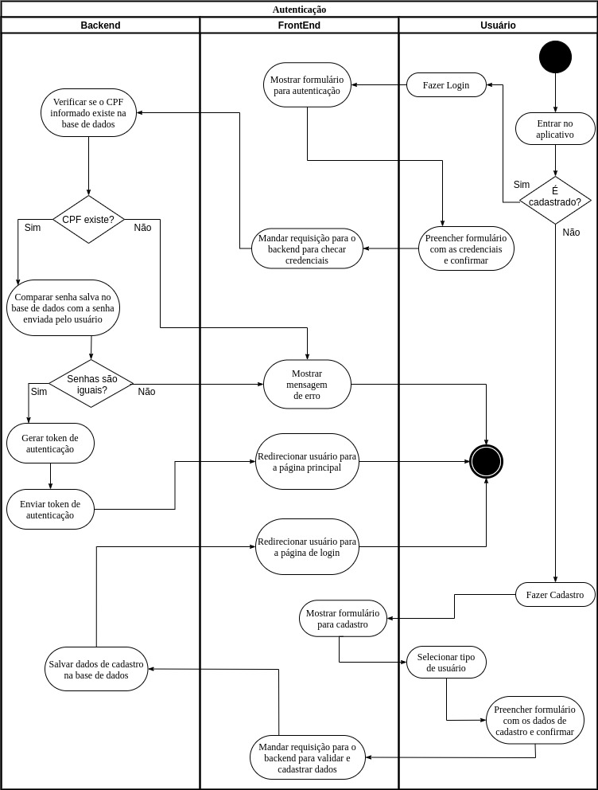
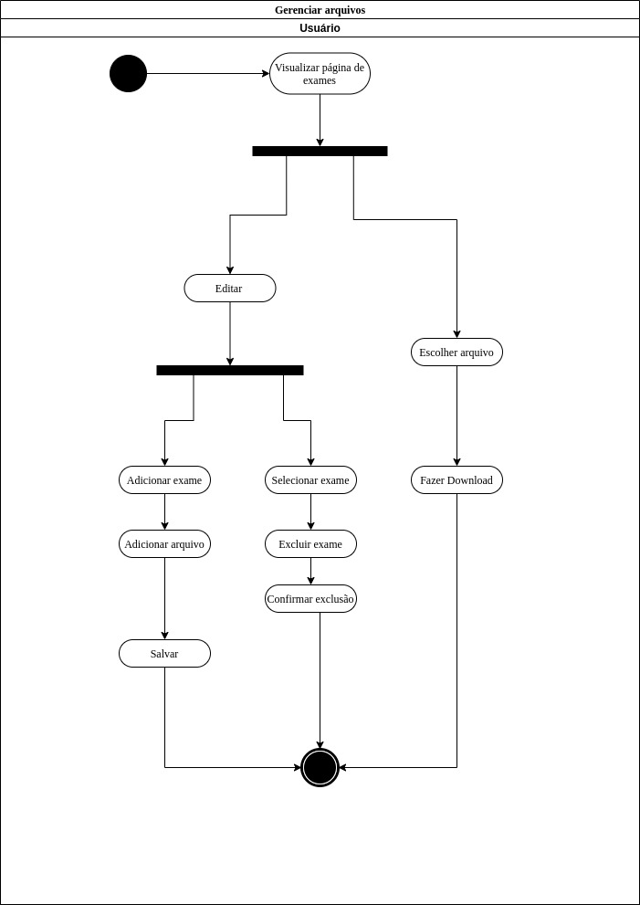
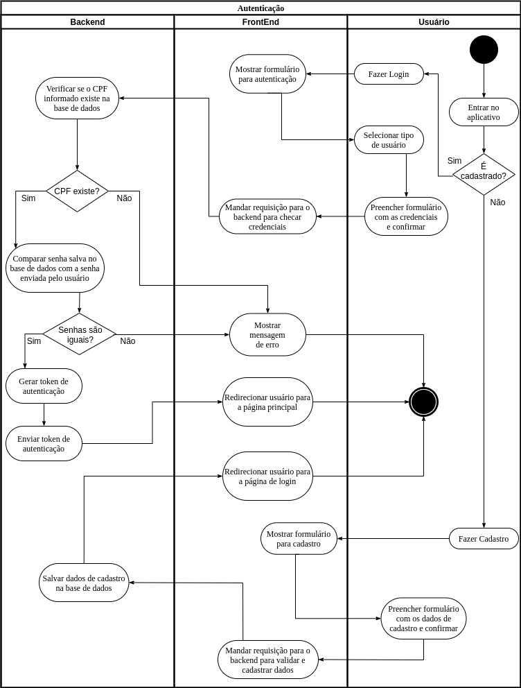
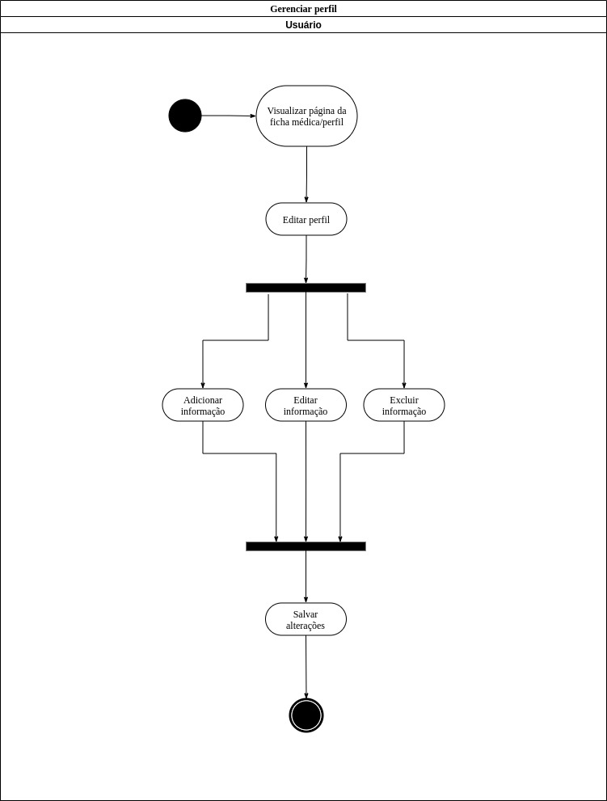
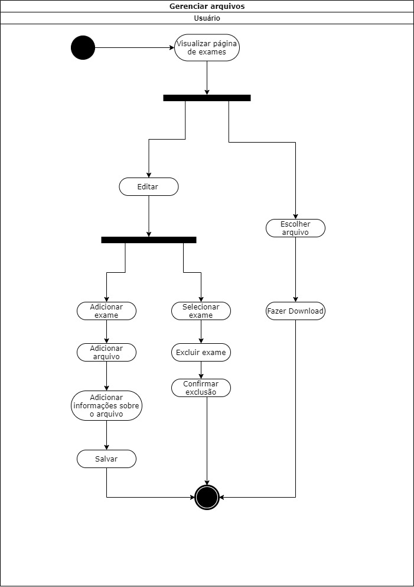
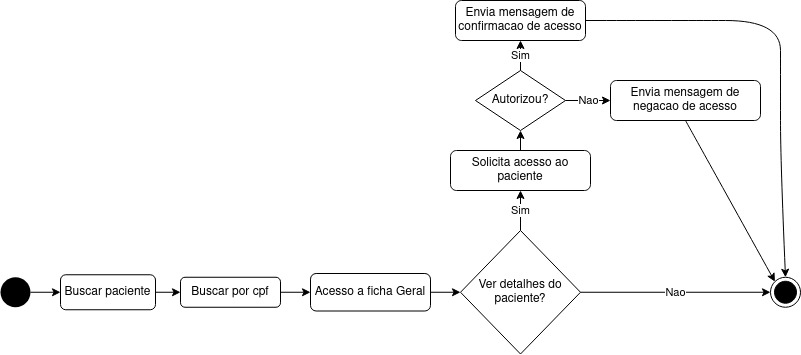

# Diagrama de Atividade

## Histórico de versionamento

|    Data    | Versão |                Descrição                 |                                              Autor(es)                                               |
| :--------: | :----: | :--------------------------------------: | :--------------------------------------------------------------------------------------------------: |
| 26/02/2021 |  0.1   |           Criação do documento           | [Victor Amaral](https://github.com/VictorAmaralc)|
| 26/02/2021 |  1.0   | Criação da primeira versão dos diagramas | [Aline Lermen](https://github.com/AlineLermen), [Ithalo Luiz](https://github.com/ithaloazevedo) e [Victor Amaral](https://github.com/VictorAmaralc) |
| 05/03/2021 |  1.1   | Revisão do documento | [Arthur Paiva](https://github.com/ArthurPaivaT), [Fellipe Araujo](https://github.com/fellipe-araujo) e [Victor Amaral](https://github.com/VictorAmaralc) |
| 05/04/2021 |  2.0   | Novas versões de diagramas | [Aline Lermen](https://github.com/AlineLermen), [Gabriel Hussein](https://github.com/GabrielHussein) |

## Introdução

Diagramas de atividade são considerados diagramas de comportamento, pois descrevem o que é necessário acontecer no sistema sendo modelado. Eles ajudam a unir as pessoas das áreas de negócios e de desenvolvimento de uma organização para entender o mesmo processo e comportamento. Os diagramas foram produzidos utilizando a ferramenta Draw.io. Eles descrevem ações consideradas essenciais para o nosso sistema, detalhadas em fluxos que podem se dividir entre raias de responsabilidade.

## Diagrama

### Autenticação (V.1)

Na autenticação de usuário foi alterado o fluxo de login e cadastro, uma vez que o usuário seleciona o tipo de usuário durante o cadastro e não durante o login.

### Gerenciar Arquivos (V.1)

No gerenciamento de arquivos o fluxo de upload de arquivos foi alterado pois não há personalização de dados do arquivo, o arquivo é salvo com o nome original em que foi enviado pelo usuário.

### Autenticação (V.0)

### Gerenciar Perfil (V.0)

### Gerenciar Arquivos (V.0)

### Busca (V.0)

## Referências

[1] **Oque e um diagrama de atividade**, Disponível em: <https://www.lucidchart.com/pages/pt/o-que-e-diagrama-de-atividades-uml> Acesso em: 26 de fevereiro, 2021.

[2] **Stock**, Disponível em: <<https://unbarqdsw.github.io/2020.1_G12_Stock/#/Project/Evaluation>>, Último acesso: 15 de fevereiro, 2021.