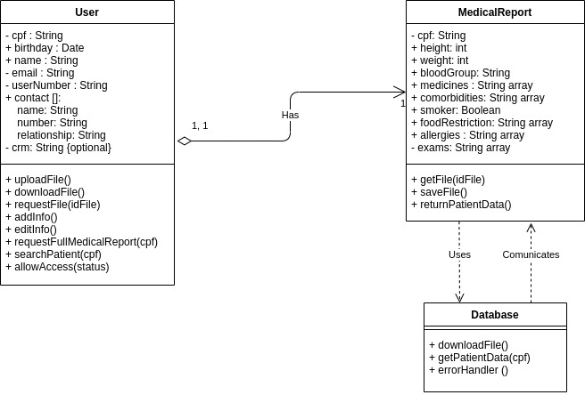
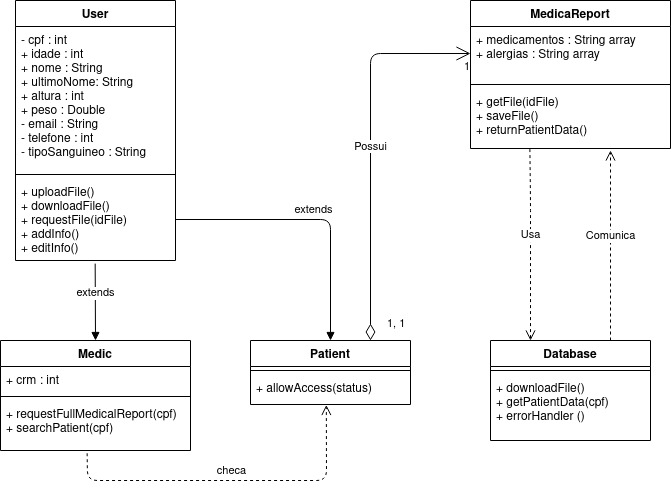

# Diagrama de Classe

## Histórico de versionamento

|    Data    | Versão |                Descrição                 |                                              Autor(es)                                               |
| :--------: | :----: | :--------------------------------------: | :--------------------------------------------------------------------------------------------------: |
| 01/03/2021 |  0.1   |           Criação do documento           | [Victor Amaral](https://github.com/VictorAmaralc)|
| 01/03/2021 |  1.0   | Criação da primeira versão do diagrama | [Victor Amaral](https://github.com/VictorAmaralc) |
| 04/03/2021 |  1.1   | Revisão do documento |[Aline Lermen](https://github.com/AlineLermen)  e [Gabriel Hussein](https://github.com/GabrielHussein)|
| 21/03/2021 |  1.2   | Refatoração do diagrama de classes |[Aline Lermen](https://github.com/AlineLermen)  e [Gabriel Hussein](https://github.com/GabrielHussein)|
| 05/04/2021 |  2.0   | Nova versão do diagrama de classes |[Aline Lermen](https://github.com/AlineLermen)  e [Gabriel Hussein](https://github.com/GabrielHussein)|

## Introdução

 &emsp;&emsp;
Diagramas de classes tem como principal objetivo mapear de forma clara a estrutura de um sistema, modelando suas classes, atributos, métodos, operações e relações entre objetos. Este diagrama auxilia no entendimento da visão geral dos esquemas da aplicação, expressa visualmente as necessidades específicas do sistema, além de ilustrar modelos de dados independente de sua complexidade.
Os diagramas foram produzidos utilizando a ferramenta Draw.io. Nele há todas as classes do nosso sistema, contendo seus atributos e métodos, sendo ocultados métodos auxiliares, além dos seus relacionamentos e cardinalidade.

## Diagrama

### V.3 
Uma nova classe foi introduzida, a classe Archive é a classe que realiza as funções de gerenciamento de arquivos do projeto.

### V.2 
Após o começo do desenvolvimento em código verificamos a necessidade de fazer algumas alterações no diagrama de classes para se adequar ao andamento do projeto, retiramos as heranças de usuário pois não havia atributo específico para paciente e condensamos médico e paciente na mesma classe com atributos opcionais para caso o usuário seja médico, também foram adicionados vários novos atributos a classe de ficha médica para refletir o que realmente será utilizado na aplicação.

### V.1
Após uma revisão foram feitas algumas alterações de nomenclatura.

### V.0

## Referências

[1] **Oque e um diagrama de Classe UML**, Disponível em: <https://www.lucidchart.com/pages/pt/o-que-e-diagrama-de-classe-uml> Acesso em: 01 de março, 2021.

[2] **Stock**, Disponível em: <<https://unbarqdsw.github.io/2020.1_G12_Stock/#/Modeling/Diagrams/Classes>>, Último acesso: 01 de março, 2021.