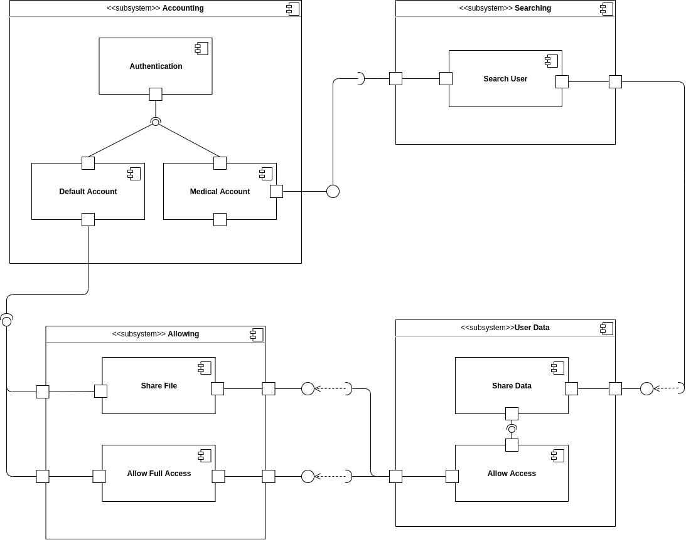
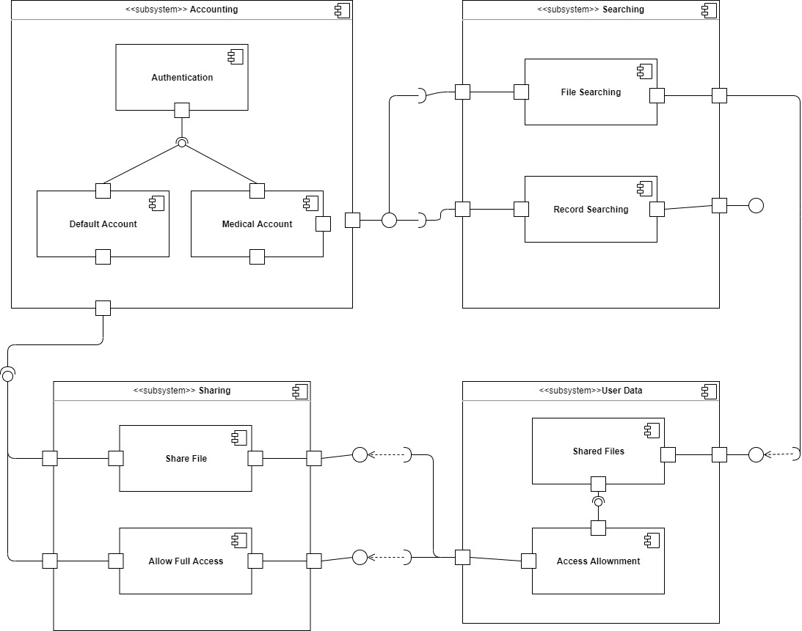

# Diagrama de Componentes

## Histórico de versões

|    Data    | Versão |                  Descrição                  |                                              Autor(es)                                               |
| :--------: | :----: | :-----------------------------------------: | :--------------------------------------------------------------------------------------------------: |
| 01/03/2021 |  0.1   |            Criação do documento             |                           [Arthur Paiva](https://github.com/ArthurPaivaT)                            |
| 01/03/2021 |  0.2   |          Adição da v0 do Diagrama           |                           [Arthur Paiva](https://github.com/ArthurPaivaT)                            |
| 01/03/2021 |  1.0   |         Adição da Metodologia usada         |                           [Arthur Paiva](https://github.com/ArthurPaivaT)                            |
| 05/03/2021 |  1.1   |             Documento revisado              |  [Danillo Souza](https://github.com/DanilloGS) e [Ithalo Azevedo](https://github.com/ithaloazevedo)  |
| 05/03/2021 |  2.0   |     Adicionado nova versão do diagrama      |  [Danillo Souza](https://github.com/DanilloGS) e [Ithalo Azevedo](https://github.com/ithaloazevedo)  |
| 05/04/2021 |  2.1   | Revisando textos e composição dos diagramas | [Aline Lermen](https://github.com/AlineLermen), [Gabriel Hussein](https://github.com/GabrielHussein) |

## Introdução

Diagrama de componentes descreve como os componentes são conectados para formar componentes maiores ou sistemas de software. Eles são usados ​​para ilustrar a estrutura de sistemas arbitrariamente complexos. Seus principais benefícios são a atenção que a equipe prestará ao comportamento do serviço quanto à interface, além de imaginar a estrutura lógica dos componentes do sistema e de como eles se relacionam. Para elaborar o diagrama de componentes, tentamos identificar a comunicação entre os componentes do sistema durante os processos da aplicação e utilizamos o draw.io para representar eles graficamente.

## Diagrama de Componentes(V.1)

## Diagrama de Componentes (V.0)

## Referências

- UML Diagrams: https://www.uml-diagrams.org. Último acesso em 01/03/2021.
