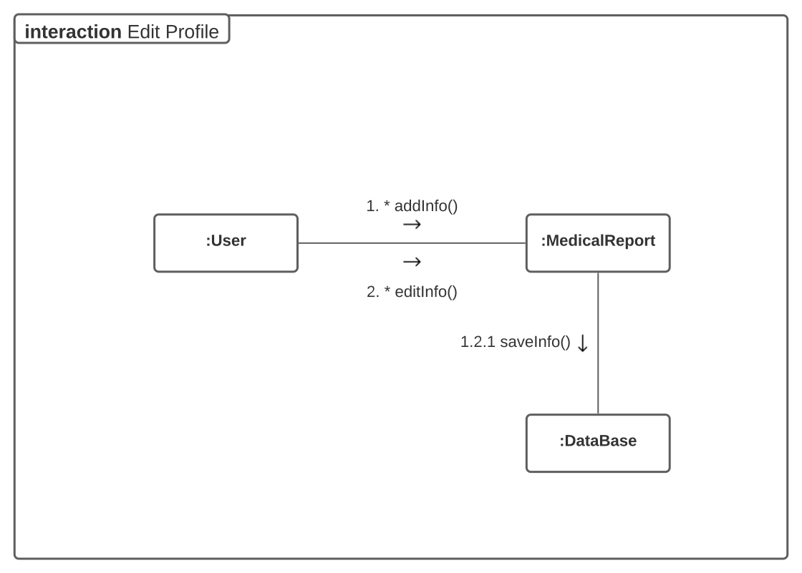
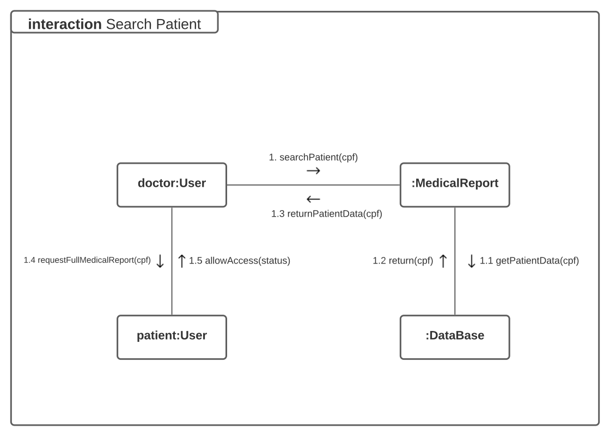
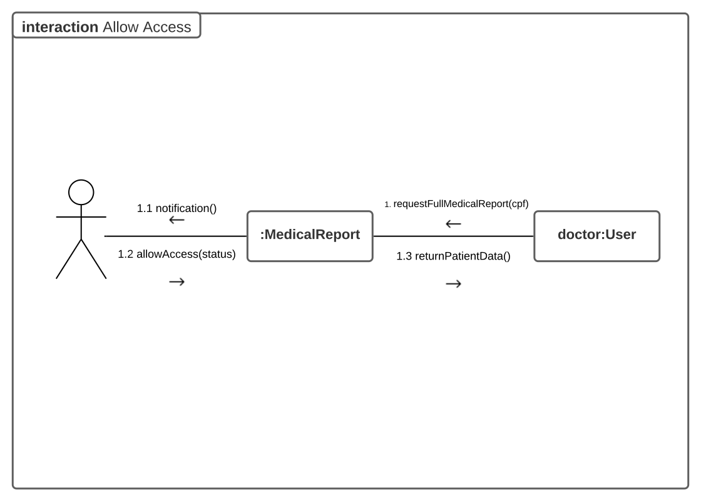
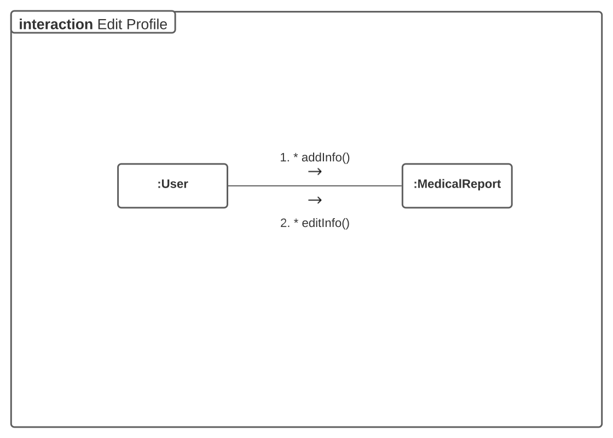
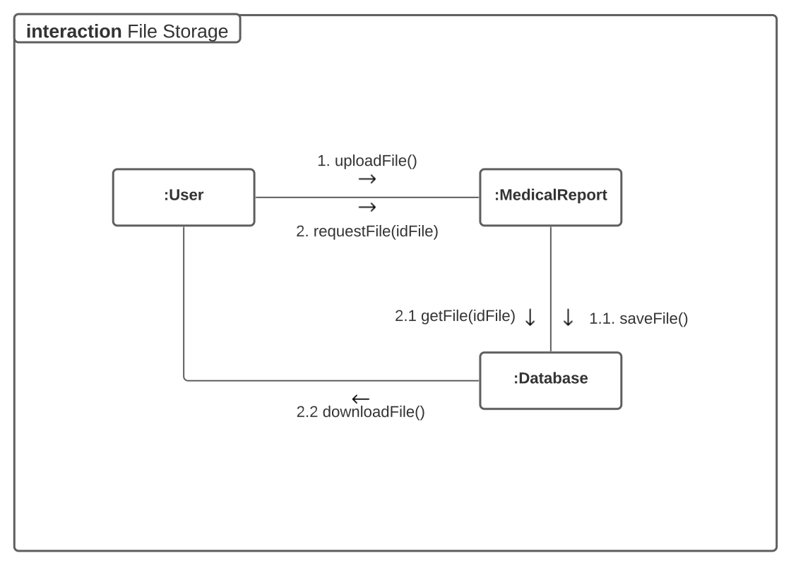
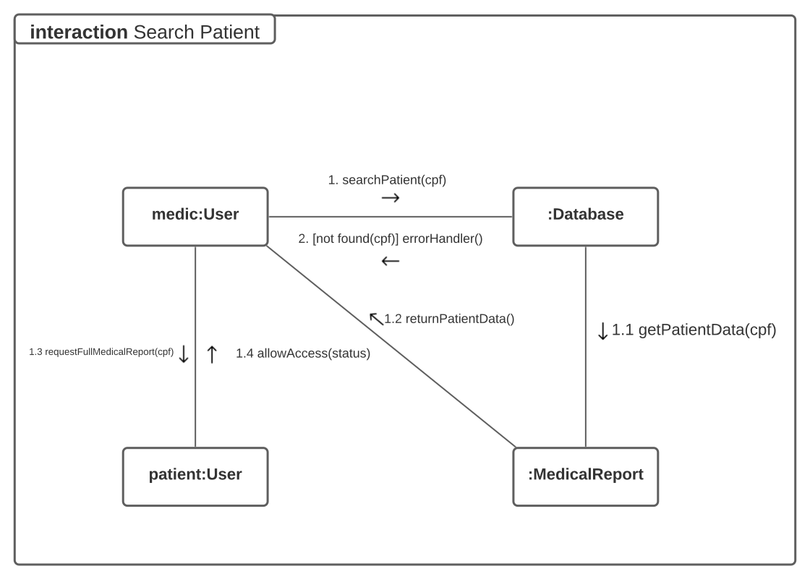

# Diagrama de comunicação

## Histórico de versões

|    Data    | Versão |                           Descrição                            |                                                                        Autor(es)                                                                         |
| :--------: | :----: | :------------------------------------------------------------: | :------------------------------------------------------------------------------------------------------------------------------------------------------: |
| 25/02/2021 |  0.1   |                      Criação do documento                      |                           [Danillo Souza](https://github.com/DanilloGS) e [Gabriel Hussein](https://github.com/GabrielHussein)                           |
| 25/02/2021 |  1.0   |            Criação da primeira versão dos diagramas            |                           [Danillo Souza](https://github.com/DanilloGS) e [Gabriel Hussein](https://github.com/GabrielHussein)                           |
| 02/03/2021 |  1.1   |         Alteração do diagrama de editar perfil médico          |                           [Danillo Souza](https://github.com/DanilloGS) e [Gabriel Hussein](https://github.com/GabrielHussein)                           |
| 02/03/2021 |  1.2   | Alteração do diagrama de buscar paciente e permissão de acesso |                           [Danillo Souza](https://github.com/DanilloGS) e [Gabriel Hussein](https://github.com/GabrielHussein)                           |
| 05/03/2021 |  1.3   |                      Revisão do documento                      | [Arthur Paiva](https://github.com/ArthurPaivaT), [Fellipe Araujo](https://github.com/fellipe-araujo) e [Victor Amaral](https://github.com/VictorAmaralc) |

## Introdução

O diagrama de comunicação, também conhecido como diagrama de colaboração, é um diagrama UML, esse diagrama serve para mostrar o funcionamento de diversas funcionalidades da aplicação via demonstração da interação entre os objetos e suas partes e o comportamento de diferentes fluxos. É equivalente ao diagrama de sequência mas sem os mecanismos de estrutura.

## Diagramas

### Editar perfil médico (V.1)

### Buscar Paciente (V.1)

### Permissão de acesso (V.1)

### Editar perfil médico (V.0)

### Gerenciamento de arquivos (V.0)

### Buscar paciente (V.0)

### Permissão de acesso (V.0)

## Referências

[1] **UML Communication Diagrams Overview**, Disponível em: <https://www.uml-diagrams.org/communication-diagrams.html> Acesso em: 25 de fevereiro, 2021.

[2] **Stock**, Disponível em: <<https://unbarqdsw.github.io/2020.1_G12_Stock/#/Modeling/Diagrams/Comunicacao>>, Último acesso: 25 de fevereiro, 2021.