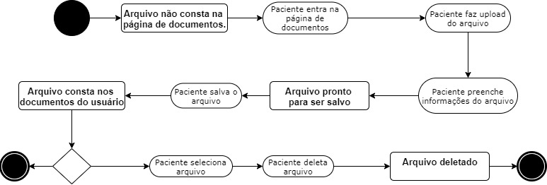
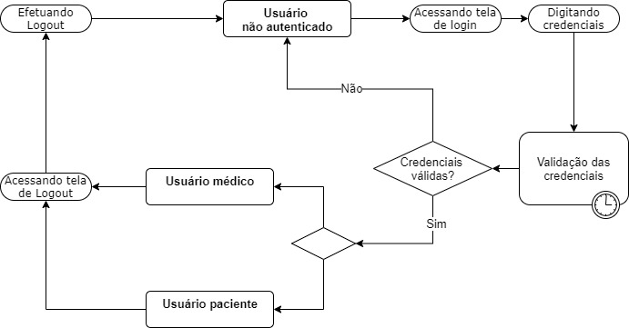
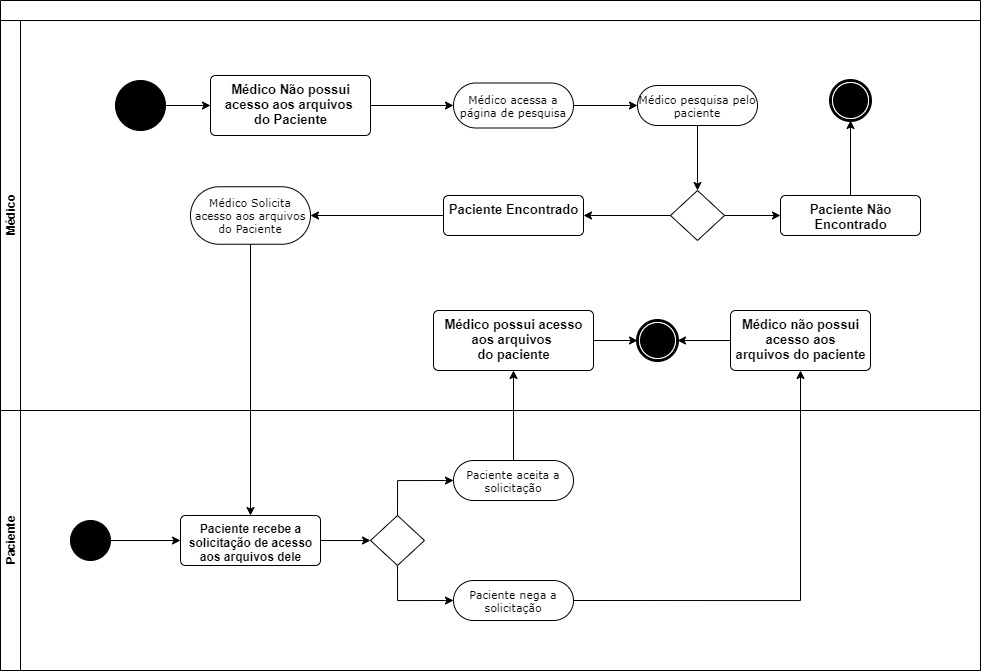

# Diagramas de Estado

## Histórico de versionamento

|    Data    | Versão |        Descrição         |                                              Autor(es)                                               |
| :--------: | :----: | :----------------------: | :--------------------------------------------------------------------------------------------------: |
| 27/02/2021 |  0.1   | Elaboração dos diagramas | [Arthur Paiva](https://github.com/ArthurPaivaT),  [Ithalo Azevedo](https://github.com/ithaloazevedo) |
| 28/02/2021 |  1.0   |   Criação do documento   | [Arthur Paiva](https://github.com/ArthurPaivaT), [Ithalo Azevedo](https://github.com/ithaloazevedo)  |
| 01/03/2021 |  1.1   | Revisão do documento e adição de referências | [Arthur Paiva](https://github.com/ArthurPaivaT) |
| 05/03/2021 |  1.2   | Revisão do documento | [Arthur Paiva](https://github.com/ArthurPaivaT), [Fellipe Araujo](https://github.com/fellipe-araujo) e [Victor Amaral](https://github.com/VictorAmaralc) |
| 05/04/2021 |  2.0   | Novas versões de diagramas | [Aline Lermen](https://github.com/AlineLermen), [Gabriel Hussein](https://github.com/GabrielHussein) |

## Introdução

Os diagramas de estado são representações dos estados de um objeto durante o seu ciclo de vida. Através deles, podemos modelar todos os possivéis estados de um objeto nos processos de um sistema e as ações que levam a transição dos estados. Para elaborar os diagramas de estado, tentamos identificar os principais objetos que transitam entre estados durante os processos do nosso sistema e utilizamos o [draw.io](https://app.diagrams.net) para representar eles graficamente.

## Diagramas

### Diagrama de  Arquivos (V.1)

No diagrama de arquivos houve alterações para retirar a seção de preenchimento de informações do arquivo uma vez que o arquivo é salvo com o nome original enviado pelo usuário e também foi adicionada uma nova seção para o download de arquivos.

### Diagrama de  Autenticação (V.0)

### Diagrama de  Arquivos (V.0)

### Diagrama de  Solicitação (V.0)

## Referências
UML Diagrams: https://www.uml-diagrams.org. Último acesso em 01/03/2021.