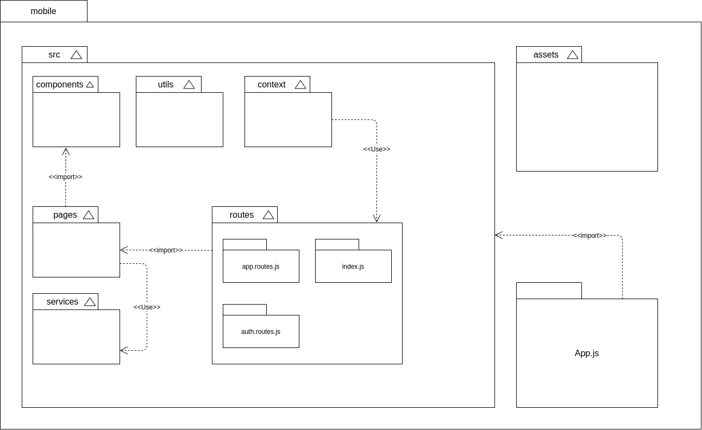
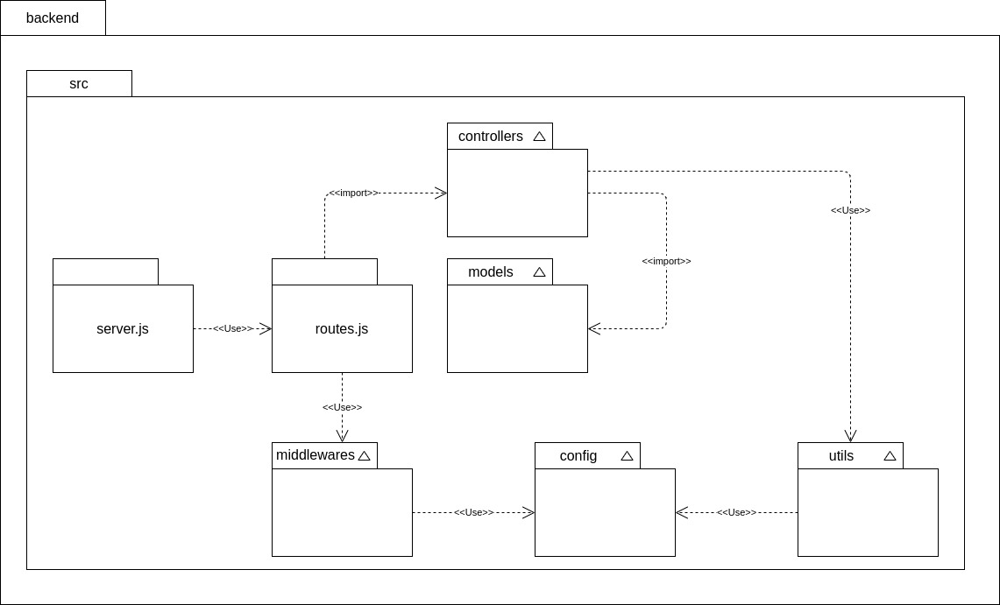

# Diagrama de Pacotes

## Histórico de Revisões

|  Data  | Versão | Descrição | Autor(es) |
| :----: | :----: | :-------: | :-------: |
| 27/02/2021 | 0.1 | Elaboração da versão V.0 dos diagramas mobile e backend | [Fellipe Araujo](https://github.com/fellipe-araujo) |
| 01/03/2021 | 0.2 | Criação do Documento | [Fellipe Araujo](https://github.com/fellipe-araujo) |

## Introdução

 &emsp;&emsp;
Diagramas de Pacotes são diagramas estruturais e também estáticos que usados para mostrar, em uma forma de pacotes, a organização e disposição de vários elementos de modelos. Os diagramas de pacotes são bastantes utilizados para proporcionar uma organização visual de uma arquitetura em camadas de qualquer classificador UML como, por exemplo, um sistema de software. Para o projeto Hígia, foi feita uma divisão entre mobile e backend para a análise de cada um deles, os quais irão apresentar a estrutura de diretórios e arquivos.

## Diagramas

### Diagrama de Pacotes - Mobile (V.0)

### Diagrama de Pacotes - Backend (V.0)

## Referências

Tudo sobre diagramas de pacotes UML. **Lucidchart**, c2021. Disponível em: https://www.lucidchart.com/pages/pt/diagrama-de-pacotes-uml . Acesso em: 27 fev. 2021.