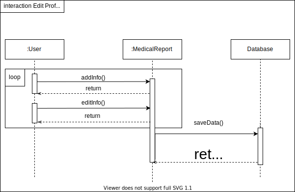

# Diagrama de sequência

## Histórico de versionamento

|    Data    | Versão |                Descrição                 |                                              Autor(es)                                               |
| :--------: | :----: | :--------------------------------------: | :--------------------------------------------------------------------------------------------------: |
| 01/02/2021 |  0.1   |           Criação do documento           | [Danillo Souza](https://github.com/DanilloGS) e [Gabriel Hussein](https://github.com/GabrielHussein) |
| 02/02/2021 |  1.0   | Criação da primeira versão dos diagramas | [Danillo Souza](https://github.com/DanilloGS) e [Gabriel Hussein](https://github.com/GabrielHussein) |

## Introdução

## Diagramas V0

### Editar perfil médico

### Gerenciamento de arquivos

## Referências

[1] **Stock**, Disponível em: <<https://unbarqdsw.github.io/2020.1_G12_Stock/#/Project/Evaluation>>, Último acesso: 15 de fevereiro, 2021.