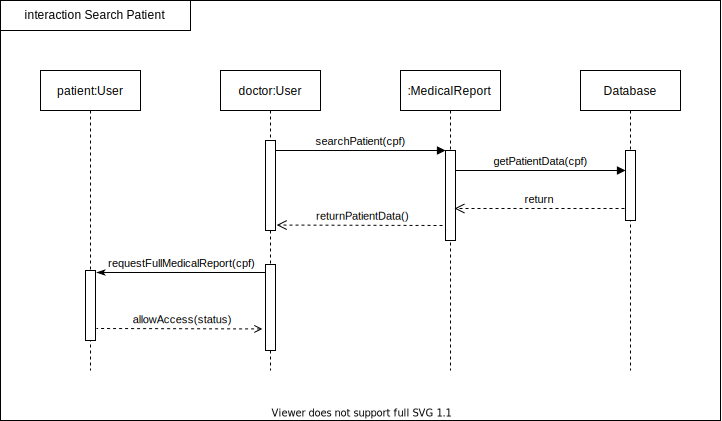
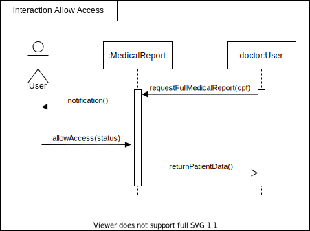

# Diagrama de sequência

## Histórico de versionamento

|    Data    | Versão |                Descrição                 |                                              Autor(es)                                               |
| :--------: | :----: | :--------------------------------------: | :--------------------------------------------------------------------------------------------------: |
| 01/02/2021 |  0.1   |           Criação do documento           | [Danillo Souza](https://github.com/DanilloGS) e [Gabriel Hussein](https://github.com/GabrielHussein) |
| 02/03/2021 |  1.0   | Criação da primeira versão dos diagramas | [Danillo Souza](https://github.com/DanilloGS) e [Gabriel Hussein](https://github.com/GabrielHussein) |
| 02/03/2021 |  1.1   | Adição da introdução e correção das datas de versão | [Danillo Souza](https://github.com/DanilloGS) e [Gabriel Hussein](https://github.com/GabrielHussein) |
| 05/03/2021 |  1.2   | Revisão do documento | [Arthur Paiva](https://github.com/ArthurPaivaT), [Fellipe Araujo](https://github.com/fellipe-araujo) e [Victor Amaral](https://github.com/VictorAmaralc) |

## Introdução

O diagrama de sequência é um diagrama de interação dinâmica que serve para mostrar o funcionamento de diversas funcionalidades da aplicação detalhando como essas funcionalidades são realizadas. Pelo diagrama de sequência ser equivalente ao de comunicação esse detalhamento é feito de forma similar em relação a demonstrar a interação entre os objetos e suas partes e o comportamento de diferentes fluxos. É focado em mostrar o tempo de execução de cada parte assim como a ordem em que os objetos interagem usando uma visualização vertical de barras.

## Diagramas

### Editar perfil médico (V.0)

### Gerenciamento de arquivos (V.0)

### Buscar paciente (V.0)

### Permissão de acesso (V.0)

## Referências

[1] **Stock**, Disponível em: <<https://unbarqdsw.github.io/2020.1_G12_Stock/#/Modeling/Diagrams/Sequencia>>, Último acesso: 02 de março, 2021.

[2] **Tutorial do Diagrama de Sequência: Guia completo com exemplos**, Disponível em:<<https://creately.com/blog/pt/diagrama/tutorial-do-diagrama-de-sequencia/>>, Último acesso: 02 de março, 2021.