# GoFs Comportamentais

## Histórico de versionamento

|    Data    | Versão |                  Descrição                  |                                                                      Autor(es)                                                                       |
| :--------: | :----: | :-----------------------------------------: | :--------------------------------------------------------------------------------------------------------------------------------------------------: |
| 22/03/2021 |  0.1   |   Criação do documento GoF Comportamental   | [Arthur Paiva](https://github.com/arthurpaivat), [Aline Lermen](https:/github.com/alinelermen) e [Fellipe Araujo](https://github.com/fellipe-araujo) |
| 22/03/2021 |  0.2   |       Adição de exemplos da aplicação       | [Arthur Paiva](https://github.com/arthurpaivat), [Aline Lermen](https:/github.com/alinelermen) e [Fellipe Araujo](https://github.com/fellipe-araujo) |
| 22/03/2021 |  0.3   |              Adição de imagens              | [Arthur Paiva](https://github.com/arthurpaivat), [Aline Lermen](https:/github.com/alinelermen) e [Fellipe Araujo](https://github.com/fellipe-araujo) |
| 23/03/2021 |  0.4   | Introdução do state e adição de referências |                     [Gabriel Hussein](https://github.com/GabrielHussein) e [Victor Cerqueira](https://github.com/VictorAmaralC)                      |
| 23/03/2021 |  0.5   |    Adição de imagens e suas explicações     |                     [Gabriel Hussein](https://github.com/GabrielHussein) e [Victor Cerqueira](https://github.com/VictorAmaralC)                      |
| 23/03/2021 |  0.6   |  Adicionados pontos positivos e negativos   |                     [Gabriel Hussein](https://github.com/GabrielHussein) e [Victor Cerqueira](https://github.com/VictorAmaralC)                      |
| 25/03/2021 |  1.0   | Adicionando GoFs criacionais não utilizados | [Aline Lermen](https://github.com/AlineLermen), [Danillo Souza](https://github.com/danillogs) e [Gabriel Hussein](https://github.com/GabrielHussein) |
| 26/03/2021 |  1.1   |            Adicionando GoF extra            |                           [Danillo Souza](https://github.com/danillogs) e [Arthur Paiva](https://github.com/ArthurPaivaT)                            |

## GoFs utilizados

### Observer

 &emsp;&emsp;
O padrão GoF Observer é um padrão de projeto comportamental que permite definir um mecanismo de assinatura para notificar múltiplos objetos sobre quaisquer eventos que aconteçam com o objeto que eles estão observando.

 
#### Diagrama Genérico
 
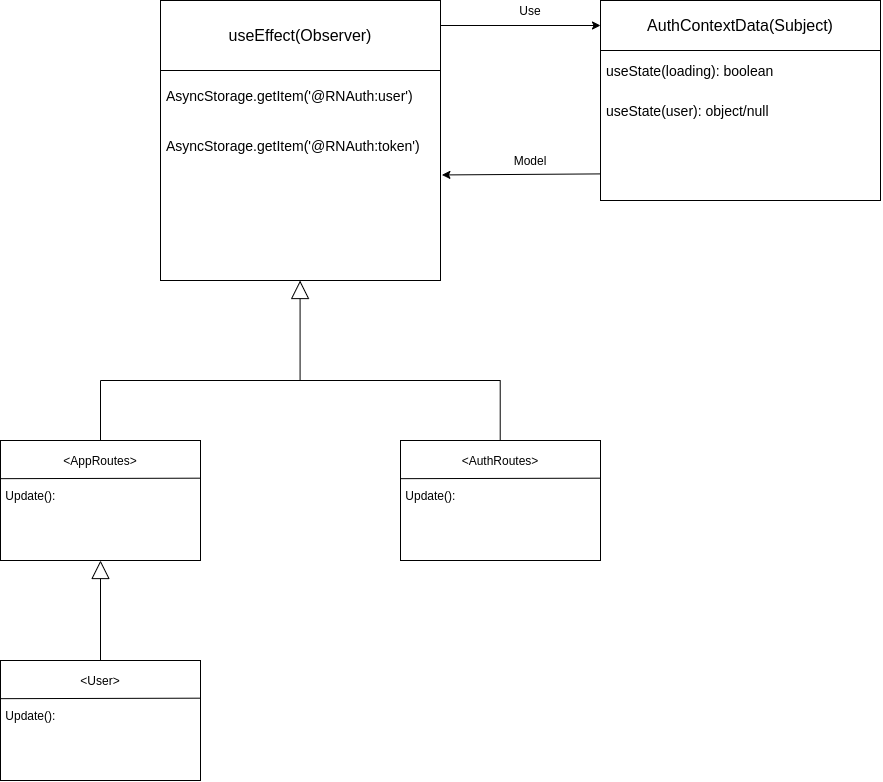
 
#### Pontos positivos
 
- _Princípio aberto/fechado_. É possível introduzir novas classes assinantes sem ter que mudar o código da publicadora (e vice versa se existe uma interface publicadora);
- É possível estabelecer relações entre objetos durante a execução.
 
#### Pontos negativos
 
- Os assinantes são notificados em ordem aleatória.
 
#### Aplicação
 
- Subject
 
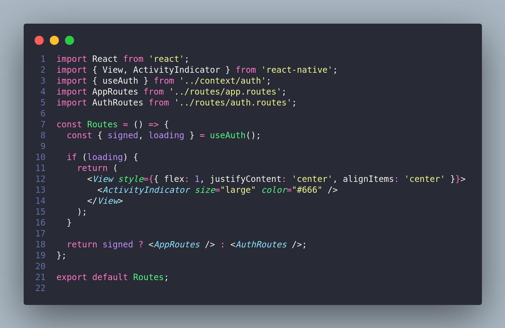
 
- Controller
 
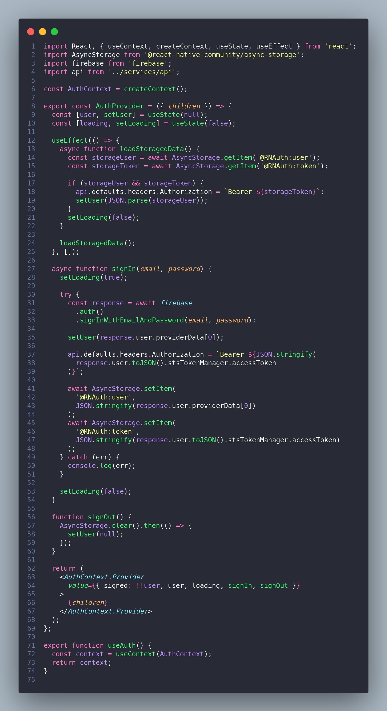
 
### State
 

 &emsp;&emsp;
O State é um padrão de projeto de comportamento que permite alterar o comportamento de um objeto quando seu estado interno muda. Sua ideia principal é que, dado um momento qualquer, existe um número finito de estados do qual o programa pode se encontrar. A partir de um único estado, o programa pode se comportar de diferentes maneiras, e também pode alterar seu estado instantaneamente. Contudo, dependendo do estado atual em que se encontra, o programa pode ou não ir para certos estados pré-definidos.

 
#### Exemplo
 
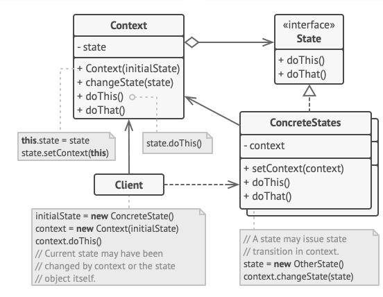
 
Como ilustrado no diagrama acima, o State exige uma mudança de comportamento para que se possa tomar uma decisão do que fazer em relação ao estado atual da aplicação.
 
#### Aplicação - Tela de login
 
Dentro do Hígia usaremos o State com a função do React Native useState em diversas partes do projeto, o useState é utilizado para alterar o estado interno de uma variável, para fins de exemplificação usaremos o sistema de login, que é uma maneira simplificada de ilustrar o padrão de projeto de comportamento State.
 
#### Declaração do useState
 
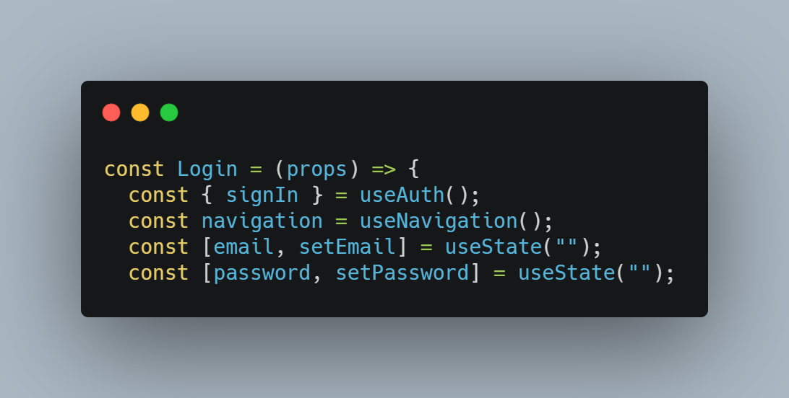
 
#### Manipulação do useState
 
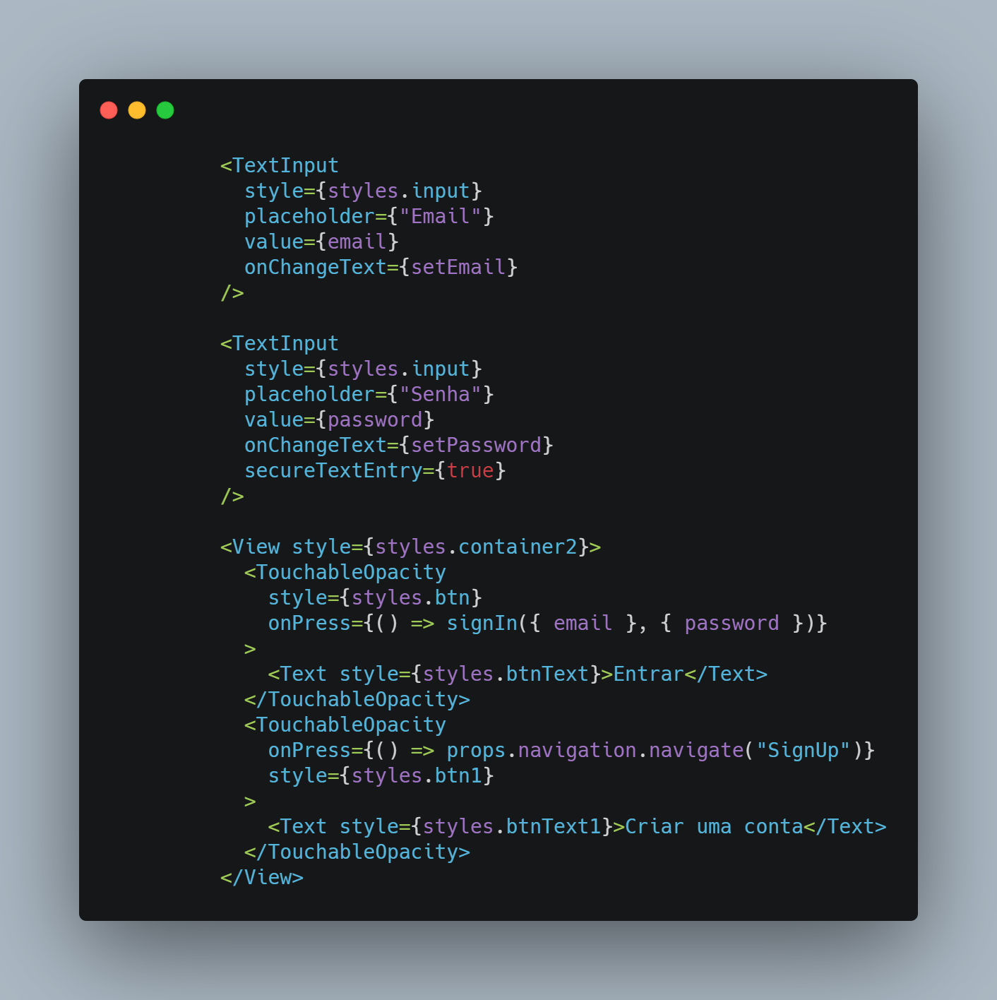
 
Como se pode ver, ao acessar com suas credenciais, o usuário muda o estado do programa para ativo, gerando um token de login para o usuário logado, que servirá para manter a área de acesso do usuário (ficha médica, pesquisa, configurações, funcionalidades em geral) acessível.
 
### Pontos positivos
 
- Os estados podem ser melhor codificados sem a necessidade de ficar duplicando código.
- Simplificação de código.
- Organização de código relacionado a estados particulares em classes separadas.
 
### Pontos negativos
 
- Aplicar o padrão pode ser um exagero se existem apenas algumas mudanças de estado ou um leque limitado de estados diferentes.
- Pode ser misturado e confundido com o padrão de projeto Strategy.
- Dependendo do tamanho das condições dos estados e o número de estados diferentes o código pode se tornar difícil de realizar manutenções.
 
## GoF extra
 
### Chain of Responsability
 

 &emsp;&emsp;
É um padrão de projeto comportamental que permite que você passe pedidos por uma corrente de handlers. Ao receber um pedido, cada handler decide se processa o pedido ou o passa adiante para o próximo handler na corrente.

 
#### Exemplo
 
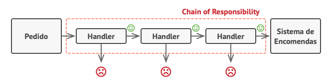
 
Como observado no exemplo, o Chain of Responsability passa o pedido por vários handlers, caso os dados estejam corretos o comportamento padrão é utilizado, caso algo esteja errado o handler impede o resto do processo de continuar.
 
#### Aplicação - Verificação de Autenticação
 

 &emsp;&emsp;
O padrão Chain of Responsibility está sendo usado com um handler de verificação de permissão de acesso, o handler verifica se a autenticação do usuário é válida e só então passa adiante para o próximo handler que irá efetuar a requisição.

 
#### Middleware
 
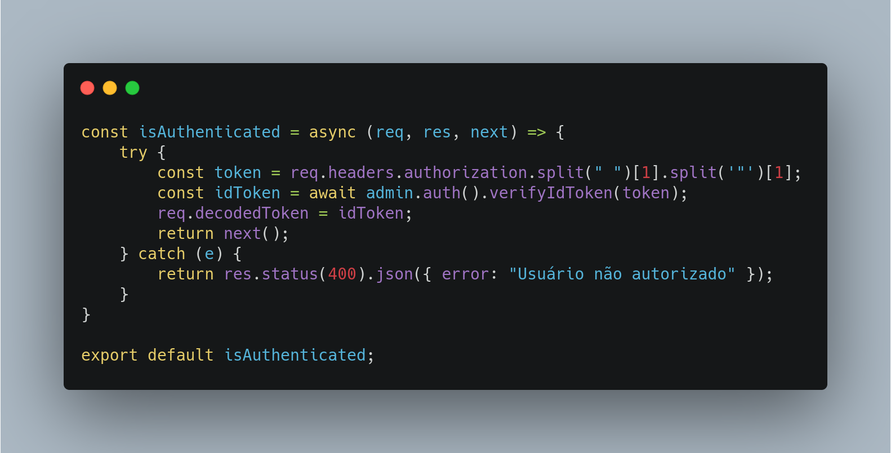
 
#### Rotas definindo a ordem dos handlers
 
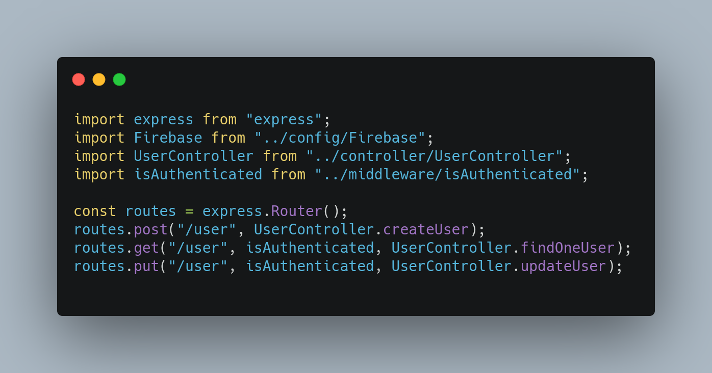
 
#### Pontos positivos
 
- Pode-se controlar a ordem de tratamento dos pedidos;
- _Princípio de responsabilidade única_. Pode-se desacoplar classes que invocam operações de classes que realizam operações;
- _Princípio aberto/fechado_. Pode-se introduzir novos handlers na aplicação sem quebrar o código cliente existente.
 
#### Pontos negativos
 
- Alguns pedidos podem acabar sem tratamento.
 
## GoFs não utilizados
 
### Command
 

 &emsp;&emsp;
Esse é um padrão que transforma um pedido em um objeto independente que contém toda a informação sobre o pedido. Essa transformação permite que você parametrize métodos com diferentes pedidos, atrase ou coloque a execução do pedido em uma fila, e suporte operações que não podem ser feitas.

 
#### Exemplo
 

 
Como é possível observar no exemplo, a Command parametriza todos os métodos relacionados a um objeto específico em uma única interface que realiza a execução da ação.
 
#### Pontos positivos
 
- _Princípio de responsabilidade única_. Pode-se desacoplar classes que invocam operações de classes que fazem essas operações;
- _Princípio aberto/fechado_. Pode-se introduzir novos comandos na aplicação sem quebrar o código cliente existente;
- Pode-se implementar desfazer/refazer;
- É possível implementar a execução adiada de operações;
- Pode-se montar um conjunto de comandos simples em um complexo.
 
#### Pontos negativos
 
- O código pode ficar mais complicado uma vez que está sendo introduzindo uma nova camada entre remetentes e destinatários.
 
#### Comentários
 
- O Command não é interessante para nosso projeto, pois não temos a necessidade de agendar execução de operações ou criar filas de operações e também não temos a necessidade de implementar operações que sejam reversíveis. Ambas as aplicações citadas encaixariam perfeitamente no funcionamento do padrão Command.
 
### Iterator
 

 &emsp;&emsp;
É um padrão de projeto comportamental que permite a você percorrer elementos de uma coleção sem expor as representações dele (lista, pilha, árvore, etc.)

 
#### Exemplo
 
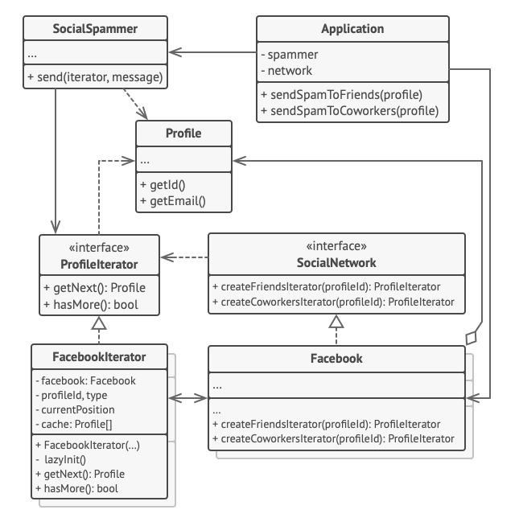
 
Neste exemplo o Iterator é utilizado para percorrer a coleção que encapsula o acesso ao grafo social do Facebook. A coleção fornece vários Iterators que podem percorrer os perfis de diferentes maneiras.
 
#### Pontos positivos
 
- _Princípio de responsabilidade única_. Pode-se limpar o código e as coleções ao extrair os pesados algoritmos de travessia para classes separadas;
- _Princípio aberto/fechado_. Pode-se implementar novos tipos de coleções e iteradores e passá-los para o código existente sem quebrar coisa alguma;
- Pode-se iterar sobre a mesma coleção em paralelo porque cada objeto iterador contém seu próprio estado de iteração;
- Pelas mesmas razões, pode-se atrasar uma iteração e continuá-la quando necessário.
 
#### Pontos negativos
 
- Aplicar o padrão pode ser um preciosismo se a aplicação só trabalha com coleções simples;
- Usar um iterador pode ser menos eficiente que percorrer elementos de algumas coleções especializadas diretamente.
 
#### Comentários
- O aplicativo Hígia não possui um funcionamento extremamente complexo, então como citado nos pontos negativos, o padrão seria um preciosismo para ser aplicado em nosso código. Algo complexo de se fazer para pouca usabilidade na hora do desenvolvimento.
### Mediator
 

 &emsp;&emsp;
Esse é um padrão de projeto comportamental que permite reduzir as dependências caóticas entre objetos. O padrão restringe comunicações diretas entre objetos e os força a colaborar apenas através do objeto mediador.

 
#### Exemplo
 
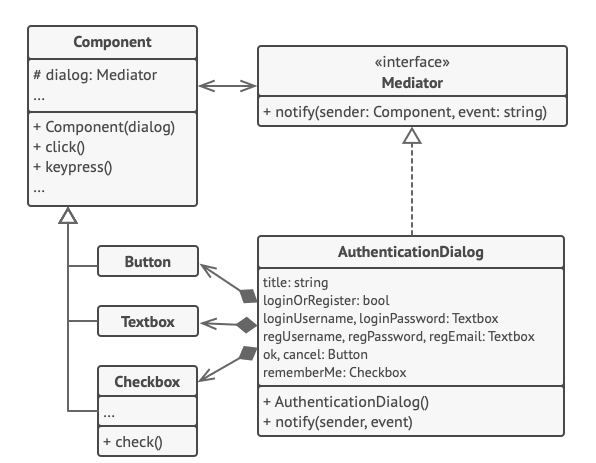
 
Como observado neste exemplo, o Mediator auxilia na redução das dependências entre as várias classes de interface de usuário.
 
#### Pontos positivos
 
- _Princípio de responsabilidade única_. Pode-se extrair as comunicações entre vários componentes para um único lugar, tornando as de mais fácil entendimento e manutenção;
- _Princípio aberto/fechado_. Pode-se introduzir novos mediadores sem ter que mudar os próprios componentes;
- É possível reduzir o acoplamento entre os vários componentes de um programa;
- Pode-se reutilizar componentes individuais mais facilmente.
 
#### Pontos negativos
 
- Com o tempo, um mediador pode evoluir para um _Objeto Deus_ (Um objeto que faz mais do que deveria, possui várias utilidades causando bagunça durante o desenvolvimento).
 
#### Comentários
- O Memento, geralmente, é utilizado para criação de retratos/versões dos estados de objetos para que seja capaz de restaurar os seus valores no futuro. A aplicabilidade citada é excelente para aplicações que necessitam de um histórico de versionamento, o que não é o caso do app Hígia.
 
### Memento
 

 &emsp;&emsp;
É um padrão de projeto comportamental que permite salvar e restaurar o estado anterior de um objeto sem revelar os detalhes de sua implementação.

 
#### Exemplo
 
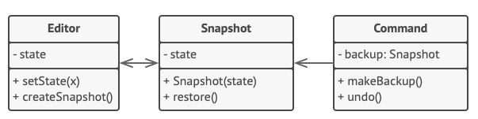
 
Neste exemplo, o Memento trabalha junto com o Command para armazenar retratos do estado de um editor de texto complexo e restaurá-lo para um estado anterior desses retratos quando necessário.
 
#### Pontos positivos
 
- Pode-se produzir retratos do estado de um objeto sem violar seu encapsulamento;
- Pode-se simplificar o código da originadora permitindo que a cuidadora mantenha o histórico do estado da originadora.
 
#### Pontos negativos
 
- A aplicação pode consumir muita RAM se os clientes criarem mementos com muita frequência;
- Cuidadoras devem acompanhar o ciclo de vida da originadora para serem capazes de destruir mementos obsoletos;
- A maioria das linguagens de programação dinâmicas, tais como PHP, Python e JavaScript, não conseguem garantir que o estado dentro do memento permaneça intacto.
 
### Strategy
 

 &emsp;&emsp;
Esse é um padrão que permite definir uma família de algoritmos, colocá-los em classes separadas, e fazer os objetos deles intercambiáveis.

 
#### Exemplo
 
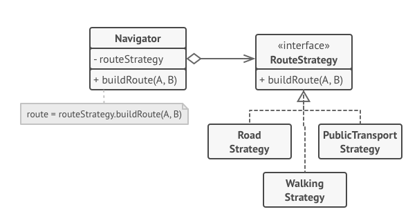
 
<!-- Breve explicação do diagrama -->
 
#### Pontos positivos
 
- Pode-se trocar algoritmos usados dentro de um objeto durante a execução;
- Pode-se isolar os detalhes de implementação de um algoritmo do código que usa ele;
- Pode-se substituir a herança por composição;
- _Princípio aberto/fechado_. Pode-se introduzir novas estratégias sem mudar o contexto.
 
#### Pontos negativos
 
- Se só há um par de algoritmos e eles raramente mudam, não há motivo real para deixar o programa mais complicado com novas classes e interfaces que vêm junto com o padrão;
- Muitas linguagens de programação modernas tem suporte do tipo funcional que permite que sejam implementadas implemente diferentes versões de um algoritmo dentro de um conjunto de funções anônimas. Então você poderia usar essas funções exatamente como se estivesse usando objetos estratégia, mas sem inchar seu código com classes e interfaces adicionais.
 
### Template Method
 

 &emsp;&emsp;
É um padrão de projeto comportamental que define o esqueleto de um algoritmo na superclasse, mas deixa as subclasses sobrescrever em etapas específicas do algoritmo sem modificar sua estrutura.

 
#### Exemplo
 
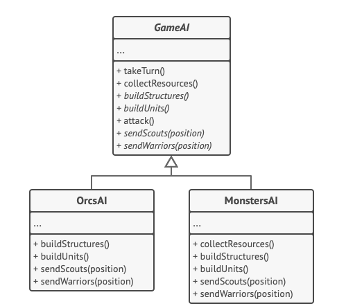
 
<!-- Breve explicação do diagrama -->
 
#### Pontos positivos
 
- Pode-se deixar clientes sobrescrever apenas certas partes de um algoritmo grande, tornando-os menos afetados por mudanças que acontece por outras partes do algoritmo;
- Pode-se elevar o código duplicado para uma superclasse.
 
#### Pontos negativos
 
- Alguns clientes podem ser limitados ao fornecer o esqueleto de um algoritmo;
- Implementações do padrão Template Method tendem a ser mais difíceis de se manter, quanto mais etapas eles tiverem.
 
### Visitor
 

 &emsp;&emsp;
É um padrão de projeto comportamental que permite separar algoritmos dos objetos nos quais eles operam.

 
#### Exemplo
 
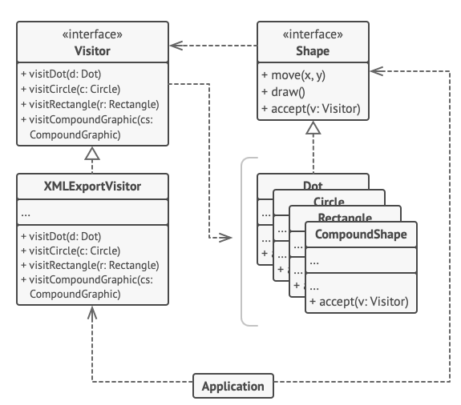
 
<!-- Breve explicação do diagrama -->
 
#### Pontos positivos
 
- _Princípio aberto/fechado_. Pode-se introduzir um novo comportamento que pode funcionar com objetos de diferentes classes sem mudar essas classes;
- _Princípio de responsabilidade única_. Pode-se mover múltiplas versões do mesmo comportamento para dentro da mesma classe;
- Um objeto visitante pode acumular algumas informações úteis enquanto trabalha com vários objetos. Isso pode ser interessante quando se quer percorrer algum objeto de estrutura complexa, tais como um objeto árvore, e aplicar o visitante para cada objeto da estrutura.
 
#### Pontos negativos
 
- É necessário atualizar todos os visitantes a cada vez que a classe é adicionada ou removida da hierarquia de elementos.
- Visitantes podem não ter seu acesso permitido para campos e métodos privados dos elementos que eles deveriam estar trabalhando.
 
## Referências
 
- Projeto Diário da Saúde. Acesso em: https://unbarqdsw.github.io/2020.1_G5_Diario_da_Saude/#gofs_comportamentais/. Último acesso em: 22/03/2021.
- Refactoring Guru - Observer. Acesso em: https://refactoring.guru/pt-br/design-patterns/observer. Último acesso em: 22/03/2021.
- Refactoring Guru - State. Acesso em: https://refactoring.guru/design-patterns/state. Último acesso em: 23/03/2021.
- Projeto Stock. Acesso em: https://unbarqdsw.github.io/2020.1_G12_Stock/#/Project/Estudos/comportamental?id=state. Último acesso em: 23/03/2021.
- Projeto Stock. Acesso em: https://unbarqdsw.github.io/2020.1_G12_Stock/#/DesignPatterns/ChainResponsibility. Último acesso em: 25/03/2021.
