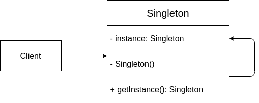
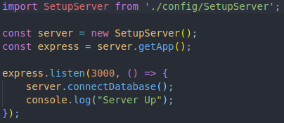
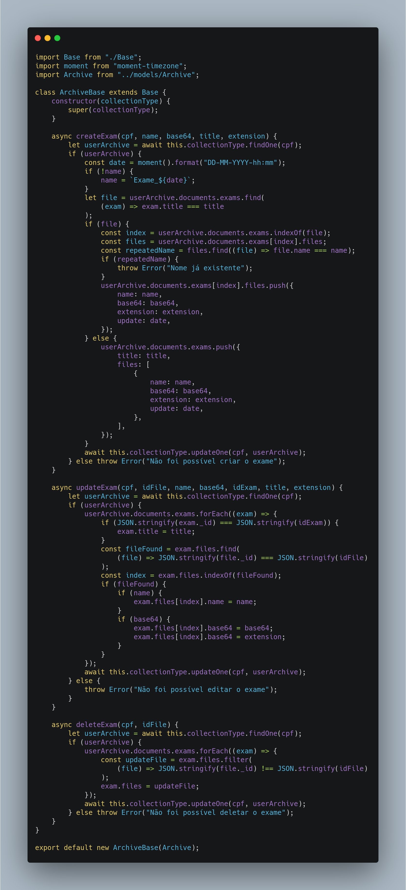

# GoFs Criacional

## Histórico de versionamento

|    Data    | Versão |                     Descrição                      |                                              Autor(es)                                              |
| :--------: | :----: | :------------------------------------------------: | :-------------------------------------------------------------------------------------------------: |
| 21/03/2021 |  0.1   |              Criação do GoF Singleton              | [Danillo Souza](https://github.com/danillogs) e [Fellipe Araujo](https://github.com/fellipe-araujo) |
| 22/03/2021 |  0.2   |  Adição da descrição do GoF Builder e referências  |                         [Ithalo Azevedo](https://github.com/ithaloazevedo)                          |
| 22/03/2021 |  0.3   |        Alteração da imagem do GoF Singleton        |                         [Ithalo Azevedo](https://github.com/ithaloazevedo)                          |
| 22/03/2021 |  0.4   | Adição dos pontos positivos e negativos do Builder |                           [Aline Lermen](https://github.com/AlineLermen)                            |
| 22/03/2021 |  0.5   |            Adicionado imagem do Builder            |                            [Danillo Souza](https://github.com/danillogs)                            |

## Singleton

 &emsp;&emsp;
O objetivo principal do padrão de projeto GoF Singleton é garantir que uma classe tenha apenas uma única instância e que forneça um acesso global a essa mesma instância. Esse padrão de projeto é muito útil quando queremos ter o controle de acesso a recursos compartilhados como, por exemplo, uma base de dados de uma aplicação.

 
### Estrutura Genérica
 

 
### Pontos positivos
 
- Pelo fato das classes nunca mudarem de estado e possuírem somente uma instância executando, melhora o desempenho e qualidade do software;
- O código se torna mais legível.
 
### Pontos negativos
 
- Caso o software não vá utilizar com frequencia a classe que implementa esse padrão, pode trazer problemas de desempenho;
- Torna mais complexo a realização de testes unitários.
 
### Aplicação
 

 &emsp;&emsp;
Em nosso Backend, criamos uma classe especialista em personalizar o Express (Framework especializado na construção de aplicações web e API's) a SetupServer. A SetupServer foi idealizada com o objetivo de tornar o arquivo de nosso servidor mais limpo. O único propósito dessa classe é subir o servidor de nossa API, portanto, a mesma é instanciada uma única vez e de forma global.

 

 
## Builder
 

 &emsp;&emsp;
O objetivo principal do GoF Builder é permitir a construção de um objeto gradativamente. Por exemplo, em uma situação em que um método construtor possui diversos parâmetros podemos utilizar o Builder para evitar passar todos os parâmetros sempre que o método for chamado.

 
### Pontos positivos
 
- Com esse padrão é possível construir objetos passo a passo, adiar etapas da construção ou até executar etapas recursivamente;
- É possível reutilizar o mesmo código de construção quando estiver construindo várias representações de produtos ;
- _ Princípio de responsabilidade única _. Pode-se realizar a manutenção do código sem afetar outros componentes diretamente.
 
### Pontos negativos
 
- A complexidade do código aumenta, pois esse padrão exige a criação de classes novas.
 
### Aplicação
 

 &emsp;&emsp;
O Builder foi utilizado na seguinte classe. Estamos utilizando o padrão para a montagem da ficha médica, nesse caso em especifico para a manipulação dos exames do usuário.

## Referências

- Refactoring.Guru. Acesso em: https://refactoring.guru/pt-br/design-patterns/singleton. Último de acesso: 21/03/2021.
- Projeto Recipebuk. Acesso em: https://www.recipebukdocs.tk/#/05-padroes-de-projeto/Estudos/gof-criacional?id=estudo-dirigido-gofs-criacional. Último de acesso: 21/03/2021.
- Projeto Stock. Acesso em: https://unbarqdsw.github.io/2020.1_G12_Stock/#/DesignPatterns/Singleton?id=aplica%c3%a7%c3%a3o-do-singleton. Último de acesso: 21/03/2021.
- Refactoring.Guru. Acesso em: https://refactoring.guru/pt-br/design-patterns/builder. Último de acesso: 22/03/2021.
