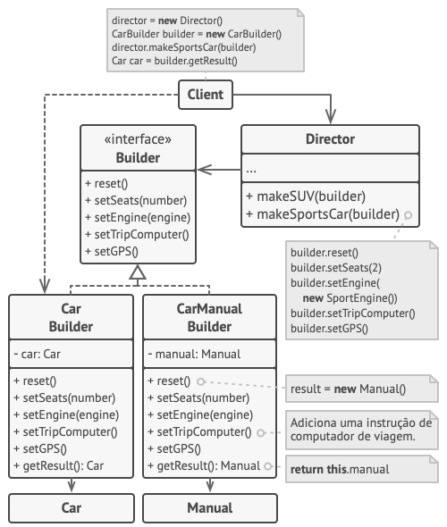
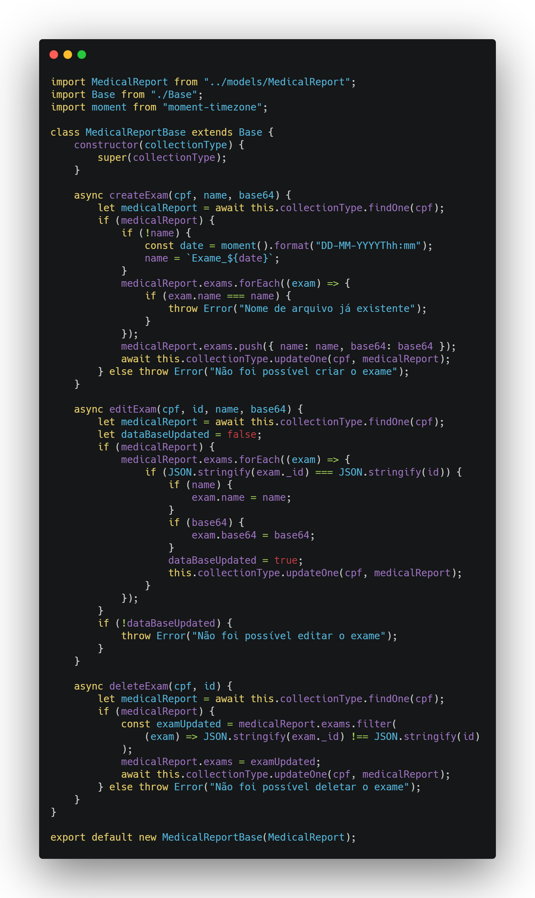
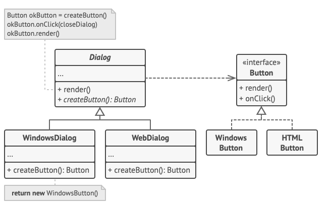
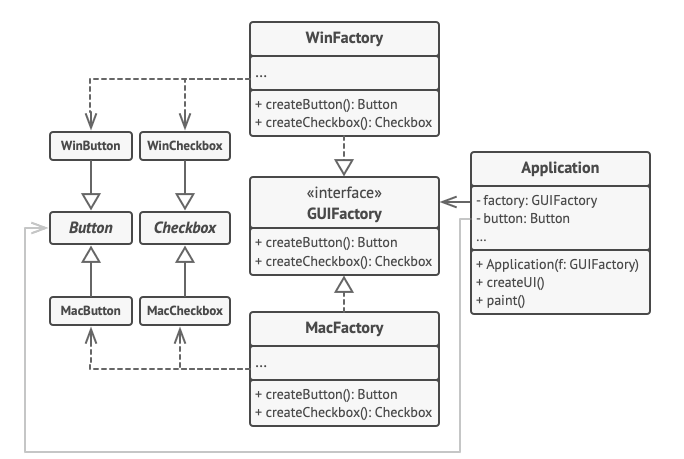
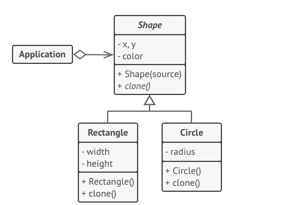

# GoFs Criacional

## Histórico de versionamento

|    Data    | Versão |                     Descrição                      |                                              Autor(es)                                              |
| :--------: | :----: | :------------------------------------------------: | :-------------------------------------------------------------------------------------------------: |
| 21/03/2021 |  0.1   |              Criação do GoF Singleton              | [Danillo Souza](https://github.com/danillogs) e [Fellipe Araujo](https://github.com/fellipe-araujo) |
| 22/03/2021 |  0.2   |  Adição da descrição do GoF Builder e referências  |                         [Ithalo Azevedo](https://github.com/ithaloazevedo)                          |
| 22/03/2021 |  0.3   |        Alteração da imagem do GoF Singleton        |                         [Ithalo Azevedo](https://github.com/ithaloazevedo)                          |
| 22/03/2021 |  0.4   | Adição dos pontos positivos e negativos do Builder |                           [Aline Lermen](https://github.com/AlineLermen)                            |
| 22/03/2021 |  0.5   |            Adicionado imagem do Builder            |                            [Danillo Souza](https://github.com/danillogs)                            |
| 25/03/2021 |  1.0   |            Adicionando GoFs criacionais não utilizados            |                           [Aline Lermen](https://github.com/AlineLermen), [Danillo Souza](https://github.com/danillogs) e [Gabriel Hussein](https://github.com/GabrielHussein)                 |
| 28/03/2021 |  1.1   |            Adição da imagem de exemplo Builder e ajuste da imagem de aplicação            |                    [Arthur Paiva](https://github.com/arthurpaivat) e [Gabriel Hussein](https://github.com/GabrielHussein)                 |
| 28/03/2021 |  1.2   |            Revisão dos GoFs criacionais            |                    [Arthur Paiva](https://github.com/arthurpaivat) e [Gabriel Hussein](https://github.com/GabrielHussein)                 |

## GoFs Utilizados

### Singleton

 &emsp;&emsp;
O objetivo principal do padrão de projeto GoF Singleton é garantir que uma classe tenha apenas uma única instância e que forneça um acesso global a essa mesma instância. Esse padrão de projeto é muito útil quando queremos ter o controle de acesso a recursos compartilhados como, por exemplo, uma base de dados de uma aplicação.

#### Exemplo

 

Neste exemplo, o diagrama demonstra que a classe Button possui apenas uma instância que é criada a partir do método createButton() caso ainda não exista ou que é somente renderizada com o método render() caso já exista.

#### Aplicação
 

 &emsp;&emsp;
Em nosso Backend, criamos uma classe especialista em personalizar o Express (Framework especializado na construção de aplicações web e API's) a SetupServer. A SetupServer foi idealizada com o objetivo de tornar o arquivo de nosso servidor mais limpo. O único propósito dessa classe é subir o servidor de nossa API, portanto, a mesma é instanciada uma única vez e de forma global.

 
#### Pontos positivos
 
- Pelo fato das classes nunca mudarem de estado e possuírem somente uma instância sendo executada, há uma melhora no desempenho e na qualidade do software;
- O código se torna mais legível.
 
#### Pontos negativos
 
- Caso o software não vá utilizar com frequencia a classe que implementa esse padrão, pode trazer problemas de desempenho;
- Torna mais complexo a implementação de testes unitários.
 
 
### Builder
 

 &emsp;&emsp;
O objetivo principal do padrão de projeto GoF Builder é permitir a construção gradativa de um objeto. Por exemplo, em uma situação em que um método construtor possui diversos parâmetros podemos utilizar o Builder, para evitar passar todos os parâmetros sempre que o método for chamado, escolhendo qual parâmetro deve ser passado ou não. 

#### Exemplo 
 

Neste exemplo, o objeto da classe mais complexa Carro pode ser construído de várias maneiras, ao invés de usar um único construtor enorme, nós extraímos o código de montagem do carro em uma classe de construção de carro separada. Essa classe tem um conjunto de métodos para configurar as várias partes de um carro.

#### Aplicação
 

 &emsp;&emsp;
O Builder foi utilizado na seguinte classe. Estamos utilizando o padrão para a montagem da ficha médica, nesse caso em especifico para a manipulação dos exames do usuário.

#### Pontos positivos
 
- Com esse padrão é possível construir objetos passo a passo, adiar etapas da construção ou até executar etapas recursivamente;
- É possível reutilizar o mesmo código de construção quando estiver construindo várias representações de produtos ;
- *Princípio de responsabilidade única*. Pode-se realizar a manutenção do código sem afetar outros componentes diretamente.
 
#### Pontos negativos
 
- A complexidade do código aumenta, pois esse padrão exige a criação de classes novas.

## GoFs não utilizados

### Factory Method

 &emsp;&emsp;
Esse é um padrão de projeto criacional que fornece uma interface para criar objetos em uma superclasse, mas permite que as subclasses alterem o tipo de objetos que serão criados.

#### Exemplo

Como observado no exemplo, o Factory Method foi utilizado para criar objetos na superclasse sem que o cliente interaja diretamente com as classes da interface de usuário, fazendo assim com que não seja necessário desenvolver uma lógica para cada sistema operacional diferente.

#### Pontos positivos
- Evita-se acoplamentos firmes entre o criador e os produtos concretos;
- *Princípio de responsabilidade única*. É possível mover o código de criação do produto para um único local do programa, facilitando a manutenção do código;
- *Princípio aberto/fechado*. Pode-se introduzir novos tipos de produtos no programa sem quebrar o código cliente existente.

#### Pontos negativos
- O código pode se tornar mais complicado, pois é necessário introduzir muitas subclasses novas para implementar o padrão.

#### Comentários

 &emsp;&emsp;
Por conta do escopo do projeto Hígia ser enxuto fica inviável a utilização do padrão Factory Method em nossa aplicação.

### Abstract Factory

 &emsp;&emsp;
É um padrão cricional que permite produzir famílias de objetos relacionados sem ter que especificar suas classes concretas.

#### Exemplo

Como observado no exemplo, o padrão se assemelha ao Factory Method na forma em que o Abstract Factory age como mediador entre o lado do cliente e a interface do usuário. Sendo assim, o Abstract Factory mantém os elementos de forma consistentes para diferentes sistemas operacionais. 

#### Pontos positivos
- Pode-se ter certeza que os produtos que se obtém de uma fábrica são compatíveis entre si;
- Evita-se um vínculo forte entre produtos concretos e o código cliente;
- *Princípio de responsabilidade única*. É possível extrair o código de criação do produto para um lugar, fazendo o código ser de fácil manutenção;
- *Princípio aberto/fechado*. Pode-se introduzir novas variantes de produtos sem quebrar o código cliente existente.

#### Pontos negativos
- O código pode tornar-se mais complicado do que deveria ser, uma vez que muitas novas interfaces e classes são introduzidas junto com o padrão.

#### Comentários

 &emsp;&emsp;
Assim como no Factory Method, o Abstract Factory fica inviável de utilizarmos em nossa aplicação por conta de nosso escopo pequeno.

### Prototype

 &emsp;&emsp;
É um padrão de projeto criacional que permite copiar objetos existentes sem fazer seu código ficar dependente de suas classes.

#### Exemplo

Como observado no exemplo, o Prototype permitiu criar cópias exatas das formas geométricas sem necessidade de as acoplar o código a suas classes.

#### Pontos positivos
- Pode-se clonar objetos sem acoplá-los a suas classes concretas;
- Livrar-se de códigos de inicialização repetidos em troca de clonar protótipos pré-construídos;
- Pode-se produzir objetos complexos mais convenientemente;
- Tem-se uma alternativa para herança quando lidar com configurações pré determinadas para objetos complexos.

#### Pontos negativos
- Clonar objetos complexos que têm referências circulares pode ser bem complicado.

#### Comentários

 &emsp;&emsp;
O Prototype não tem cabimento em nosso projeto, pois todos os objetos presentes em nossa aplicação são únicos, o que torna inviável a criação de objetos genêricos. 

## Referências

- Refactoring.Guru - Singleton Pattern. Acesso em: https://refactoring.guru/pt-br/design-patterns/singleton. Último de acesso: 21/03/2021.
- Refactoring.Guru - Factory Method Pattern. Acesso em: https://refactoring.guru/pt-br/design-patterns/factory-method. Último de acesso: 25/03/2021.
- Refactoring.Guru - Abstract Factory Pattern. Acesso em: https://refactoring.guru/pt-br/design-patterns/abstract-factory. Último de acesso: 25/03/2021.
- Refactoring.Guru - Builder Pattern. Acesso em: https://refactoring.guru/pt-br/design-patterns/builder. Último de acesso: 25/03/2021.
- Refactoring.Guru - Prototype Pattern. Acesso em: https://refactoring.guru/pt-br/design-patterns/prototype. Último de acesso: 25/03/2021.
- Projeto Recipebuk. Acesso em: https://www.recipebukdocs.tk/#/05-padroes-de-projeto/Estudos/gof-criacional?id=estudo-dirigido-gofs-criacional. Último de acesso: 21/03/2021.
- Projeto Stock. Acesso em: https://unbarqdsw.github.io/2020.1_G12_Stock/#/DesignPatterns/Singleton?id=aplica%c3%a7%c3%a3o-do-singleton. Último de acesso: 21/03/2021.
- Refactoring.Guru. Acesso em: https://refactoring.guru/pt-br/design-patterns/builder. Último de acesso: 22/03/2021.
