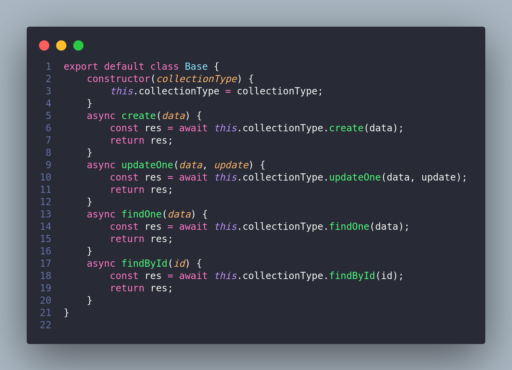
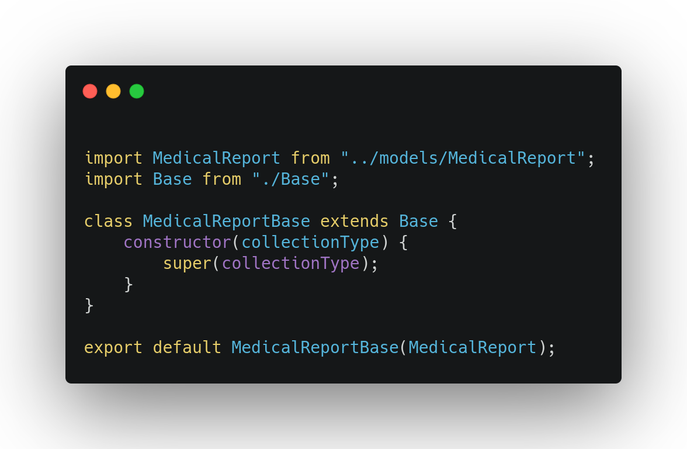
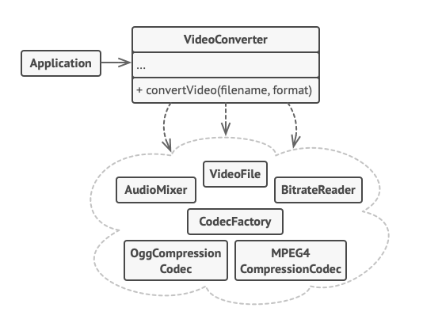
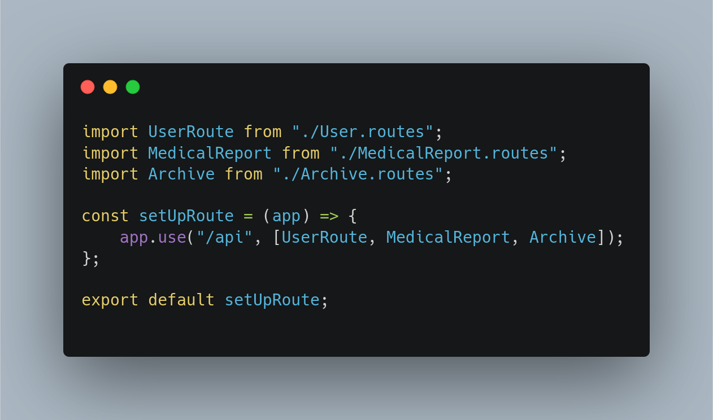
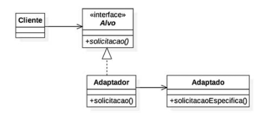
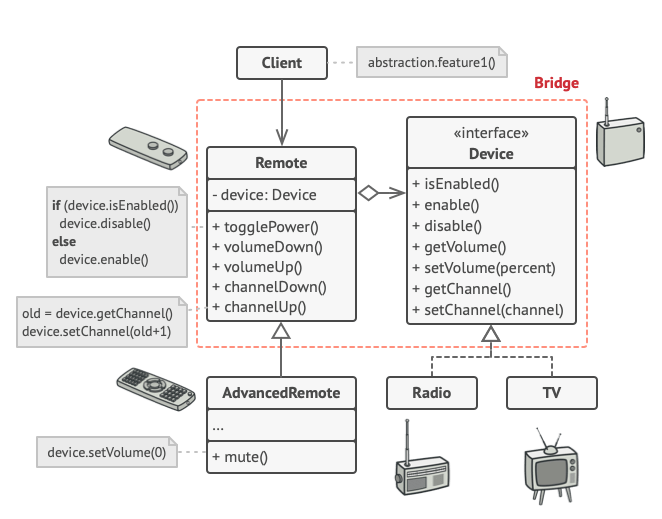
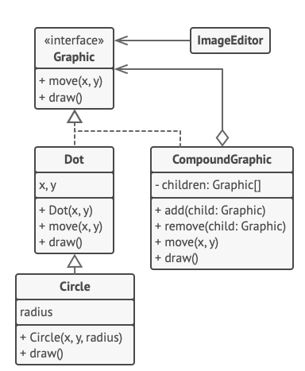
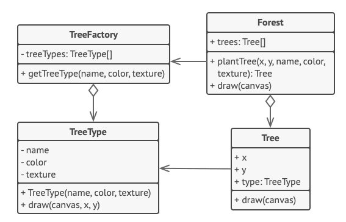
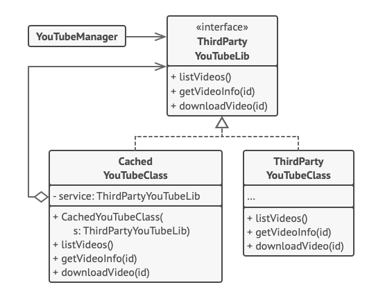

# GoFs Estruturais

## Histórico de versionamento

|    Data    | Versão |                    Descrição                     |                                              Autor(es)                                              |
| :--------: | :----: | :----------------------------------------------: | :-------------------------------------------------------------------------------------------------: |
| 22/03/2021 |  0.1   |             Criação do documento GoF Estrutural             | [Victor Amaral](https://github.com/victoramaralc) |
| 22/03/2021 |  0.2   |             Introdução e Metodologia Decorator      | [Victor Amaral](https://github.com/victoramaralc) |
| 22/03/2021 |  0.3   |             Criação do GoF Decorator            | [Arthur Paiva](https://github.com/ArthurPaivaT) e [Victor Amaral](https://github.com/victoramaralc) |
| 22/03/2021 |  0.4   |             Adição dos Pontos positivos e negativos do decorator   | [Arthur Paiva](https://github.com/ArthurPaivaT) |
| 23/03/2021 |  0.5   |             Criação do GoF Facade   | [Gabriel Hussein](https://github.com/GabrielHussein) e [Ithalo Azevedo](https://github.com/ithaloazevedo) |
| 23/03/2021 |  0.6   |             Adição das imagens de exemplo e implantação   | [Gabriel Hussein](https://github.com/GabrielHussein) e [Ithalo Azevedo](https://github.com/ithaloazevedo) |
| 23/03/2021 |  0.7   |             Adição de pontos positivos e negativos e aplicação  | [Gabriel Hussein](https://github.com/GabrielHussein) e [Ithalo Azevedo](https://github.com/ithaloazevedo) |
| 23/03/2021 |  0.8   |             Adição de referências   | [Gabriel Hussein](https://github.com/GabrielHussein) e [Ithalo Azevedo](https://github.com/ithaloazevedo) |
| 24/03/2021 |  0.9   |             Revisão e ajuste do documento   | [Aline Lermen](https://github.com/AlineLermen) |
| 25/03/2021 |  1.0   |            Adicionando GoFs estruturais não utilizados            |                           [Aline Lermen](https://github.com/AlineLermen), [Danillo Souza](https://github.com/danillogs) e [Gabriel Hussein](https://github.com/GabrielHussein)                 |

## GoFs utilizados

### Decorator

 &emsp;&emsp;
O Decorator é um padrão de projeto estrutural que permite acoplar novos comportamentos para objetos ao colocá-los dentro de invólucros de objetos que contém os comportamentos.

#### Exemplo

Como no exemplo de decorator base acima, o mesmo irá servir como uma ponte entre o Client e os Decorators que realmente irão alterar o comportamento do objeto concreto. Todos devem implementar a mesma interface.

#### Aplicação 

Aqui o objetivo é criar uma nova camada para os métodos principais que o mongoose oferece, como findAll, findOne, create e assim por diante, para que seja utilizada pelas classes. Porém cada classe irá alterar o comportamento de acordo com sua necessidade. Para isso, utilizaremos o método Decorator, onde o Decorator Base irá implementar os métodos do mongoose e assim cada classe poderá herdar desse Decorator Base.

#### Decorator Base

#### Medical Report

Neste caso, o Medical Report é uma classe cujos objetos serão gerenciados pelo banco usando os métodos da classe Base

#### Pontos positivos

- É possível estender o comportamento de um objeto sem fazer um nova subclasse;
- É possível adicionar ou remover responsabilidades de um objeto no momento da execução;
- É possível combinar diversos comportamentos ao envolver o objeto com múltiplos decoradores;
- *Princípio de responsabilidade única*. Você pode dividir uma classe monolítica que implementa muitas possíveis variantes de um comportamento em diversas classes menores

#### Pontos Negativos

- É difícil remover um invólucro de uma pilha de invólucros;
- É difícil implementar um decorador de tal maneira que seu comportamento não dependa da ordem do pilha de decoradores;
- A configuração inicial do código de camadas pode ficar bastante feia.

### Facade

 &emsp;&emsp;
O Facade é um padrão de projeto que simplifica a interface para uma biblioteca, framework ou qualquer conjunto completo de classes. Em uma situação em que há a necessidade de inicializar vários objetos para que a implementação funcione, o código fica confuso a pessoas não familiarizadas com o processo e também há a dificuldade de manutenção. Assim, o padrão de projeto Facade implementa uma classe de "Fachada" que fornece uma interface simples para um subsistema mais complexo. Por mais que a Fachada seja limitada em relação as funcionalidades de tal subsistema, ela concentra as funcionalidades com as quais o cliente se importa.

#### Exemplo

Como observado no exemplo, várias dependências foram convertidas dentro de uma única interface para organizar o código de forma mais limpa e clara para leitura e manutenção.

#### Aplicação

 &emsp;&emsp;
No projeto utilizamos o Facade para condensar as nossas rotas em uma única interface de rotas, para que não seja necessário um excesso de chamadas e referências a rotas distintas. Assim, uma única chamada é necessária para importar todas as rotas que são pertinentes a aplicação.

#### Medical Report Routes

#### Pontos positivos
- É possível isolar o código da complexidade de um subsistema;
- Fornece um código mais organizado visualmente;
- Permite uma implementação mais simples;
- Facilidade de manutenção futura;

#### Pontos negativos
- Pode acontecer da Facade se tornar um *objeto Deus* (objeto que mantém a maior parte das informações do programa inteiro e também fornece a maioria dos métodos para manipular esses dados) que contêm todos os objetos e classes do sistema;
- A Facade é mais limitada do que utilizar diretamente o subsistema do qual ela se torna interface.

## GoFs não utilizados

### Adapter

 &emsp;&emsp;
Adapter é um padrão estrutural de projeto que possibilita a integração de interfaces incompatíveis.  

#### Exemplo

Como observado no exemplo, o Adapter, ou Adaptador nesse caso, implementa a interface Alvo de interagir com a classe Adaptado.

#### Pontos positivos
- É possível realizar manutenção no código sem prejudicar o funcionamento de outros adaptadores.
- É possível adicionar novos adaptadores no código sem afetar o funcionamento das estruturas existentes.

#### Pontos negativos
- A complexidade do código aumenta consideravelmete, pois há a necessidade de adicionar um conjunto de classes e interfaces. Nem sempre a adição desses conjuntos é a forma mais simples.

### Bridge

 &emsp;&emsp;
É um padrão de projeto estrutural que permite dividir uma classe grande ou um conjunto de classes intimamente ligadas em duas hierarquias separadas (abstração e implementação), que podem ser desenvolvidas independentemente umas das outras.

#### Exemplo

Como observado no exemplo, o Bridge age como a ligação entre duas classes grandes de "remote" e "device" que são ligadas diretamente.

#### Pontos positivos
- Pode-se criar classes e aplicações independentes de plataforma;
- O código cliente trabalha com abstrações em alto nível. Ele não fica exposto a detalhes de plataforma;
- *Princípio aberto/fechado*. Pode-se introduzir novas abstrações e implementações independentemente uma das outras;
- *Princípio de responsabilidade única*. Pode-se focar na lógica de alto nível na abstração e em detalhes de plataforma na implementação.

#### Pontos negativos
- Pode tornar o código mais complicado ao aplicar o padrão em uma classe altamente coesa.

### Composite 

 &emsp;&emsp;
É um padrão de projeto estrutural que permite compor objetos em estruturas de árvores e então trabalhar com essas estruturas como se elas fossem objetos individuais.

#### Exemplo

No exemplo o Composite permite a implementação da composição de várias figuras geométricas em um editor gráfico. Uma forma geométrica composta possui os mesmos métodos que uma forma geométrica simples. Um objeto composto passa a requisição para todos seus herdeiros e "soma" o resultado.

#### Pontos positivos
-  Pode-se trabalhar com estruturas de árvore complexas mais convenientemente: utilize o polimorfismo e a recursão a seu favor.
- *Princípio aberto/fechado*. Pode-se introduzir novos tipos de elemento na aplicação sem quebrar o código existente, o que agora funciona com a árvore de objetos.

#### Pontos negativos
- Pode ser difícil providenciar uma interface comum para classes cuja funcionalidade difere muito. Em certos cenários, precisaria generalizar muito a interface componente, fazendo dela uma interface de difícil compreensão.

### Flyweight

 &emsp;&emsp;
É um padrão que permite colocar mais objetos na quantidade de RAM disponível ao compartilhar partes comuns de estado entre os múltiplos objetos ao invés de manter todos os dados em cada objeto.

#### Exemplo

O padrão extrai o estado intrínseco repetido para uma classe Árvore principal e o move para dentro da classe flyweight TipoÁrvore. O código cria novos objetos árvore usando a fábrica flyweight, que encapsula a complexidade da busca pelo objeto correto e o reutiliza se necessário.

#### Pontos positivos
- Pode-se economizar muita RAM, desde que o programa tenha muitos objetos similares.

#### Pontos negativos
- Pode estar trocando RAM por ciclos de CPU quando parte dos dados de contexto precisa ser recalculado cada vez que alguém chama um método flyweight;
- O código fica muito mais complicado. Novos membros de equipe sempre se perguntarão por que o estado de uma entidade foi separado de tal forma.

### Proxy

 &emsp;&emsp;
Esse é um padrão que permite fornecer um substituto ou um espaço reservado para outro objeto. Um proxy controla o acesso ao objeto original, permitindo que você faça algo ou antes ou depois do pedido chegar ao objeto original.

#### Exemplo

Como observado no exemplo, o Proxy fornece um substituto para a biblioteca de download de vídeos, pois a biblioteca sempre baixa o vídeo mesmo se ele já foi baixado anteriormente ao invés de procurar uma alternativa eficiente, o Proxy fornece essa alternativa na forma de salvamento em cache, quando o mesmo vídeo é requisitado o padrão de projeto retorna o resultado em cache. O Proxy age como implementação da mesma interface que "copia" e delega-a todo o trabalho, enquanto o proxy age como o registro dos arquivos baixados.

#### Pontos positivos
- Pode-se controlar o objeto do serviço sem os clientes ficarem sabendo;
- Pode-se gerenciar o ciclo de vida de um objeto do serviço quando os clientes não se importam mais com ele;
- O proxy trabalha até mesmo se o objeto do serviço ainda não está pronto ou disponível;
- *Princípio aberto/fechado*. Pode-se introduzir novos proxies sem mudar o serviço ou clientes.

#### Pontos negativos
- O código pode ficar mais complicado uma vez que precisa introduzir uma série de novas classes;
- A resposta de um serviço pode ter atrasos.

## Referências

- Padrão de projeto decorator. Disponível em <https://www.devmedia.com.br/padrao-de-projeto-decorator-em-java/26238>. Último acesso: 22 de março de 2021.
- Refactoring Guru - Decorator Pattern. Disponível em <https://refactoring.guru/design-patterns/decorator>. Último acesso: 22 de março de 2021.
- Projeto Stock Decorator. Disponível em <https://unbarqdsw.github.io/2020.1_G12_Stock/#/DesignPatterns/Decorator>. Último acesso: 22 de março de 2021.
- Refactoring Guru - Facade Pattern. Disponível em <https://refactoring.guru/pt-br/design-patterns/facade>. Último acesso: 23 de março de 2021.
- Projeto Stock Facade. Disponível em <https://unbarqdsw.github.io/2020.1_G12_Stock/#/Project/Estudos/estrutural?id=facade>. Último acesso: 23 de março de 2021.
- Objeto Deus. Disponível em <https://pt.wikipedia.org/wiki/Objeto_deus>. Último acesso: 23/03/2021.
- Padrão de Projeto: Adapter. Disponível em <https://www.thiengo.com.br/padrao-de-projeto-adapter>. Último acesso: 25/03/2021.
- Refactoring Guru - Adapter Pattern. Disponível em <https://refactoring.guru/pt-br/design-patterns/adapter>. Último acesso: 25 de março de 2021.
- Refactoring Guru - Bridge Pattern. Disponível em <https://refactoring.guru/pt-br/design-patterns/bridge>. Último acesso: 25 de março de 2021.
- Refactoring Guru - Composite Pattern. Disponível em <https://refactoring.guru/design-patterns/composite>. Último acesso: 25 de março de 2021.
- Refactoring Guru - Flyweight Pattern. Disponível em <https://refactoring.guru/design-patterns/flyweight>. Último acesso: 25 de março de 2021.
- Refactoring Guru - Proxy Pattern. Disponível em <https://refactoring.guru/design-patterns/proxy>. Último acesso: 25 de março de 2021.
