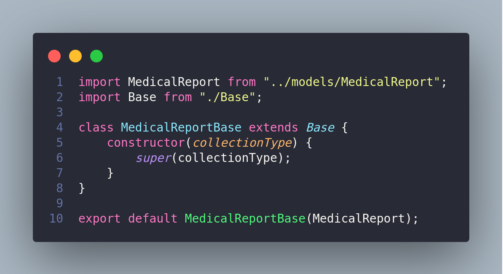

# GoFs Decorator

## Histórico de versionamento

|    Data    | Versão |                    Descrição                     |                                              Autor(es)                                              |
| :--------: | :----: | :----------------------------------------------: | :-------------------------------------------------------------------------------------------------: |
| 22/03/2021 |  0.1   |             Criação do documento GoF decorator             | [Victor Amaral](https://github.com/victoramaralc) |
| 22/03/2021 |  0.2   |             Introdução e Metodologia       | [Victor Amaral](https://github.com/victoramaralc) |
| 22/03/2021 |  0.3   |             Criação do GoF             | [Arthur Paiva](https://github.com/ArthurPaivaT) e [Victor Amaral](https://github.com/victoramaralc) |

## Introdução

O decorator permite adicionar novos comportamentos a objetos através da adição de uma nova camada de um objeto externo que possui os comportamentos que deseja-se ser acrescentados.

Como no exemplo de decorator base acima, o mesmo irá servir como uma ponte entre o Client e os Decorators que realmente irão alterar o comportamento do objeto concreto. Todos devem implementar a mesma interface.

## Metodologia 

Aqui o objetivo é criar uma nova camada para os métodos principais que o mongoose oferece como findAll, findOne, create e assim por diante para utilização pelas classes, porém cada uma irá alterar o comportamento de acordo com sua necessidade. Para isso, utilizaremos o método Decorator, onde o Decorator Base irá implementar os métodos do mongoose e assim cada classe poderá herdar desse Decorator Base.

## Decorator Base

## Medical Report

Neste caso, o Medical Report é uma classe cujos objetos serão gerenciados pelo banco usando os métodos da classe Base

## Referências

- Padrão de projeto decorator, Disponível em <https://www.devmedia.com.br/padrao-de-projeto-decorator-em-java/26238>, último acesso: 22 de março de 2021
- Refactoring Guru - Decorator Pattern, Disponível em <https://refactoring.guru/design-patterns/decorator>, último acesso: 22 de março de 2021
- Projeto Stock, Disponível em <https://unbarqdsw.github.io/2020.1_G12_Stock/#/DesignPatterns/Decorator>, último acesso: 22 de março de 2021