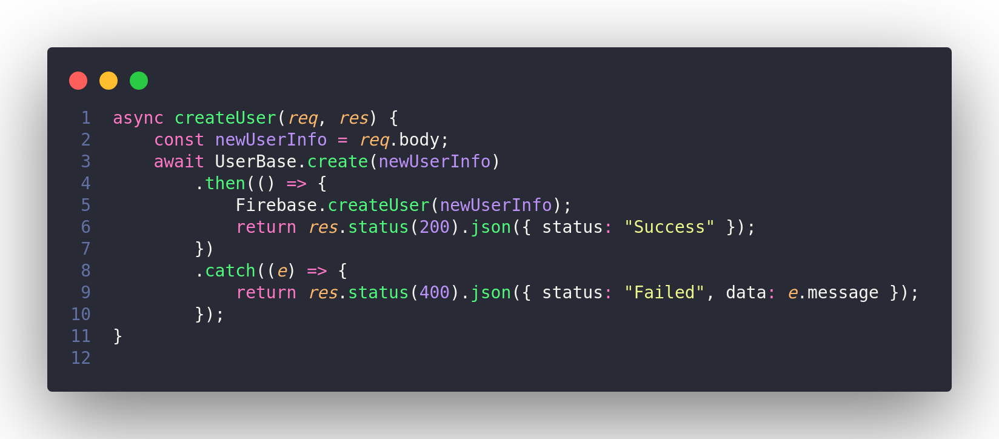
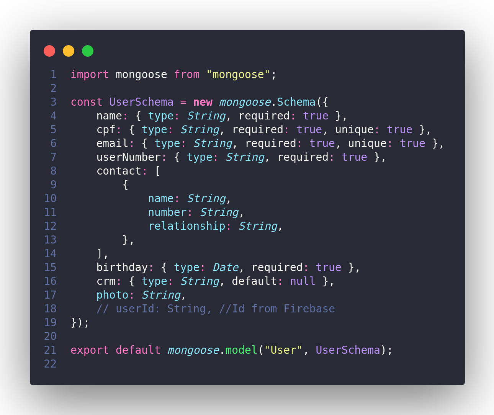
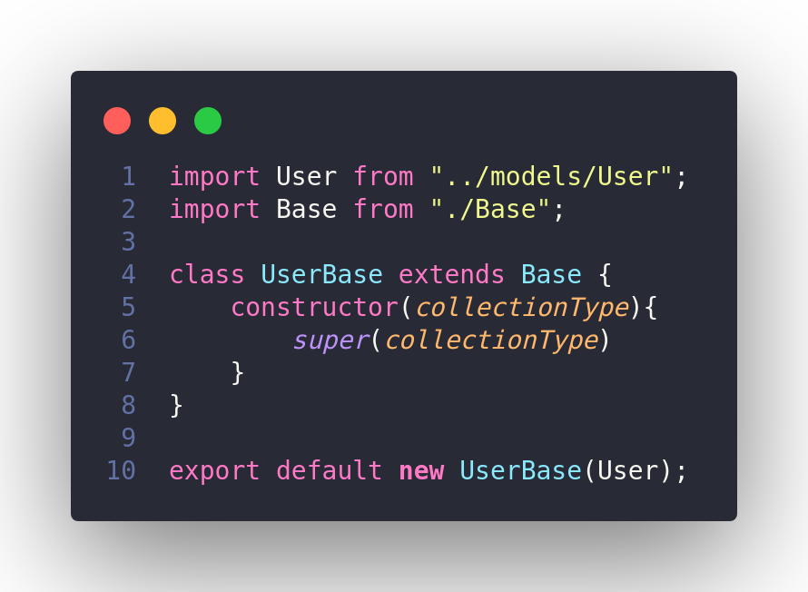

# Documento de Arquitetura de Software

## Histórico de versões

|    Data    | Versão |               Descrição               |                                                                     Autor(es)                                                                      |
| :--------: | :----: | :-----------------------------------: | :------------------------------------------------------------------------------------------------------------------------------------------------: |
| 15/04/2021 |  0.1   |         Criação do documento          |                                                 [Ithalo Azevedo](https://github.com/ithaloazevedo)                                                 |
| 16/04/2021 |  0.2   |          Adicionado tópico 1          |                                                 [Ithalo Azevedo](https://github.com/ithaloazevedo)                                                 |
| 18/04/2021 |  0.3   |         Adicionado tópico 2.1         |                        [Arthur Paiva](https://github.com/ArthurPaivaT), [Ithalo Azevedo](https://github.com/ithaloazevedo)                         |
| 18/04/2021 |  0.4   | Adicionadas tecnologias no tópico 2.1 |                         [Danillo Souza](https://github.com/DanilloGS), [Ithalo Azevedo](https://github.com/ithaloazevedo)                          |
| 18/04/2021 |  0.5   |          Adicionado tópico 3          | [Arthur Paiva](https://github.com/ArthurPaivaT), [Danillo Souza](https://github.com/DanilloGS), [Ithalo Azevedo](https://github.com/ithaloazevedo) |
| 18/04/2021 |  0.6   |          Adicionado tópico 4          |                        [Arthur Paiva](https://github.com/ArthurPaivaT), [Ithalo Azevedo](https://github.com/ithaloazevedo)                         |

## 1. Introdução
### 1.1. Finalidade

 &emsp;&emsp;
A finalidade deste documento é detalhar as decisões arquiteturais do projeto Hígia utilizando diferentes visões arquiteturais, a fim de facilitar o entendimento dos processos envolvidos no desenvolvimento e todo o funcionamento do nosso produto de software. 

### 1.2. Escopo

 &emsp;&emsp;
Nesse documento, estão documentados os componentes, tecnologias e diferentes visões arquiteturais do Hígia. O produto, consiste em um software que visa facilitar o controle dos arquivos médicos pelos pacientes e inovar o compartilhamento de arquivos e informações entre pacientes e médicos. Trazendo soluções como:  armazenamento de arquivos e informações, controle do usuário sobre seus arquivos, obtenção de informações de forma imediata por parte de médicos e compartilhamento de arquivos entre médicos e pacientes. 

### 1.3. Definições, acrônimos e abreviações
| Acrônimos/abreviações | Definição |
| :-------------------: | :-------: |
|                       |           |

### 1.4. Referências
Como documentar a Arquitetura de Software. Disponível em: <http://www.linhadecodigo.com.br/artigo/3343/como-documentar-a-arquitetura-de-software.aspx>. Último acesso em: 15/04/2021.
Chatbot Gaia - Documento de arquitetura. Disponível em: <https://fga-eps-mds.github.io/2019.1-Gaia/#/projeto/DocArquitetura>. Último acesso em: 16/04/2021.
React Native. Disponível em: <https://reactnative.dev>. Último acesso em: 17/04/2021.
ExpressJS. Disponível em: <https://expressjs.com/pt-br/>. Último acesso em: 17/04/2021.
NodeJS – O que é, como funciona e quais as vantagens. Disponível em: <https://www.opus-software.com.br/node-js/>. Último acesso em: 18/04/2021.
Firebase. Disponível em: <https://firebase.google.com>. Último acesso em: 18/04/2021.
React Native: o que é, quais as funcionalidades e as vantagens desse framework. Disponível em: <https://ateliware.com/blog/react-native>. Último acesso em: 18/04/2021.
Expo: o que é, para que serve e quando utilizar?. Disponível em: <https://blog.rocketseat.com.br/expo-react-native/>. Último acesso em: 18/04/2021.

## 2. Representação arquitetural 
### 2.1. Tecnologias
- **NodeJS:** é um ambiente de execução Javascript server-side, ele é muito popular e sua arquitetura flexível é uma ótima escolha para implementação de microsserviços e componentes da arquitetura <i>serveless</i>. O node possibilita a criação de aplicações javascript para rodar como uma aplicação <i>standalone</i> em uma máquina, não dependendo de um browser para a execução, como estamos acostumados. Uma particularidade do node é que ele se embasa na programação assícrona de <i>thread</i> de execução e fila de espera, o que permite a manipulação do fluxo de execução de código. 
- **ExpressJS:** é um framework para aplicativo da web do Node.js mínimo e flexível que fornece um conjunto robusto de recursos para aplicativos web e móvel.
- **Firebase:** é uma plaforma que fornece aos desenvolvedores uma variedade de ferramentas e serviços para ajudá-los a desenvolver aplicativos de qualidade e facilita diversos fatores como: autenticação, segurança e transferência de dados.
- **React Native:** é um framework híbrido, baseado em JavaScript, para desenvolvimento de aplicativos mobile. O React Native possui um acervo de bibliotecas que fornece diversas facilidades para os desenvolvedores. A escolha dessa tecnologia se deu principalmente pela sua versatilidade em podermos utilizar o mesmo código para desenvolver para iOS e para Android. 
- **Expo:** é uma ferramenta utilizada no desenvolvimento mobile com React Native. Através dele, conseguimos acessar recursos nativos de forma bem simples. 
## 3. Metas e restrição de arquitetura
### 3.1. Metas
- **Responsividade:** o app deve ser responsivo sem que haja comprometimento das funcionalidades do app.
- **Segurança:** a aplicação deve tratar de forma de segura os dados sensíveis dos usuário.
- **Escalabilidade:** a aplicação deve estar preparada para atender uma alta demanda de usuário sem diminuir sua qualidade.
- **Multiplataforma:** o app deve ser suportado em sistemas operacionais Android e iOS.

### 3.2 Restrições
- **Conectividade:** será necessária conexão com a internet para utilização do app.
- **Linguagem:** o sistema será desenvolvido em português do Brasil.
- **Equipe:** a equipe possui 7 integrantes.
- **Prazo:** o escopo deverá estar pronto até o dia 03/05/2021.
- **Metodologias:** o sistema deve ser desenvolvido utilizando metodologias ágeis. 

## 4. Padrão arquitetural
O padrão arquitetural que utilizamos é o MVC (Model-View-Controller). Esse padrão separa a apresentação e a interação de dados do sistema. Estruturando o sistema em três camadas que interagem entre si:

### View
É a camada de apresentação ao usuário, responsável por exibir os dados. A View também é responsável por criar e inicializar a controller associada e solicitar a atualização das models. 

A View disponibiliza para o usuário a controller createUser:

  

### Controller 
É responsável pela comunicação entre View e Model. Todas as requisições do usuário são encaminhadas pela View para a Controller que as transforma em requisições à Model. A Controller está diretamente associada ao padrão [GRASP Controlador](./05-padroesDeProjeto/GRASP?id=controlador), já que é ela quem recebe e lida com os eventos do sistema.   

A Controller recebe a requisição da view e envia para a model (`UserBase.create(newUserInfo)`), e ao receber a resposta da model, retorna a informação de sucesso ou falha para a view: 

  

### Model
É responsável pela definição e contenção dos dados de cada entidade e detém a principal funcionalidade do sistema.

A UserBase acionada pela controller é criada a partir da model User, que recebe da classe Base os métodos de interação com o banco.

## 5. Visões de caso de uso
## 6. Visão lógica
## 7. Visão de processos
## 8. Visão de implantação
## 9. Visão de implementação 
## 10. Qualidade do software