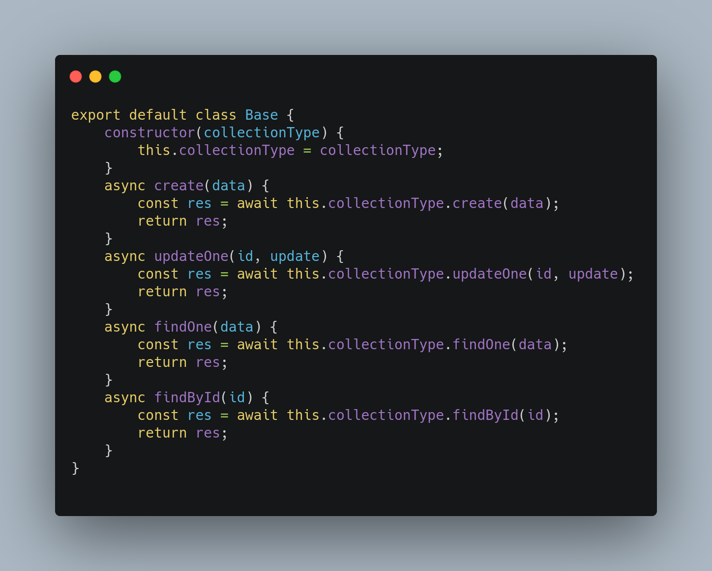
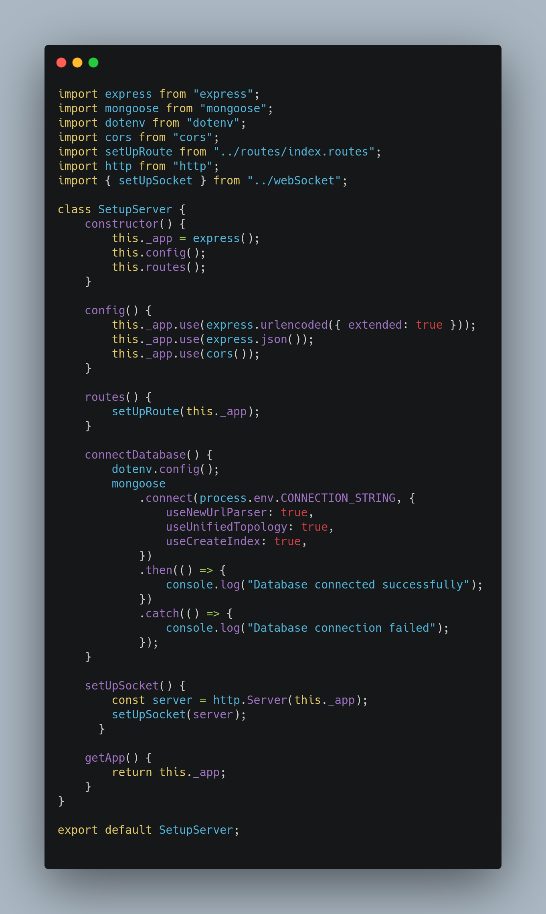

# Reutilização de Software - Backend

## Histórico de versões

|    Data    | Versão |      Descrição       |                                                                                                Autor(es)                                                                                                |
| :--------: | :----: | :------------------: | :-----------------------------------------------------------------------------------------------------------------------------------------------------------------------------------------------------: |
| 18/04/2021 |  0.1   | Criação do documento | [Aline Lermen](https://github.com/AlineLermen), [Danillo Souza](https://github.com/DanilloGS), [Gabriel Hussein](https://github.com/GabrielHussein), [Ithalo Azevedo](https://github.com/ithaloazevedo) |
| 18/04/2021 |  0.2   | Adição informações Classe Base  |                                                                           [Ithalo Azevedo](https://github.com/ithaloazevedo)                                                                            |
| 18/04/2021 |  0.3   | Adição informações Firebase  |                                                                           [Aline Lermen](https://github.com/AlineLermen)                                                                            |
| 18/04/2021 |  0.4   | Adição informações Middleware  |                                                                           [Danillo Souza](https://github.com/DanilloGS)                                                                            |
| 18/04/2021 |  1.0   | Adição informações SetupServer  |                                                                           [Gabriel Hussein](https://github.com/GabrielHussein)                                                                            |

## Classe Base

 &emsp;&emsp;
A classe Base é reutilizável pois ela faz apenas chamadas genéricas para o Mongo, então qualquer outro projeto que utilizar Backend em Node JS pode desfrutar dessa classe. 

* Frozenspot: Utilização das chamadas genéricas do Mongo são padrões.

## Firebase

 &emsp;&emsp;
A classe Firebase é reutilizável pois é uma classe de criação genérica de usuários utilizando funções padrões da plataforma Firebase. Caso haja exportação dessa classe para qualquer outro projeto que utiliza o Node JS como backend o funcionamento se mantém o mesmo.

* Frozenspot: Utilização das funções padrões do firebase como criação de usuário e o construtor.

## Middleware

 &emsp;&emsp;
A classe Middleware implementa o padrão Chain of Responsibility para fazer a autenticação do Firebase. A reutilização se dá pelo fato de que quando utilizado em conjunto com a plataforma Firebase a classe de autenticação pode ser exportada para realizar as mesmas funções.

* Frozenspot: Utilização da autenticação do Firebase entre backend e frontend ao chamar uma rota.

## SetupServer

 &emsp;&emsp;
A classe SetupServer tem como função personalizar nosso servidor HTTPS (Express), além de também fazer a conexão do nosso banco de dados. A Classe pode ser reutilizável pois as estruturas que estão sendo implementadas dentro da classe são totalmente genéricas.

* Hotspot: A classe pode ser totalmente personalizável. O desenvolvedor tem total liberdade de colocar qualquer tipo de configuração dentro do SetupServer.

