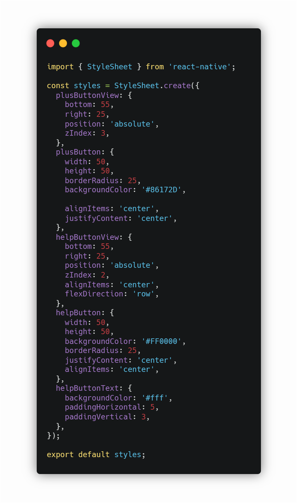
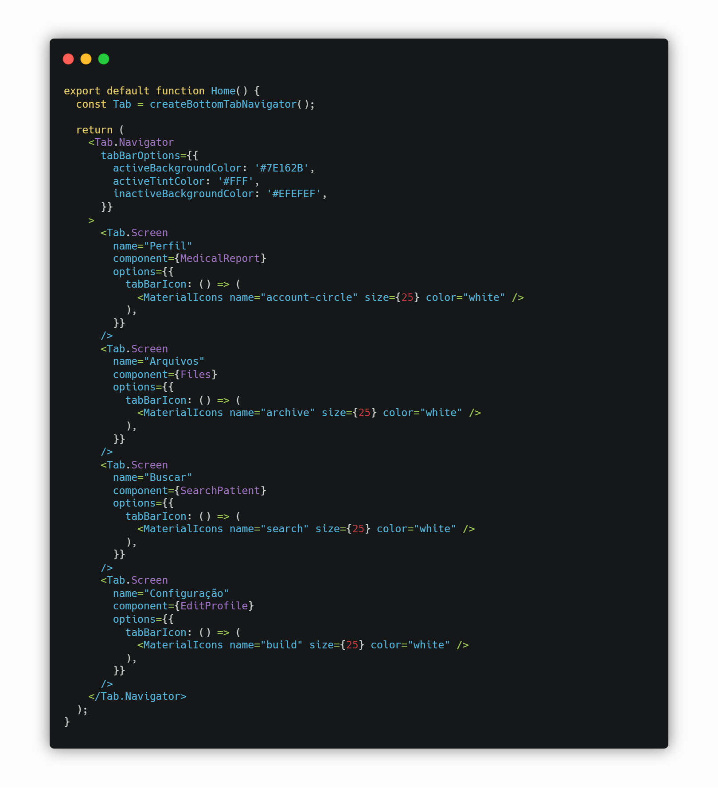
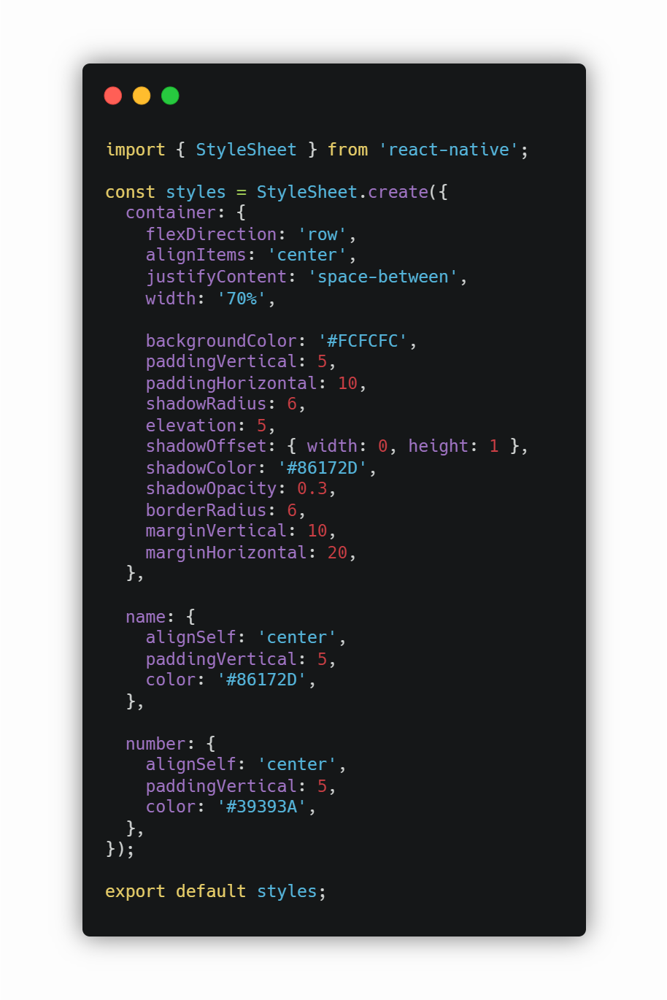
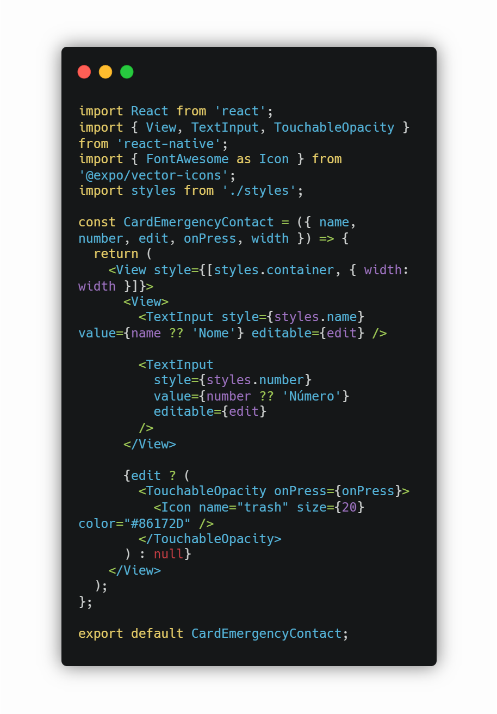
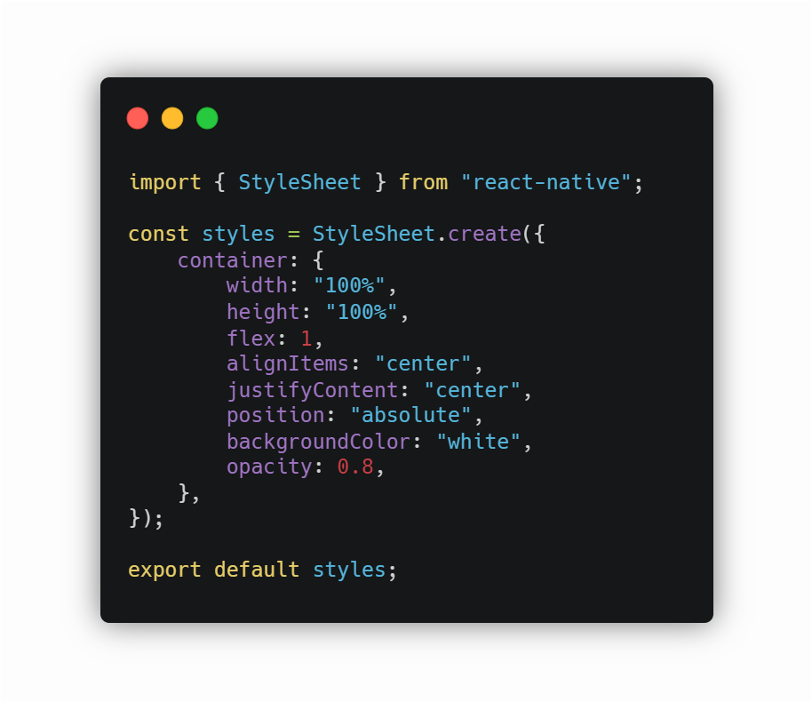
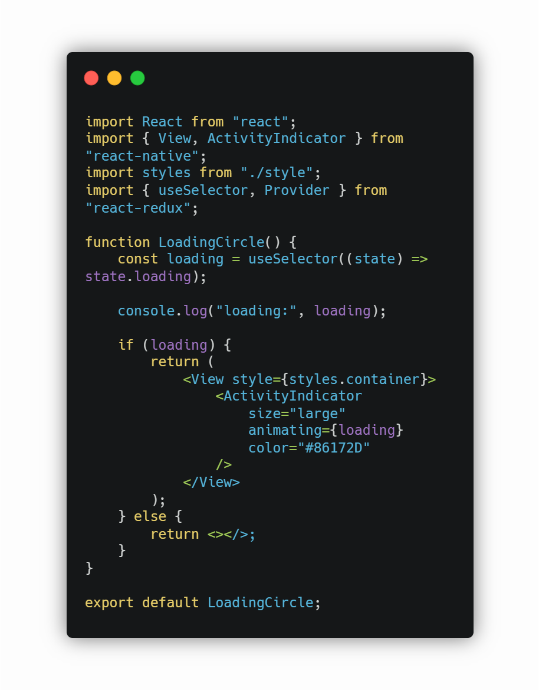
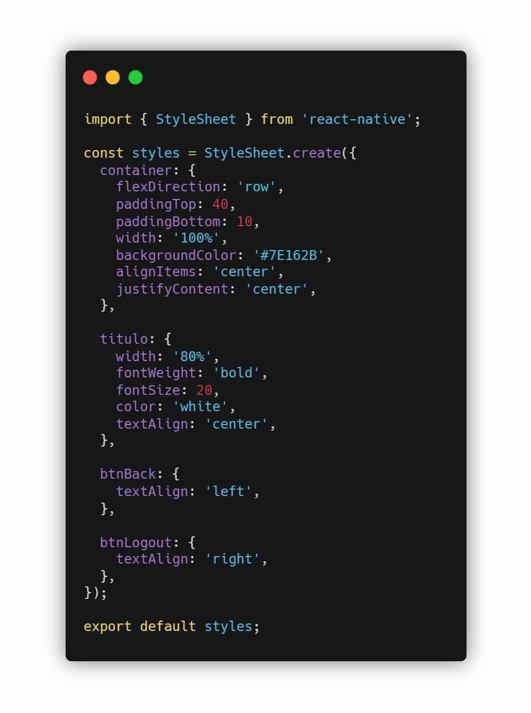
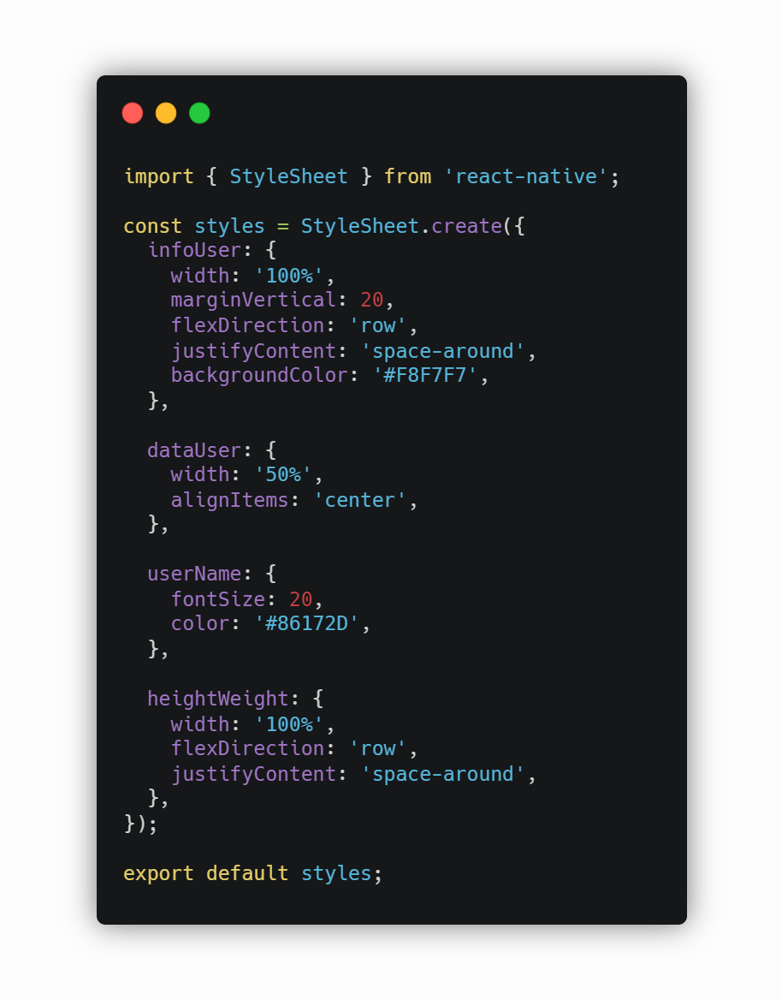
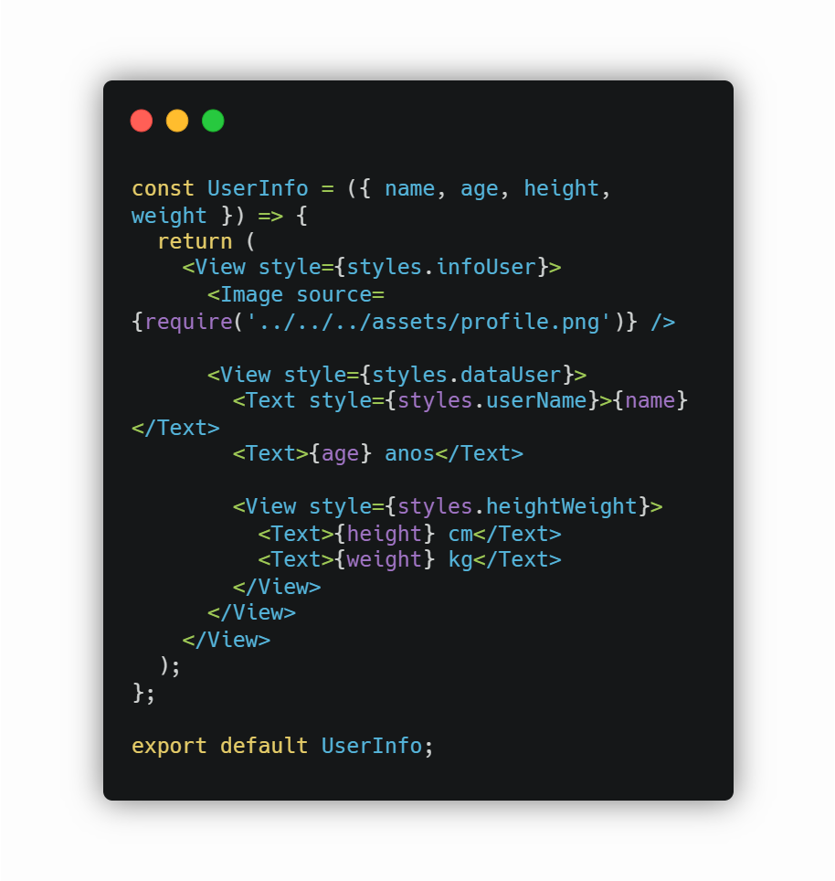

# Reutilização de Software - Frontend

## Histórico de versões

|    Data    | Versão |          Descrição          |                                                                          Autor(es)                                                                          |
| :--------: | :----: | :-------------------------: | :---------------------------------------------------------------------------------------------------------------------------------------------------------: |
| 19/04/2021 |  0.1   |    Criação do documento     | [Gabriel Hussein](https://github.com/GabrielHussein), [Ithalo Azevedo](https://github.com/ithaloazevedo), [Victor Amaral](https://github.com/victoramaralc) |
| 19/04/2021 |  0.2   |  Componentes reutilizados   | [Gabriel Hussein](https://github.com/GabrielHussein), [Ithalo Azevedo](https://github.com/ithaloazevedo), [Victor Amaral](https://github.com/victoramaralc) |
| 19/04/2021 |  0.3   |  Candidatos à reutilização  | [Gabriel Hussein](https://github.com/GabrielHussein), [Ithalo Azevedo](https://github.com/ithaloazevedo), [Victor Amaral](https://github.com/victoramaralc) |
| 19/04/2021 |  0.4   |      Adição de imagens      | [Gabriel Hussein](https://github.com/GabrielHussein), [Ithalo Azevedo](https://github.com/ithaloazevedo), [Victor Amaral](https://github.com/victoramaralc) |
| 19/04/2021 |  0.5   | Reestruturação do documento |                                                     [Ithalo Azevedo](https://github.com/ithaloazevedo)                                                      |

## Componentes reutilizados

### Floating button 
Tendo em vista a pratricidade e agilização do desenvolvimento do nosso projeto, foi realizada a reutilização do componente "*Floating Button*" vinda de outro projeto realizado por um de nossos integrantes.
Este componente foi utilizado na tela principal do aplicativo com a função de acessar a edição de informações do perfil.

**HotSpot:**
 - Ícones
 - Cores

### Bottom Bar
Assim como no caso do *Floating Button*, a bottom bar utilizada em nosso aplicativo foi reutilizada de outro projeto realizado por nossos integrantes.
A bottom bar é o nosso principal meio de navegação entre as telas, foi utilizada em todas as páginas e gerencia o acesso entre as telas.

**HotSpot:**
 - Número de páginas referenciadas
 - Cores
 - Ícones

## Candidatos á reutilização
Para facilitar o desenvolvimento dentro do projeto foram criadas uma série de componentes que seriam reutilizados entre as telas do aplicativo, diminuindo a necessidade de reescrita de código e tempo de desenvolvimento. Esses componentes, podem ser facilmente reutilizados em outros projetos.

### cardEmergencyContact
- **style.js** [*(link para o github)*](https://github.com/UnBArqDsw2020-2/2020.2_G3_ProjetoHigia/blob/devel/frontend/src/components/CardEmergencyContact/styles.js)

- **index.js** [*(link para o github)*](https://github.com/UnBArqDsw2020-2/2020.2_G3_ProjetoHigia/blob/devel/frontend/src/components/CardEmergencyContact/index.js)

### loading
- **style.js** [*(link para o github)*](https://github.com/UnBArqDsw2020-2/2020.2_G3_ProjetoHigia/blob/devel/frontend/src/components/Loading/style.js)

- **index.js** [*(link para o github)*](https://github.com/UnBArqDsw2020-2/2020.2_G3_ProjetoHigia/blob/devel/frontend/src/components/Loading/index.js)

### header
- **style.js** [*(link para o github)*](https://github.com/UnBArqDsw2020-2/2020.2_G3_ProjetoHigia/blob/devel/frontend/src/components/Header/style.js)

- **index.js** [*(link para o github)*](https://github.com/UnBArqDsw2020-2/2020.2_G3_ProjetoHigia/blob/devel/frontend/src/components/Header/index.js)

### userInfo
- **style.js** [*(link para o github)*](https://github.com/UnBArqDsw2020-2/2020.2_G3_ProjetoHigia/blob/devel/frontend/src/components/UserInfo/styles.js)

- **index.js** [*(link para o github)*](https://github.com/UnBArqDsw2020-2/2020.2_G3_ProjetoHigia/blob/devel/frontend/src/components/UserInfo/index.js)
