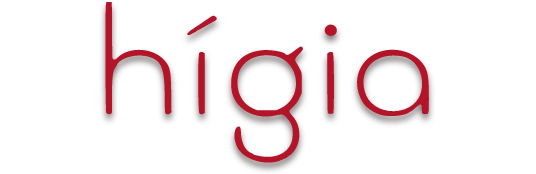

- [Home](README.md)
- Apresentações
  - [Entrega 01](./videos/entrega1.md)
  - [Entrega 02](./videos/entrega2.md)
  - [Entrega 03](./videos/entrega3.md)
- Projeto
  - [Metodologias](./03-projeto/metodologias.md)
  - [Estimativas](./03-projeto/estimativas.md)
  - [BPMN](./03-projeto/bpmn.md)
  - [Documento de Visão](./03-projeto/docVisao.md)
  - [Guia de Estilo](03-projeto/guiaDeEstilo.md)
- Sprints
  - [Sprint 0](./00-sprint/sprint00.md)
  - [Sprint 1](./00-sprint/sprint01.md)
  - [Sprint 2](./00-sprint/sprint02.md)
  - [Sprint 3](./00-sprint/sprint03.md)
  - [Sprint 4](./00-sprint/sprint04.md)
  - [Sprint 5](./00-sprint/sprint05.md)
  - [Sprint 6](./00-sprint/sprint06.md)
  - [Sprint 7](./00-sprint/sprint07.md)

- Design Sprint
  - [Metodologia](01-designSprint/metodologia.md)
  - [Unpack](./01-designSprint/brainstorming.md)
  - [Sketch](./01-designSprint/protipoPapel.md)
  - [Decide](./01-designSprint/prototipoMediaFidelidade.md)
  - [Prototype](./01-designSprint/prototipoAlta.md)
- Requisitos
  - Pré-rastreabilidade
    - [5W2H](./02-requisitos/pre-rastreabilidade/5w2h)
    - [Rich Pictures](./02-requisitos/pre-rastreabilidade/richPicture.md)
    - [Mapa Mental](./02-requisitos/pre-rastreabilidade/mapaMental.md)
    - [Diagrama de Ishikawa](./02-requisitos/pre-rastreabilidade/ishikawa.md)
  - Elicitação
    - [Brainstorming](./02-requisitos/elicitacao/brainstorming.md)
    - [Personas](./02-requisitos/elicitacao/personas.md)
    - [Storyboard](./02-requisitos/elicitacao/storyboard.md)
    - [Questionário](./02-requisitos/elicitacao/questionario.md)
    - [Requisitos Elicitados](./02-requisitos/elicitacao/requisitosElicitados.md)
  - Modelagem
    - [Léxicos](./02-requisitos/modelagem/lexicos.md)
    - [Cenários](./02-requisitos/modelagem/cenarios.md)
    - [Especificação Suplementar](./02-requisitos/modelagem/especificacaoSuplementar.md)
    - [Backlog](./02-requisitos/modelagem/backlog.md)
- Diagramas UML
  - Diagramas Estáticos
    - [Pacotes](./04-diagramasUML/diagramaPacote.md)
    - [Componentes](./04-diagramasUML/diagramaComponentes.md)
    - [Classe](./04-diagramasUML/diagramaClasse.md)
  - Diagramas Dinâmicos
    - [Sequência](./04-diagramasUML/diagramaSequencia.md)
    - [Comunicação](./04-diagramasUML/diagramaComunicacao.md)
    - [Atividade](./04-diagramasUML/diagramaAtividade.md)
    - [Estados](./04-diagramasUML/diagramaEstado.md)
- Padrões de Projeto
  - [GRASP](./05-padroesDeProjeto/GRASP.md)
  - [GoF Criacional](./05-padroesDeProjeto/GoFCriacional.md)
  - [GoF Estrutural](./05-padroesDeProjeto/GoFEstrutural.md)
  - [GoF Comportamental](./05-padroesDeProjeto/GoFComportamental.md)
  - [Padrão Emergente](./05-padroesDeProjeto/PadraoEmergente.md)
- Padrões arquiteturais
  - [Documento de Arquitetura](06-padroesArquiteturais/das.md)
- [Reutilização de Software](07-reutilizacaoSoftware/reutilizacao_Geral.md)
    - [Backend](07-reutilizacaoSoftware/reutilizacao_Backend.md)
    - [Frontend](07-reutilizacaoSoftware/reutilizacao_Frontend.md)